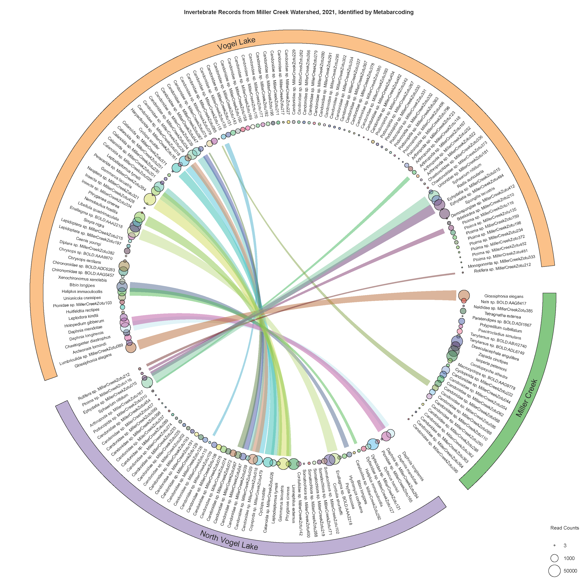

```{r, include=FALSE}
knitr::opts_chunk$set(
  comment = "#>", echo = FALSE
)
```

```{r, child="../../share/header_html.Rmd"}
```

# Miller Creek Watershed aquatic invertebrate inventory

*by Matthew L. Bowser^[USFWS Kenai National Wildlife Refuge, Soldotna, Alaska, matt_bowser@fws.gov],
 Samuel I. Artaiz,
 Jake M. Danner^[USFWS Kenai National Wildlife Refuge, Soldotna, Alaska],
 Kris K. Dent^[Alaska Department of Fish and Game, Soldotna, Alaska],
 Robert L. Massengill^[Alaska Department of Fish and Game, Soldotna, Alaska],
 Benjamin Meyer^[Kenai Watershed Forum, Soldotna, Alaska],
 Dom Watts^[USFWS Kenai National Wildlife Refuge, Soldotna, Alaska], 
 Chelsea Wisotzkey^[Kenai Watershed Forum, Soldotna, Alaska], and
 Warren R. Wyrick*^[Alaska Department of Fish and Game, Soldotna, Alaska]

## Abstract

Because benthic macroinvertebrates and zooplankton are susceptible to the pesticide rotenone, surveys of freshwater macroinvertebrates were conducted in the Miller Creek Watershed, Kenai Peninsula, Alaska ahead of a planned rotenone treatment in fall 2021. Currently, 32 of 32 planned samples have been collected in 2021. Another 32 post-treatment invertebrate samples are planned in 2022 to enable comparison of pre- and post-treatment freshwater invertebrate communities.

## Introduction

Invasive northern pike (*Esox lucius* Linnaeus, 1758) were discovered in the Miller Creek watershed in 2019 [@KNWR2021] and a rotenone treatment to eradicate pike from the drainage was planned for fall 2021.

Benthic macroinvertebrates and zooplankton are susceptible to rotenone [@Finlaysonetal2018], some of them dying at lower rotenone concentrations than fish [@Rach1988]. Planktonic crustations decline rapidly after rotenone treatments, generally taking months to years to fully recover [@Kiseretal1963; @Anderson1970]. In other southcentral Alaska lakes, most pre-treatment plankton species were present in lake water with in one to two years of treatment and plankton abundace returned to pre-treatment levels in the third year [@Chlupach1977]. On the Kenai Peninsula, most invertebrate taxa that were present in lakes before present were again present one year after treatment [@Massengill2014; @Massengill2017]. 

@Finlaysonetal2018 recommended sampling aquatic invertebrates before and after rotenone treatments to document survival and recovery of these animals.

Freshwater bioassessments have been based on morphological identfications, but metabarcoding has been found to be an efficient means of conducting freshwater biodiversity surveys [@Turunenetal2021].

For this paper we sought to

- document the pre-treatment aquatic invertebrate communities in the water bodies to be treated with rotenone as recommended by [@Finlaysonetal2018] and demonstrated by [@Massengill2014; @Massengill2017],
- test metabarcoding as a method for conducting this kind of routine inventory and monitoring, and
- compare the results of a metabarcoding analysis pipeline provided as a commercial service with the results of using a pipeline featuring Je [@Girardotetal2016], MetaWorks [@PorterHajibabaei2020], and local reference libraries.

## Methods

We began collecting a small number of invertebrate specimens in the Miller Creek watershed after northern pike and then elodea were discovered in the drainage. A small number of additional samples were collected in 2020.

A more thorough inventory effort began in 2021. We generally followed the methods used in previous aquatic inventories that were performed before and after rotenone applications on the Kenai Peninsula [@Massengill2014; @Massengill2017] with the exception that most identifications were to be obtained by metabarcoding instead of morphological identifications.

Aquatic mollusks were sampled under Alaska Department and Fish and Game Aquatic Resource Permit number SF2021-134 in 2021 and they will be sampled under permit number SF2022-122 in 2022.

The rotenone treatment of these three connected water bodies was completed on October 4&ndash;7, 2021.

### Study area

The waterbodies surveyed were those in which rotenone was applied, the same water bodies in which northern pike have been detected. These included North Vogel Lake, Vogel Lake, and Miller Creek. North Vogel Lake (14 ha) and Vogel Lake (49 ha) are separated by about 200 m and connected by a small stream that flows through a wetland. Both lakes are similar in terms of water quality metrics [@Meyer2021]. Miller Creek drains Vogel Lake, running approximately 7 km to Cook Inlet.

### Field sampling

We generally followed the methods of [@Massengill2014; @Massengill2017] for lake sampling aquatic invertebrates. Each of the three waterbodies was to be surveyed once in July and once in August. Sampling was to be conducted in the same temporal windows in 2021 and 2022.

At North Vogel Lake, Vogel Lake, and upper Miller Creek we sampled twice in 2021: first on July 20&ndash;23 and second on August 28. We sampled at 15 sites using three methods. We failed to make it out to the mouth of Miller Creek in July and August, so we collecting samples there on September 13, 2021. 

Sample sizes were chosen to be similar to those used by @Massengill2014 and @Massengill2017. @Massengill2014, to survey invertebrates in 38 ha Scout Lake, collected 3 light trap samples, 5 Ekman samples, 5 D-net samples, and 2 Wisconsin net samples. For 157 ha Stormy Lake, @Massengill2017 collected 5 Ekman samples, 5 D-net samples, and 3 Wisconsin net samples.

```{r nsamples}
ds <- read.csv("Miller_Creek_inventory_table_design.csv")
col.names <- gsub("\\.", " ", names(ds))
col.names <- gsub("D net", "D-net", col.names)
knitr::kable(ds, 
  longtable = TRUE, 
  booktabs = TRUE,
  col.names = col.names,
  caption = "Numbers of samples to be collected monthly in the three water bodies by sampling method."
)
```

At each of two visits per year we collected 3 D-net samples, 3 Ekman dredge samples, and 2 Wisconsin net samples in Vogel Lake; 2 D-net samples, 2 Ekman dredge samples, and 1 Wisconsin net sample in North Vogel Lake; and 3 D-net samples in Miller Creek, a total of 16 invertebrate samples per visit (Table \@ref(tab:nsamples)), 32 samples per year, and 64 samples over the two year project.

```{r millermap, fig.cap="Map of the Miller Creek watershed showing sample locations."}
knitr::include_graphics('img/Miller_Creek_map.pdf')
```

In addition to the 32 samples per year intended to be processed by metabarcoding, invertebrates were collected opportunistically while the authors were working within the study area.

Field methods generally followed @Massengill2014 and @Massengill2017. We took vertical plankton tows in the deepest parts of the lakes using an Aquatic Research Instruments Wisconsin net. We sampled littoral areas using with D-nets. We obtained benthic samples using either an AMS Incorporated model 445.11 Ekman dredge or an AMS Incorporated model 445.60  stainless steel dredge. Most benthic samples were sorted using a series of sieves.

Field notes are available in @Bowser2022b.

Samples were collected into ethanol or SK picglobal 99.9% pure propylene glycol. Samples intended for metabarcoding were collected into propylene glycol or, in the case of two samples, collected into ethanol and then transferred to propylene glycol.

### Specimen processing

Specimens were deposited in the Kenai National Wildlife Refuge's entomology and invertebrate collections (coden: KNWR) and managed with Arctos (https://arctos.database.museum/).

For the morphologically identified specimens, we used the following references: @Borroretal1989, @Brooks1957, @Burch1982, @Collet2008, @Durfee2005, @Haneyetal2013, @Hatch1953, @Herrington1962, @Kenner2009, @Mackie2007, @Marx1957, @MerrittCummins1996, @Merrittetal2008, @Reid1987, @Rileyetal2002, @Roughley2000, @Walker1953, @Wallis1933, and @White1983.

Notes on morphological identifications are available in @Artaiz2021, @Bowser2022b, and @Bowser2022d.

### Molecular methods

Metabarcoding samples were stored in a -23&deg;C freezer except when samples were being processed. Invertebrates were separated from debris by hand under a dissecting microscope. Care was taken to reduce possible cross-contamination of DNA among samples. Samples were shipped out on ice on September 29, 2021, arriving the next day at MR DNA (Shallowater, Texas, http://www.mrdnalab.com).

We chose to use the *mlCOIintF*/*jgHCO2198* (GGWACWGGWTGAACWGTWTAYCCYCC/TAIACYTCIGGRTGICCRAARAAYCA) primer set of @Lerayetal2013 for PCR, targeting a 313 bp region of the COI DNA barcoding region. This primer set has been successfully used for a wide variety of invertebrates, including terrestrial invertebrates @Bowseretal2020, freshwater macroinvertebrates @Hajibabaeietal2019, freshwater plankton @Yangetal2017, and stomach contents of freshwater fish @BowserBowser2020.

The *mlCOIintF*/*jgHCO2198* primer pair was used with barcode on the forward primer in 30&ndash;35 PCR cycles using the HotStarTaq Plus Master Mix Kit (Qiagen, USA) under the following conditions: 94&deg;C for 3 minutes, followed by 30&ndash;35 cycles of 94&deg;C for 30s, 53&deg;C for 40 seconds and 72&deg;C for 1minute, after which a final elongation step at 72&deg;C for 5minutes was performed.  After amplification, PCR products were checked in 2% agarose gel to determine the success of amplification and the relative intensity of bands. Multiple samples were pooled together in equal proportions based on their molecular weight and DNA concentrations. Pooled samples were purified using calibrated Ampure XP beads. The pooled and purified PCR product was used to prepare an illumina DNA library. Sequencing was performed at MR DNA on a MiSeq following the manufacturer’s guidelines. 

### MR DNA analysis pipeline

Sequence data were processed by using MR DNA analysis pipeline (MR DNA, Shallowater, Texas).  In summary, sequences were joined, sequences < 150bp were removed, and sequences with ambiguous base calls were removed. Sequences were quality filtered using a maximum expected error threshold of 1.0 and dereplicated. The dereplicated or unique sequences were denoised and chimeras were removed. Final zero-radius operational taxonomic units were taxonomically classified using BLASTn against a curated database derived from NCBI (<www.ncbi.nlm.nih.gov>).   

### Je + MetaWorks pipeline

We processed the raw sequence data on the USGS Yeti supercomputer [@USGSARC2021] using R, version 4.1.1 for manipulating data and Je, version 2.0.RC [@Girardotetal2016] for demultiplexing. The raw data included reads in alternating directions with the sample barcodes only on one read. Accordingly, we exectued the `je demultiplex` command, accepting the defaults that only require one of the two reads to contain a sample barcode.

Raw read data were processed using MetaWorks, version 1.9.5 [@PorterHajibabaei2020], running the default analysis options for metazoan COI DNA barcode sequences. Sequences were identified using the RDP classifier, version 2.13 [@Wangetal2007] and the CO1 Classifier, version 4.0.1 reference library [@Porter2017; @PorterHajibabaei2018]. 

We assembled a reference library by concatenating final Exact Sequence Variant (ESV) sequences from @Bowseretal2020 and @BowserBowser2020 and the DS-BOWSER project on BOLD^[https://boldsystems.org/index.php/Public_SearchTerms?searchMenu=records&query=DS-BOWSER], then dereplicating them with `vsearch --derep_fulllength`. We looked for matches with this reference library using `vsearch --usearch_global`. We also compared our sequences to sequences available in BOLD using the bold package [@Chamberlain2021], version 1.2.0.

To further check identifications, we generataed a phylogenetic tree from our sequence variants using the [NGPhylogeny.fr](https://ngphylogeny.fr/) &ldquo;One Click&rdquo; fully automatic workflow [@CriscuoloGribaldo2010;
@DesperGascuel2002;
@Lefortetal2015;
@Lemoineetal2018;
@KatohStandley2013;
@JunierZdobnov2010] after removing highly divergent sequences with the odseq package [@Jimenez2021], version 1.22.0, running the `odqeq` command with an arguement of `threshold = 1.0`.

We processed data in R, versions 4.0.1 and 4.1.2 [@RCoreTeam2021] using the R packages ape, version 5.6-1 [@ParadisSchliep2019]; Biostrings, version 2.62.0 [@Pagesetal2021]; ggtree, version 3.2.1 [@Yuetal2017; @Yuetal2018;  @Yu2020]; msa, version 1.26.0 [@Bodenhoferetal2015]; openssl, version 1.4.6 [@Ooms2021]; reshape2, version 1.4.4 [@Wickham2007]; ritis, version 1.0.0 [@Chamberlain2021b]; treeio, version 1.18.1 [@Wangetal2020], uuid, version 1.0-3 [@UrbanekTso2021]; and zip, version 2.2.0 [@Csardietal2021]. We generated a circular plot using the circlize package, version 0.4.14 [@Guetal2014].

To the extent possible, scientific names have been conformed to the Integrated Taxonomic Information System [@ITIS2021] because it is the *de facto* standard taxonomic database used by the U.S. Fish & Wildlife Service [e.g., @NRPC2014; @NRPC2019].

In order to exclude potential false positive detections as defined by @Mackenzieetal2002 and @Mackenzieetal2006 due to demultiplexing errors, we conservatively removed from the ESV table all occurrences that represented less than 0.05% of the total number of reads for any ESV, based on assuming a 0.01% to 0.03% rate of mis-assignment of reads @Deineretal2017. We also removed all occurrences represented by only one or two reads.

As in @Massengill2014 and @Massengill2017, the metric used was simple presence or absence of taxa within the waterbodies before and after treatment.

We formatted occurrence records to be published to GBIF using the guidance of @Anderssonetal2020.

## Results

```{r specimentable}
sr <- read.csv("Miller_Creek_Arctos_records.csv", stringsAsFactors = FALSE)

# Remove records identified only as Animalia.
sl <- !sr$phylum == ""
sr <- sr[sl,]

# Get waterbody names.
sr$waterbody <- NA
sl <- grepl("Vogel Lake", sr$spec_locality)
sr$waterbody[sl] <- "Vogel Lake"
sl <- grepl("North Vogel Lake", sr$spec_locality)
sr$waterbody[sl] <- "North Vogel Lake"
sl <- grepl("Miller Creek", sr$spec_locality)
sr$waterbody[sl] <- "Miller Creek"

sr <- sr[order(sr$phylum, sr$phylclass, sr$phylorder, sr$family, sr$genus, 
  sr$scientific_name, sr$guid),]

sr$GUID <- paste0("[", sr$guid, "](https://arctos.database.museum/guid/", sr$guid, ")")

# Italicize genera and species.
it <- !sr$genus == ""
sr$scientific_name[it] <- paste0("*", sr$scientific_name[it], "*")
sr$scientific_name[it] <- gsub(" \\?\\*", "* ?", sr$scientific_name[it])

knitr::kable(sr[,c("phylum", "phylorder", "phylclass", "family", "scientific_name", "waterbody", "GUID")], 
  longtable = TRUE, 
  booktabs = TRUE,
  #col.names = col.names,
  row.names = FALSE,
  caption = "Specimen records."
)
```

```{r chordplot, fig.cap="Chord plot of identifications obtained by metabarcoding from the Miller Creek watershed in 2021. Sizes of circles correspond to numbers of sequence reads observerd."}

```

Specimen data and images are available from an Arctos project (<https://arctos.database.museum/project/10003613>). Specimen records are available through a search for records from this project (<https://arctos.database.museum/SpecimenResults.cfm?project_id=10003613>). All Arctos records from this project are also published to the Global Biodiversity Information Facility (GBIF, <https://www.gbif.org/>) via the VertNet Integrated Publishing Toolkit (<http://ipt.vertnet.org/>).

Georeferenced photo observations have been gathered in a project on iNaturalist.org at <https://www.inaturalist.org/projects/miller-creek-invertebrate-inventory>.

A corresponding project record was also made on ServCat (<https://ecos.fws.gov/ServCat/Reference/Profile/139305>). Raw metabarcoding data are available from Servcat (<https://ecos.fws.gov/ServCat/Reference/Profile/139306>). Resulting occurrences have been published in @Bowseretal2022.

In the metagenomic data, we were not able to distinguish between species of *Enallagma* (Odonata: Coenagrionidae) because multiple species shared identical or nearly identical DNA barcode sequences in BIN BOLD:AAA2218, which includes multiple Nearctic species [@Geigeretal2021].

The sequences identified as *Ephydatia* (Spongillina: Spongillidae) were 100% similar ($p$-dist) to sequences of *Ephydatia cooperensis* (Addis & Peterson 2005), but we refrained from using this name because this species is known only from Montana [@Mazzacano2008] and the COI sequences of *E. cooperensis* and the holarctic *Ephydatia fluviatilis* (Linnaeus, 1759) have been shown to differ by as little as one nucleotide [@AddisPeterson2005] or to be identical [@Meixneretal2007].

## Discussion

### Identification remarks and new distribution records

Although the spongillafly genus *Sisyra* (Neuropotera: Sisyridae) and the species *Sisyra nigra* (Retzius, 1783) had been reported from Alaska previously [@Bowles2006; @Sikes2022], either these had not been identified to species or specific locality data were not published. Our record of *S. nigra* at Vogel Lake is the first georeferenced record of this species in Alaska that we are aware of. Our observation of *S. nigra* was in a dredge sample from which the sequences of *Ephydatia* mentioned above were detected, so *S. nigra* may have been associated with this sponge. 

New distribution records for the Kenai National Wildlife Refuge we included 
*Coenagrion interrogatum*, 
*Donacia hirticollis*, and  
*Sisyra nigra*.

### Methodological concerns

In all except the plankton samples, we generally observed less diversity in the metabarcoding results than we expected. We suspect that this was due to subsampling of the bulk samples, resulting in some species not being included in DNA extractions. In the future, we may homogenize samples using a blender and cleaning between samples using DIY-DS as described by @Buchneretal2021 before shipping samples out for metabarcoding.

In future metagenomic analyses we may retain sequences from non-target taxonomic groups as recommended by @Zafeiropoulosetal2021.

## Acknowledgments

We thank [iNaturalist.org](https://www.inaturalist.org/) people `amr_mn` and `zvkemp` (Zach Kemp) for identifications.

## References
