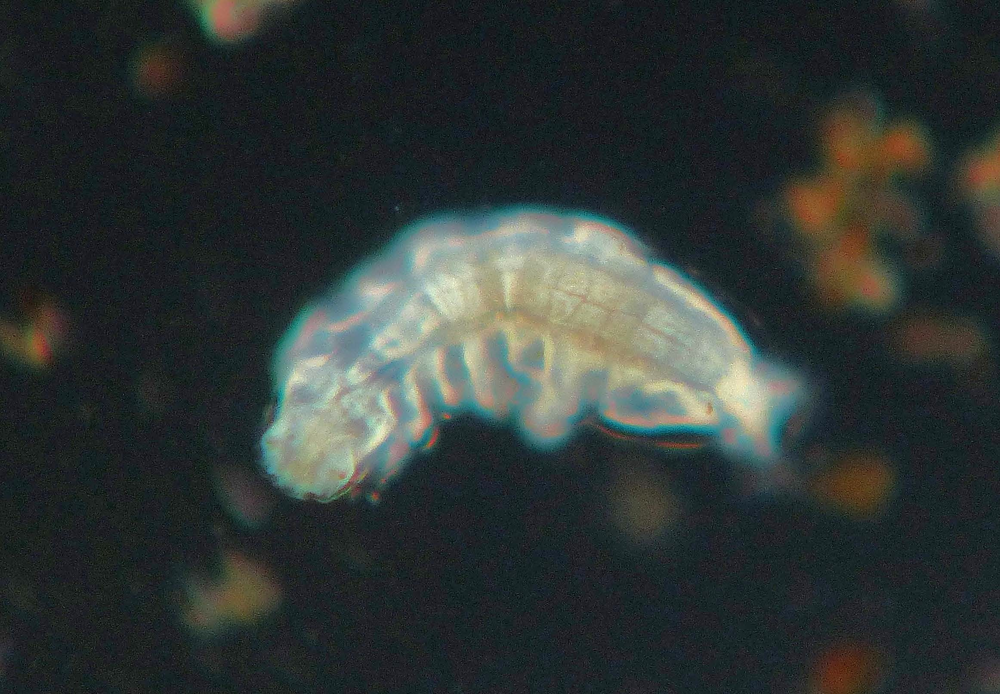
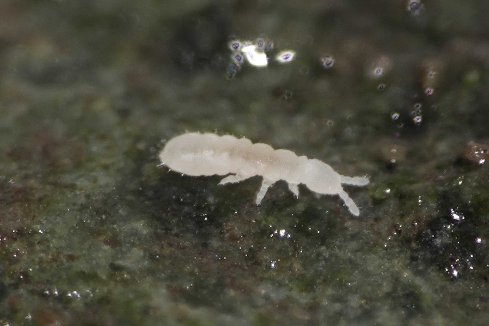

```{r, include=FALSE}
source("../../share/setup.R")
```

```{r, child="../../share/header_html.Rmd"}
```

# Using the Sony RX10 iv for photographing insects

*by Bob Armstrong*

```{r sonyfront, fig.alt="A digital camera.", fig.cap="Sony RX10 iv, front view."}
knitr::include_graphics('img/Sony_front.jpg')
```

```{r sonyrear, fig.alt="A digital camera.", fig.cap="Sony RX10 iv, back view."}
knitr::include_graphics('img/Sony_rear.jpg')
```

I have been testing a Sony RX10 iv (Figures \@ref(fig:sonyfront)&ndash;\@ref(fig:sonyrear)) for insect photography and so far:

1. This may be the best camera for photographing insects both in the wild and in the lab.

2. It focuses very quickly on insects in nature from a few feet away. This allows you to photograph them without any disturbance.

3. With the addition of a Raynox Super Macro snap on lens you can photograph very tiny insects.

4. The built in flash works very well. This allows you to use a high f-stop, up to f/16, and a high shutter speed (1/1,000 of a second). This gives you a high depth of field and best of all you can hand hold the camera and not have to use a tripod or external flash.

5. In the lab the viewing screen moves for perfect viewing. The camera has a high depth of field, the built in flash works well, and there is no need to use a camera attached to a microscope.

```{r fly1, fig.alt="A fly standing on the surface tension of water.", fig.cap="A long-legged fly."}

```

```{r fly2, fig.alt="Two flies standing on the surface tension of water in copula.", fig.cap="Long-legged flies."}

```

These long-legged flies (Figures \@ref(fig:fly1)&ndash;\@ref(fig:fly2)) dart about on the water surface. The camera focused on them very quickly. The camera was hand held from about four feet away.

```{r sonybee, fig.alt="A bee in flight near a flower", fig.cap="A queen bumblebee."}
knitr::include_graphics('img/Sony_bee.jpg')
```

```{r sonymoth, fig.alt="A moth perched on a bud of a plant spreads its wings.", fig.cap="A moth."}

```

The camera focused quickly on flying insects such as the queen bumblebee (Figure \@ref(fig:sonybee)) and moth (Figure \@ref(fig:sonymoth)). It should be great for dragonflies and butterflies.

```{r sonyweevil, fig.alt="A weevil on a willow catkin", fig.cap="A willow weevil."}

```

```{r sonypseudo, fig.alt="A pseudoscorpion on the surface of a rock.", fig.cap="A pseudoscorpion."}

```

For very tiny insects you can quickly snap on the Raynox super macro lens and use the built in flash and a high f-stop. Figure \@ref(fig:sonyweevil) is a Willow Weevil adult on a willow catkin. Figure \@ref(fig:sonypseudo) shows a pseudoscorpion hiding under a rock in the intertidal area. They are only about 3&ndash;5 mm long. The Sony was able to full frame them.

In the lab you can attach the camera to a fine adjustment stand and actually use it as a microscope. With the Raynox super micro attached you can easily focus on very tiny subjects such as tardigrades (water bears, Figure \@ref(fig:sonytardi)) and tiny springtails (Figure \@ref(fig:sonyspringtail)). With the high depth of field there is no need for stacking images.

```{r sonytardi, fig.alt="A tardigrade.", fig.cap="A tardigrade about 0.5 mm long."}

```

```{r sonyspringtail, fig.alt="A pail springtail on a rock.", fig.cap="A beach springtail about 4 mm long."}

```

How much does this equipment Cost? The camera costs \$1,698.00 from B&H photo. And also from B&H photo, the Raynox Super Micro lens costs \$70.25. It appears that the Raynox Super Micro lens might have to be purchased from the Raynox lens company.

In order to attach these lenses to the Sony camera you will need a 72&ndash;62 mm step down ring. A Sensei 72&ndash;62mm step-down ring from B & H photo costs \$5.95.

I am glad to answer any questions at <bob@discoverysoutheast.org>.


