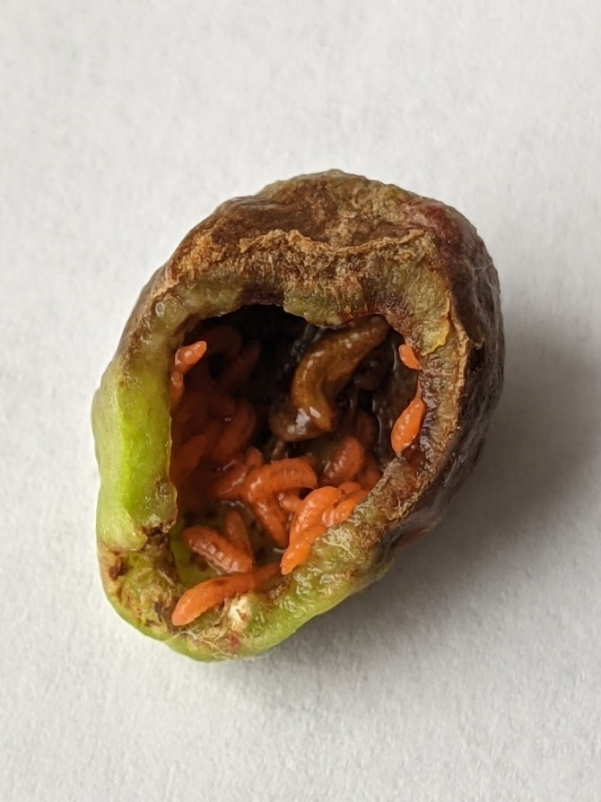
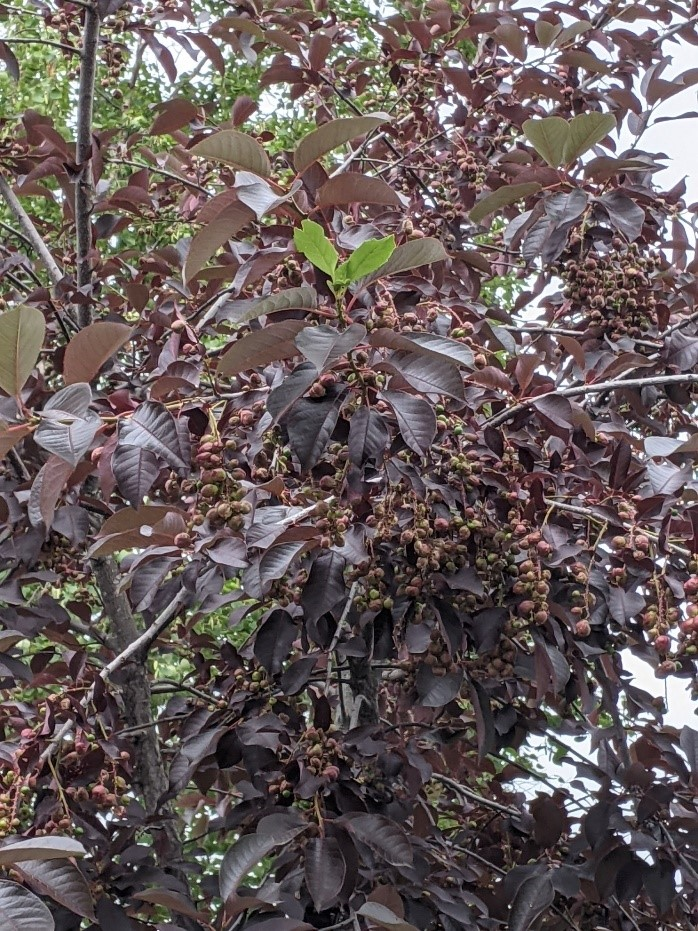
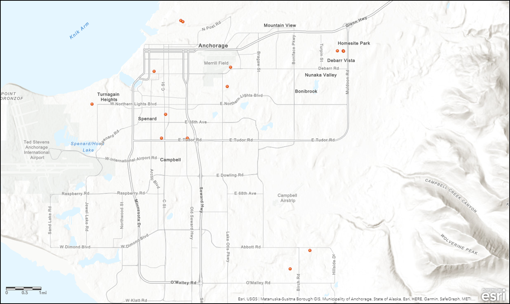

```{r, include=FALSE}
#knitr::opts_chunk$set(
#  comment = "#>", echo = FALSE
#)
source("../../share/setup.R")
```

# Notes on the chokecherry midge: A new insect species record for Alaska and natural enemy of invasive chokecherry

*by Alexandria Wenninger*^[University of Alaska Fairbanks Cooperative Extension Service Integrated Pest Management Program, akwenninger@alaska.edu]

```{r, child="../../share/header_html.Rmd"}
```

## Introduction

```{r midgelarvae, fig.cap="Chokecherry midge larva inside of a gall that has been opened. Note the shriveled seed within the center of the gall."}

```

The chokecherry midge *Contarinia virginianiae* (Diptera: Cecidomyiidae) was first recorded in Alaska in 2021. This insect was described by @Felt1906 under the name *Cecidomyia virginianiae* from larvae in fruit galls of the host *Prunus virginiana*. This species is also referred to as the &ldquo;chokecherry gall midge&rdquo; or &ldquo;chokecherry gall fly&rdquo;. I present a summary of this insect's known life history as well as some of my observational notes of this insect in an effort to facilitate recognition and reporting of this insect. I am interested in mapping the chokecherry midge's distribution in Alaska as this insect disrupts normal seed production of *P. virginiana*, an invasive species in Southcentral and Interior Alaska, which may slow the spread of this invasive species into our forests. 

## Insect life history

The chokecherry midge larva is bright orange in color and ranges from about two to three millimeters in length (Figure \@ref(fig:midgelarvae)). It induces fleshy, hollow galls within the fruits of host *Prunus virginiana* (Figure \@ref(fig:midgetree)). Occupied galls contained anywhere from one to upwards of thirty larvae within a single gall. The galls grow up to two centimeters in length and turn from green to red as they mature. A small hole eventually forms near the petiole of the galled fruit through which the larvae can escape the gall. The larvae drop to the soil to pupate and spend the winter in this form. The adults emerge in spring and are thought to lay their eggs on the blossoms of the host plant; there is one generation per year [@Cranshaw2004]. 


(ref:midgetreecap) An ornamental *Prunus virginiana* with a substantial amount of galled fruit caused by the chokecherry midge.


```{r midgetree, fig.cap="(ref:midgetreecap)"}

```

From my observations in 2021, these galled fruits began dropping from the tree around early August and had largely all fallen off the trees by September, before the time when the non-galled fruits on these trees had fully ripened. In one case, a homeowner discovered a large mass of larvae and empty galls piled on the pavement beneath their chokecherry tree in mid-August. Presumably the larvae had dropped off the tree to pupate but were caught on the impervious surface. (A similar phenomenon has been observed in Anchorage in prior years, where masses of bright orange larvae have been found on impervious surfaces including pavement, gutters, and decks after rainfall events. This phenomenon is most often associated with birch trees around mid-late July and when found in association with birch is suspected to be a different species of fly larva from the same family, Cecidomyiidae.)

## Host
 The initial description of the chokecherry midge was from chokecherry host species *Prunus virginiana* [@Felt1906]. Known hosts of this species in North America are listed as &ldquo;*Prunus* sp.&rdquo; by @GagneJaschhof2021, however, I have only been able to find literature reports of this insect on *P. virginiana* specifically. In my limited survey, galls were only found on the &lsquo;Canada Red&rsquo; variety of *P. virginiana*, despite close ornamental plantings of both *P. virginiana* and *P. padus* throughout Anchorage. *P. virginiana* is native throughout much of Canada and the United States but is not native to Interior or Southcentral Alaska. *P. virginiana*, particularly the &lsquo;Canada Red&rsquo; variety, has been planted as a landscape ornamental throughout the state and is naturalized in Anchorage forests, although possibly in fewer numbers than *P. padus*. The habit of the chokecherry midge larvae to fall to the soil to overwinter facilitates the spread of this species in potted nursery plants (Ray Gagné, pers. comm. 2021). This insect is of particular interest for invasive species management as the gall formation results in seed inviability which could potentially reduce the spread of invasive chokecherry via seed (see Figure \@ref(fig:midgelarvae)).
 
## Records & Distribution
The galls were first noted on July 29, 2021 in Anchorage, Alaska. Upon subsequent investigation, trees containing the galled fruit with larvae were found at several locations in Northern and Midtown Anchorage (Figure \@ref(fig:midgemap)). @GagneJaschhof2021 list its distribution as &ldquo;widespread Nearctic&rdquo;. Given how widespread *P. virginiana* has been planted ornamentally in the state I am interested to monitor for this species in areas outside of Anchorage.  

```{r midgemap, out.width='100%', fig.cap="Map of locations where the chokecherry midge was recorded in Anchorage in 2021. Observed locations are indicated by red circles."}

```

## Reporting
 The University of Alaska Fairbanks Cooperative Extension Service Integrated Pest Management (IPM) program is interested in identifying and monitoring insects and diseases of invasive chokecherries in Alaska, in hopes that these insects may serve as natural biocontrol agents in slowing the spread of invasive chokecherry. If you see this insect, or any other insect or disease of chokecherry fruits and/or seeds, we would love to hear about it. Please send photos of both the host plant and the insect when submitting observations. You can submit your observations to Statewide IPM Technician Alex Wenninger directly via email at akwenninger@alaska.edu or via our monitoring portal at <https://pestreporter.alaska.edu/>.  
 
## Acknowledgements
I am grateful to Dr. Raymond J. Gagné (Smithsonian Museum of Natural History) for confirming the identity of the chokecherry midge larvae. Thank you to Josh Hightower (Alaska DNR Division of Forestry, Community Forestry Program) for keeping an eye out for this species while doing site visits for the *Prunus* &lsquo;Remove and Replace&rsquo; program and for sharing his observations with me. I also thank the citizen scientists that reached out to report their observations. 

## References