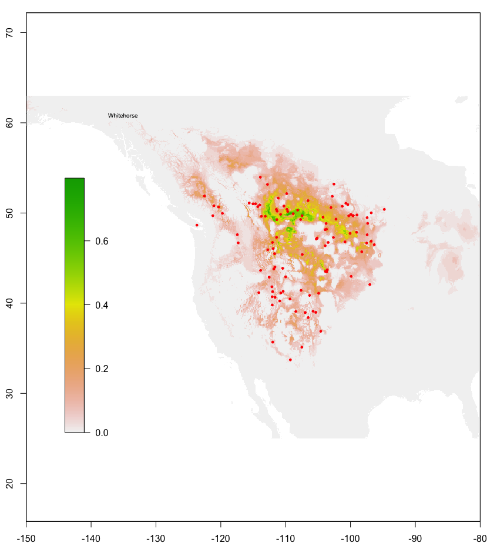

# Corrections to the literature: Three recently published records for *Nicrophorus* (Coleoptera: Staphylinidae: Silphinae) deemed erroneous

*by Derek S. Sikes*^[University of Alaska Museum, 1962 Yukon Dr., University of Alaska Fairbanks, Fairbanks, AK 99775, <dssikes@alaska.edu>]

## Abstract

During the last decade three occurrence records for three species of *Nicrophorus*&mdash;*N. guttula,* from Sitka Alaska, USA*,* *N. hebes* from Alaska, and *N. hybridus* from Whitehorse, Yukon, Canada&mdash;were published, which are likely erroneous because no reliable evidence suggests these species occur or occurred in these regions. This short note provides details, comments, and species distribution modeling analyses on these records and concludes all three are erroneous.

## Introduction

Species of the genus *Nicrophorus*, commonly called
burying beetles in North America, are relatively well known,
large-bodied beetles [@AndersonPeck1985] now in the family
Staphylinidae [@Caietal2022]. Despite peer-reviewed publications
being the gold standard for reliable scientific information, errors do
make it into print and, when found, are best corrected. Herein, three
such records are addressed&mdash;while admitting the much greater
difficulty of demonstrating the absence, relative to the presence, of a
species from a region. One approach to this problem is to attempt to
answer the question of whether the climate of a region is suitable for a
species based on an understanding of the climate from where it is known
to occur. Thus, a niche modeling, aka species distribution modeling,
analysis was undertaken to help quantify the likelihood of two of these
questionable records.

## Methods

### Species Distribution Modeling

The basics of the protocols in @Oliver2021 and @Waraniak2018 were followed using the 19 bioclimatic variables available from the WorldClim 2.0 database which contain the averages for the years 1970&ndash;2000 at 2.5 minutes resolution (\~5 km) [@FickHijmans2017]. The bioclim [@Nix1986; Boothetal2014] model in the dismo 1.3-5 package [@Hijmansetal2021] for R v.4.0.2 [@RCoreTeam2020] was used with the presence-only occurrence data for *N. hybridus* and *N. guttula*. The R script for the *N. guttula* analysis is provided as an appendix. The occurrence data files for the R analyses presented herein are available at <https://doi.org/10.6084/m9.figshare.19401131>. These data came from the collections and literature sources listed in Table \@ref(tab:collit). Those with DSS as the source are available in more complete form at <http://dx.doi.org/10.5061/dryad.mr221> from @SikesVenables2013. Those with GBIF as the source are listed below in the literature cited as @GBIF2022DL.YFNK6B and @GBIF2022DL.44ZMQ2.

```{r collit}
collit <- read.csv("corrections_table.csv")
knitr::kable(collit, 
  longtable = TRUE, 
  booktabs = TRUE,
  caption = "Collections and literature from which data used herein were derived."
)
```

## Results

### *Nicrophorus hebes* Kirby

Based on molecular, ecological, breeding trial, and morphological data, @Sikesetal2016 recognized this species as valid and elevated it to species status from a junior synonym under *Nicrophorus vespilloides* Herbst. *Nicrophorus hebes* is distrtibuted widely within eastern and central Canada and, to date, there is no evidence that *Nicrophorus hebes* occurs west of about 120° longitude or north of about 61° latitude in the Nearctic. It is thus absent from northwestern Canada and Alaska. Nevertheless, this species was accidentally reported from Alaska by @Meeds2021 who, while reviewing literature relevant to forensic entomology for Alaska, misunderstood the information presented in @Sikesetal2016.

### *Nicrophorus hybridus* Hatch & Angell 
@BygarskiLeBlanc2013, presenting on forensic entomological research conducted in Whitehorse, Yukon Territory (60° 43' N, 135° 03' W) reported the species *N. hybridus* from their samples. This species has never been confirmed north of 53° latitude and is relatively difficult to distinguish from *Nicrophorus investigator* (magnified lateral and ventral views are needed). *Nicrophorus investigator* is a widespread and common species in northern regions of the Nearctic and Palearctic so any records of *N. hyrbidus* north of 53° latitude are likely misidentifications of *N. investigator,* as suggested for this case by @SampsonSikes2020. There are numerous records of *N. investigator* north of 60° latitude in both the Nearctic and Palearctic, with maximum latitude records at 69°N in Norway and 67° in Yukon Territory [@AndersonPeck1985; @SikesVenables2013].

Climate change is expected to expand many species' ranges polewards [@Staffordetal2013] so *N. hybridus* records north of 53° latitude may increase in likelihood as the planet warms. Any such records would need confirmation by careful study of voucher specimens and use of appropriate keys [e.g., @AndersonPeck1985] by someone experienced with identification of *Nicrophorus*.

@BacklundMarrone1997 reported *N. hybridus* from sandy grasslands and scattered cottonwood stands in South Dakota. @PeckKaulbars1987 reported this species from prairie, sage steppe, and montane meadow. @AndersonPeck1985 indicated it occurs in prairies and dry inland valleys. The ecoregion data of @Olsonetal2001, as mapped in SimpleMappr [@Shorthouse2010] (data not shown), indicate it occurs primarily in grasslands, shrub steppe, montane and foothills forests and parklands east of the Rocky Mountains but some records are known from west of these mountains in coastal forest ecoregions&mdash;presumably in drier inland grassland and shrub valleys. All these habitats and climates are quite different from the subarctic boreal habitats of the Whitehorse region.

Using presence-only data for *N. hybridus* a niche model for this species was estimated which shows Whitehorse to have habitat unsuitable for this species (Figure \@ref(fig:Nhybridusmap)). Thus, making it far more likely that the specimens in question were actually *N. investigator.*

```{r Nhybridusmap, fig.cap="Map of records for *Nicrophorus hybridus* Hatch &amp; Angell showing observations (red dots) and habitat suitability probability (colors, see key) based on presence-only niche modeling using the bioclim algorithm in the dismo package in R."}

```

### *Nicrophorus guttula* Motschulsky

@Bousquetetal2013 in their checklist of the beetles of Canada and Alaska, reported *N. guttula* from Alaska because the type locality of this species is Sitka, Alaska (57° N). @Sikesetal2002 had addressed this issue and concluded the type locality was likely based on an error. Aside from the type locality description there have been no other records of this species reported from Sitka or anywhere in southeast Alaska, despite relatively extensive beetle collections having been made there, including 408 records of *Nicrophorus* from southeast Alaska&mdash;with the only *Nicrophorus* species being *N. investigator* and *N. defodiens* [@GBIF2022DL.YFNK6B]. The northernmost, verified record (specimen identified by S. Peck) for *N. guttula* is from Riske Creek in southern British Columbia at 51.9° [@GBIF2022DL.6UHRWM]. However, this northernmost record appears to be an outlier, because 97% of records are south of 50°N [@SikesVenables2013; @GBIF2022DL.44ZMQ2]. Note that in Sikes and Venables (2013) there is a record from 55°N that, upon inspection, was revealed to be incorrectly georeferenced -- its locality data said only "British Columbia" with no further geoprecision and it had thus been georeferenced to the approximate center of the province. I therefore deleted that record's geocoordinates.  

Using presence-only data for *N. guttula* a niche model for this species was estimated which shows southeast Alaska to have unsuitable habitat for this species (Fig. 2). Thus, making the likelihood very low that the type locality of Sitka is correct. The correct type locality is presumably somewhere along the northwestern coast of California, Oregon, or Washington. Many beetle specimens from this coastline, and Alaska, made their way to Europe via Russia naturalists in the mid 1800s and confusion over collection data is quite plausible.  

Finally, how is it that this error was published in a work (Bousquet et al. 2013) on which I, a specialist on both the beetles of Alaska and the genus *Nicrophorus*, was a co-author? The answer is that the Alaskan record for this species was added to the draft, without consulting me, after I had finished and submitted my edits. Nevertheless, I was curious how likely such a record was and these analyses helped lay this question to rest.

## References