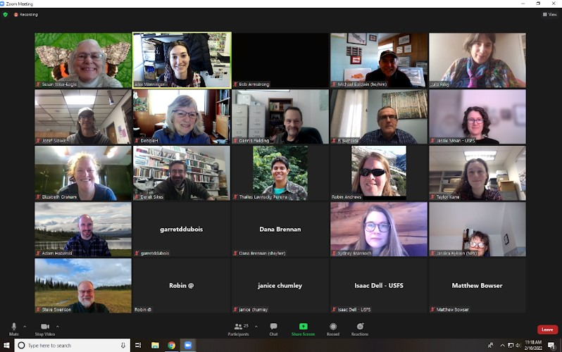

```{r, include=FALSE}
source("../../share/setup.R")
```

```{r, child="../../share/header_html.Rmd"}
```

# Review of the fifteenth annual meeting

*by Dana Brennan^[Alaska Department of Environmental Conservation, Fairbanks, Alaska, <danambrenn@gmail.com>] and Alexandria Wenninger^[UAF Cooperative Enxtension Service, Anchorage, Alaska, <akwenninger@alaska.edu>]*

```{r meeting, out.width='100%', fig.alt="A screen shot of people at a Zoom virtual meeting.", fig.cap="Zoom gallery view of the faces of 24 society members that were in attendance of the 15th annual meeting: From left to right top row: Susan Wise-Eagle, Alex Wenninger, Bob Armstrong, Mike Baldwin, Julie Riley. Second row: Joey Slowik, Debbie H, Dennis Fielding, Roger Burnside, Jessie Moan. Third row: Elizabeth Graham, Derek Sikes, Thalles Lavinscky Pereira, Robin Andrews, Taylor Kane. Fourth row: Adam Haberski, Garret Dubois, Dana Brennan, Sydney Brannoch, Jessica Rykken. Fifth row: Steve Swenson, Janice Chumley, Isaac Dell, Matt Bowser."}

```

## Presentations

Contrary to what many would think, over time Alaska butterfly species appear to be moving south! Or are they? In “Testing for Shifts in Distribution of Alaskan Butterflies: Dealing with Non-independence and Sampling Bias,” **Walker Brinkman** and **Derek Sikes** discussed this surprising result when examining the range of butterfly species in Kenelm Philip’s collection. Derek’s first suspicion was that Ken’s early career in Alaska was very active in northern part of the state and moved into the Interior in his later years which could explain this range shift by sampling bias. When examining the data, Ken’s butterfly data is highly variable in sampling effort per unit time and region, with more collection events occurring in the 1970s and the number of site visits varying by latitude. Ideally, sampling efforts would be the same per unit of time and region and collections independent of each other. Despite initially statistically significant, yet misleading, answers, the data cannot be used to conclude Alaska butterflies are shifting range southerly. 

In “Alaska Forest Health Update,” **Liz Graham** described the ongoing outbreak of hemlock sawfly and western blackheaded budworm in Southeast Alaska, species that prefer Western Hemlock hosts. There have not been much other forest disturbances in Southeast like fire, bark beetle, etc. **Jessie Moan** gave an update for Southcentral Alaska, where spruce beetle outbreak continues to be the largest cause of tree mortality in the area. **Garret Dubois** gave an update on leafminers in birch, which are responsible for 20,000 acres of damage between Talkeetna and Little Coal Creek as well as continued heavy damage in the Fairbanks area. Interestingly, Garret found *Heterarthrus nemoratus* in birch in Bethel at US Fish and Wildlife Service Yukon Delta National Wildlife Refuge staff housing, raising questions as to how, and when, it got there. **Sydney Brannoch** shared an update on the continued rusty tussock moth outbreak, which is heaviest in the Denali State Park area. Egg masses sent to Stephen Cook at the University of Idaho were found to have a frequent parasitism by *Telenomus* sp.

In “Phenology of the Root Maggot, *Delia floralis*, in Alaska,” **Dennis Fielding** described experiments done to determine emergence patterns of Turnip Root Maggot, *Delia floralis*, a long-time pest across northern climates. Indoors, *D. floralis* had a bi-modal emergence pattern. Outdoors, emergence was extended over several weeks from May to July in both Fairbanks and Palmer, which makes control methods difficult. While degree-days from 1921 to 2020 in Fairbanks have increased from 1200 to 1380 and in Palmer have increased from 1175 to 1325, it still remains too cold in Fairbanks in late September for *D. floralis* to complete a second generation.

**Joey Slowik** and **Alex Wenninger** presented “Interesting Insect Finds in the Cooperative Extension Unit Office in 2021,” where they shared the first confirmed brown recluse report in AK! Additionally, some new-to-Alaska species of spiders were identified: *Pellenes ignifrons*, *Tetragnatha dearmata*, *Emblyna mitis*, and *Philodromus praelustris*. *Scrobipalpa atriplicella*, is a new-to-Alaska lepidopteran that was found on lamb’s quarters. Alex has been investigating chokecherry gall midge, a fly that galls the fruit of chokecherry trees, and is looking for records outside of Anchorage: anyone who has any questions or possible samples should contact Alex with CES.

Phorid flies, parasitoids of spiders, beetles, millipedes, cockroaches, ants, and crickets, may be more diverse in Alaska than originally thought. There are 29 species of phorid flies recorded in Alaska, only four of which have voucher specimens in the Museum of the North collection. In “More than meets the eye: using Next Generation Sequencing – MinION – to study the diversity of Alaskan Phoridae (Diptera),” **Thalles Lavinscky Pereira** used MinION sequencing to determine lower classification identifications for specimens and make more data available. 1,110 phorid barcodes were cleaned, resulting in 13 new species records in Alaska and four species specimens newly vouchered into the Museum collection. The MinION found 144 species clusters, which may represent a lot of new species of phorids. 

**Robin Andrews** showed us her current work in “A comparison of High and Low Vacuum SEM images of Microarthropods.” The wonderful photos show an array of ways to image mites. There are pros and cons to each method, but the best contrast and crispness resulted from high vacuum SEM. Unfortunately, much of this imaging is destructive to specimens imaged, but if the imaging turns out well, is a good alternative to physical specimens that allows visualization of many identifying characteristics. 

In “Searching for *Boreus* in Wrangell-St. Elias,” **Taylor Kane** gave an update on her work with *Boreus* snow scorpionflies. *Boreus* are small, flightless moss-dwelling insects with four species found in Alaska. Taylor sought to confirm presence of *B. nix* and *B. intermedius* in Alaska, identify habitat and collections methods, and get fresh specimens for genetic and morphological study. Through sampling efforts, both male and gravid female *B. intermedius* were collected in Kennecott in May. Taylor returned in September to check for *B. nix*/*gracilis*, and collected more males and females of *B. intermedius* as well as some *B. nix*/*gracilis*. Morphological comparison of *B. nix*/*gracilis* found in Alaska to *B. nix* collected in Washington supported *B. nix* as a valid species found in Alaska, further supported by DNA analysis.

Thanks to our student presenters this year: Walker, Taylor, and Robin. Taylor’s presentation earned her the 2022 Student Presentation Award and we are excited to hear more about her work with Boreus in the future. Congratulations to Taylor! We also thank the judges this year: Julie Riley, Garret Dubois, Dana Brennan, and Alex Wenninger.

## Business items – highlights

The society discussed the idea of having the meeting over two days, which would allow for a shorter time commitment for each day to accommodate for those who must take time off work to attend. Ideas for a split day meeting included having a keynote or social event or student presentations the evening before and the main meeting the following day.

- This year the meeting was held on a weekday after polling members and the society discussed their thoughts on this compared to normal weekend meetings. There are still mixed opinions on the matter as many do not want to commit to a weekend event and others cannot make a weekday event work with their normal schedule.
- With Bioquip closing, new prizes will need to determined for science fair project winners.
- Creating AKES t-shirts was discussed again, including where to get shirts from and what kind of logo or artwork to print on the shirts.

In a fun new addition to the annual meeting, Julie Riley selected a random participant as a winner of a door prize, Bug Bingo! Congrats Garret!

Minutes from our business meeting are [available on the website](http://www.akentsoc.org/doc/AKES_meeting_20220210_minutes.pdf).

