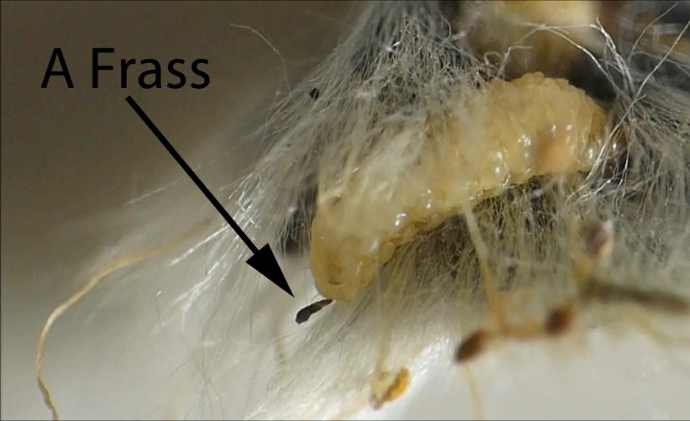
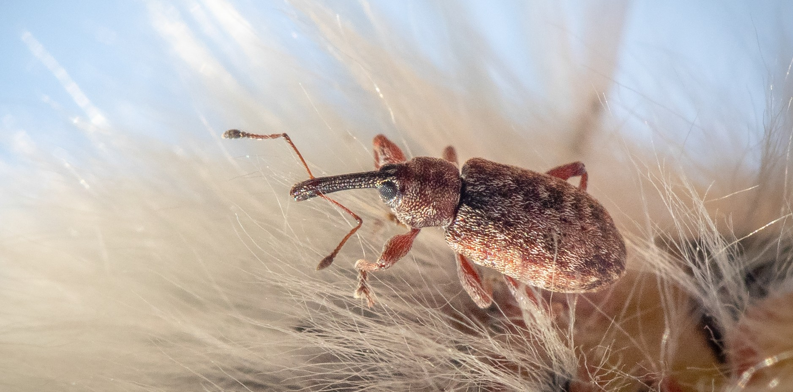

```{r, include=FALSE}
source("../../share/setup.R")
```

```{r, child="../../share/header_html.Rmd"}
```

# Willow Weevils in Juneau, Alaska

*by Bob Armstrong and John Hudson*

## What we have seen and learned about willow weevils in Juneau

```{r weevilsnow, fig.alt="A weevil on snow.", fig.cap="A willow weevil on snow."}
knitr::include_graphics('img/willow_weevils_01.jpg')
```

We often see adult willow weevils crawling on the snow in March and early April (Figure \@ref(fig:weevilsnow)). Derek Sikes of the University of Alaska Museum of the North identified photographs of specimens as *Dorytomus*. Of the 252 records of Dorytomus in Alaska, *D. leucophyllus* is the only species that has been found in Juneau.

On April 11, 2021 we visited a willow area at the end of Industrial Boulevard  in Juneau (Figure \@ref(fig:Indwillow)). We shook one of the trees and several adult weevils fell on the snow beneath the tree. A few of these adults were placed in a terrarium and kept indoors. Within a few hours we observed four couples mating (\@ref(fig:weevilsmating)). It appeared that the weevils were on the tree for the purpose of mating.

```{r Indwillow, fig.alt="Willows along a snowy road.", fig.cap="A willow area at the end of Industrial Boulevard  in Juneau."}
knitr::include_graphics('img/willow_weevils_02.jpg')
```

```{r weevilsmating, fig.alt="Two mating weevils.", fig.cap="Willow weevils mating in a terrarium."}
knitr::include_graphics('img/willow_weevils_03.jpg')
```

After mating the female lays an egg on the catkin (Figure \@ref(fig:femoncatkin)). We never found more than one larva inside the catkins that were examined (Figure \@ref(fig:larva)). This indicates the weevil may only lay one egg per catkin.

```{r femoncatkin, fig.alt="A weevil on a willow catkin.", fig.cap="A female willow weevil on a willow catkin."}

```

```{r larva, fig.alt="A weevil larva in willow catkin.", fig.cap="A weevil larva inside a dissected catkin."}

```

Catkins containing willow larvae are usually bent (Figure \@ref(fig:bentcatkin)). A cavity with brown edges inside the catkin indicates where the larva has been feeding.
 
```{r bentcatkin, fig.alt="A willow catkin cut in half to show a chamber where the weevil larva has been feeding inside the catkin.", fig.cap="A willow catkin dissected to show the cavity in which a weevil has been feeding."}

```

```{r larvafront, fig.alt="A detail of the head of a willow weevil larva.", fig.cap="Front view of the weevil larva showing the head."}

```

```{r larvarear, fig.alt="A detail of the posterior end of a willow weevil larva.", fig.cap="The rear end of the larva and clumps of fecal pellets called frass."}

```

```{r frass, fig.alt="A detail of weevil frass on the outside of a willow catkin.", fig.cap="Willow weevil frass on a willow catkin."}

```

With the amount of frass produced as the larvae eat the catkins we wondered if it is beneficial to the willows.

Of the catkins that we monitored, the larvae pupated within the catkin and adults emerged in early June (Figure \@ref(fig:emergeadult)). To understand if the weevils are overwintering as larvae or adults, we examined the fallen catkins, leaf litter and soil below willows that were used by weevils. So far we have not found any weevils.

```{r emergeadult, fig.alt="An adult weevil next to a willow catkin.", fig.cap="An adult weevil after emergence from a catkin."}

```


After captive adults emerged we examined several catkins on trees in
mid-June and found no evidence of the adult weevils mating, laying eggs, or producing any more larvae.

On March 14 and 15, 2022 we found weevils on top of the snow near to where we had observed them on willow trees last summer (Figure \@ref(fig:adultsnow2022)) and we found one adult on a newly emerged catkin on this willow tree (Figures \@ref(fig:willow2022)&ndash;\@ref(fig:adultcatkin2022)).


```{r adultsnow2022, fig.alt="A willow on snow.", fig.cap="A weevil on the snow."}

```

```{r willow2022, fig.alt="A willow in the snow.", fig.cap="A willow tree on which we found an adult weevil."}

```

```{r adultcatkin2022, fig.alt="An adult weevil on a willow catkin.", fig.cap="An adult on a willow catkin."}

```

On April 27, 2022 we saw some willow catkins with the willow weevil larva in them (Figure \@ref(fig:larvacatkin2022)). Our conclusion, so far, is that the larva pupate within the catkins and the adults emerge in the summer. They overwinter as adults and mate and lay their eggs on the catkins in spring.

```{r larvacatkin2022, fig.alt="A weevil larva in a willow catkin.", fig.cap="A willow weevil larva in a willow catkin."}

```

According to the literature some birds have learned to target catkins with weevil larva in them (Figures \@ref(fig:waxwing)&ndash;\@ref(fig:sparrow)). 

```{r waxwing, fig.alt="A bird holding a willow catkin in its beak.", fig.cap="This Bohemian Waxwing is eating a willow catkin in Juneau."}

```

```{r sparrow, fig.alt="A bird holding a willow catkin in its beak.", fig.cap="A Song Sparrow eats a willow catkin in Juneau (Photo by Doug Jones)."}

```


## References
