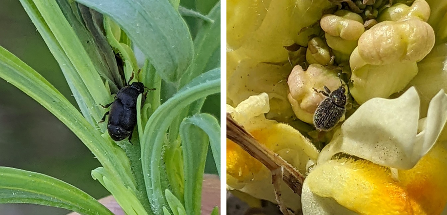
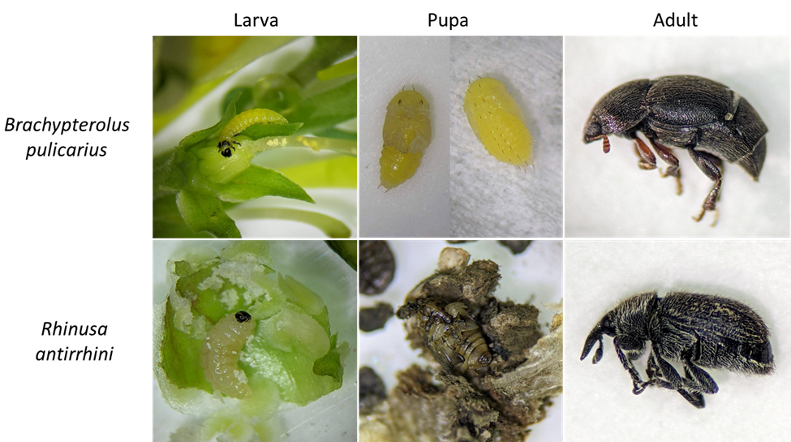
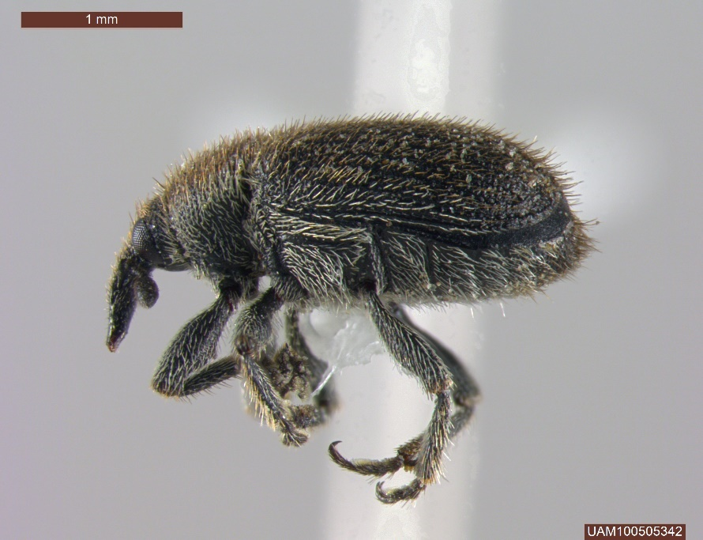
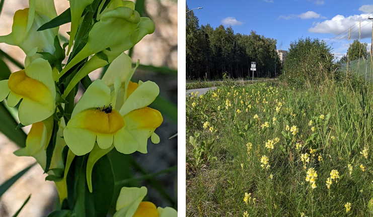
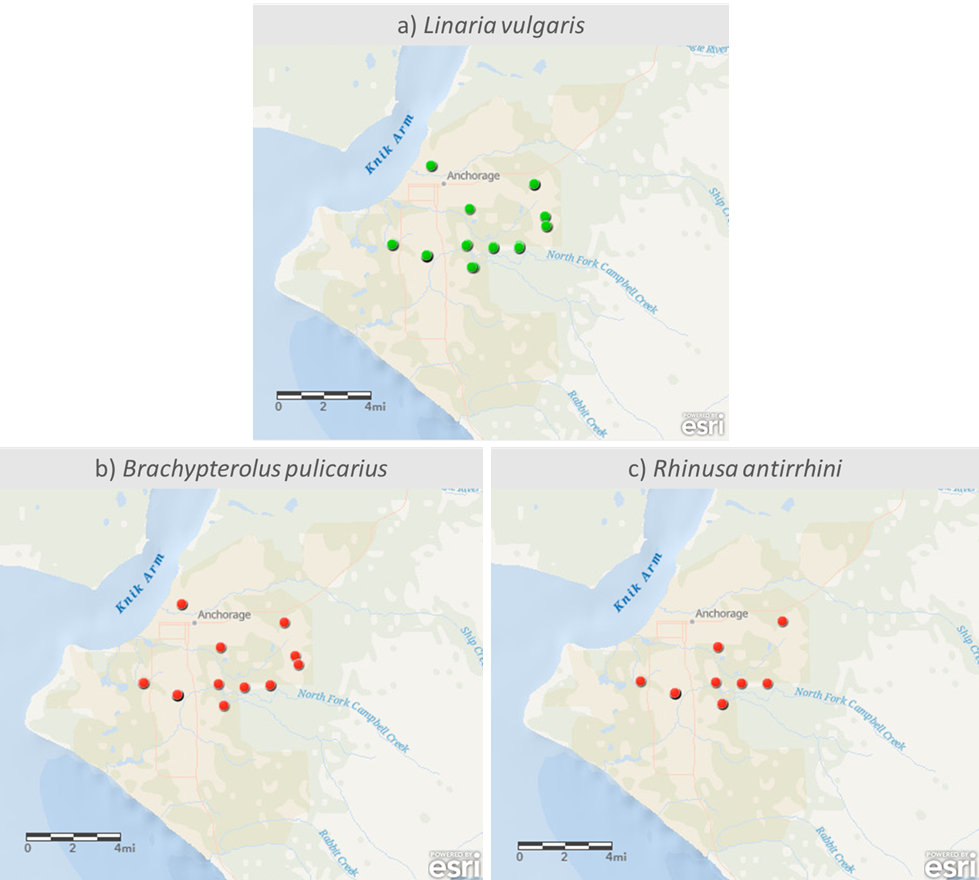

```{r, include=FALSE}
source("../../share/setup.R")
```

```{r, child="../../share/header_html.Rmd"}
```

# Two biocontrol insects of invasive yellow toadflax self-established in Anchorage, Alaska: the toadflax flower-feeding beetle and the toadflax seed capsule weevil

*by Alexandria Wenninger*^[University of Alaska Fairbanks Cooperative Extension Service Integrated Pest Management Program, akwenninger@alaska.edu]

Two biological control agents of the invasive plant yellow toadflax (*Linaria vulgaris* Miller, 1768) have established in Anchorage, Alaska without intentional introduction: the toadflax flower-feeding beetle (*Brachypterolus pulicarius* (Linnaeus, 1758)) and the toadflax seed capsule weevil (*Rhinusa antirrhini* (Paykull, 1800)). Both of these species were accidentally introduced to eastern North America in the early 1900s and are now found throughout much of the continent where yellow toadflax infestations occur; some states have intentionally redistributed these species, however no formal biocontrol introductions of these species have been made in Alaska. Despite the lack of formal introductions in Alaska, these two biocontrol species both occur in Anchorage, Alaska. Feeding by these two species reduces seed production, which may slow the spread and establishment of new populations of invasive toadflax in Alaska. 

## The toadflax flower-feeding beetle, *Brachypterolus pulicarius* (Linnaeus) (Coleoptera: Kateretidae)

The toadflax flower-feeding beetle emerges as an adult in spring and feeds on emerging toadflax shoot tips before laying eggs into unopened flower buds [@Wilsonetal2005]. Adults are brown to black in color and ~2&ndash;3 mm in length (Figure \@ref(fig:biocontroladults)). The larvae feed on flowers (ovaries, pollen, and anthers) and developing seeds before dropping to the ground to overwinter as pupae [@McClay1992]. Larvae are yellow in color with a brown to black head and darkened band on the pronotum, reaching a length of ~7 mm (Figure \@ref(fig:biocontrollifehistory)). Larval feeding can reduce a flower’s seed production by as much as ~75%&ndash;90% [@Harris1961; @McClay1992; @Winstonetal2014]. Pupae are yellow in color, ~2&ndash;3 mm in length, and feature a row of paired spines along the dorsum extending from the head to the end of the abdomen (Figure 2); the spines on the thorax project forward toward the head whereas the spines on the abdomen project back toward the rear. The adults have been reported feeding on flowers of other plant species, including strawberry and dandelion, however, the species is only known to be able to complete development on species in the genus *Linaria* [@Hervey1927]. Only one generation is known per year in Canada, with the species overwintering as pupae, however, in Europe and some states in the US, some may eclose late in the season and overwinter as an adult [@GovernmentofBritishColumbia2018]. 

(ref:biocontroladultsalt) Two pictures of adult beetles on yellow toadflax.

(ref:biocontroladultscap) Left: Adult *Brachypterolus pulicarius*, a.k.a. toadflax flower-feeding beetle on yellow toadflax shoot. Right: Adult *Rhinusa antirrhini*, a.k.a. toadflax seed capsule weevil on yellow toadflax flower. Photographed June 2022 in Anchorage, Alaska by A. Wenninger.

```{r biocontroladults, out.width='100%', fig.alt="(ref:biocontroladultsalt)", fig.cap="(ref:biocontroladultscap)"}

```


The toadflax flower-feeding beetle is thought to have been accidentally introduced to North America in New York, USA in 1919, after which it was intentionally redistributed to various localities within the lower 48 states, however no known intentional introductions have been made in Alaska that I can find evidence of. The toadflax flower-feeding beetle has been released in and is established in British Columbia [@GovernmentofBritishColumbia2018] though it has not yet been recorded in Yukon, Canada^[There is conflicting information in the literature about the presence of this species in western Canada. @Harris1961 states that the species had been found in all Canadian provinces by 1953, however, this species has not been recognized as being present in British Columbia nor Yukon in the first [@Bousquet1991] nor second [@Bousquetetal2013] editions of the *Checklist of the Beetles of Canada and Alaska*. A publication titled ‘*Brachypterolus pulicarius* L.’ found on the Government of British Columbia website states that intentional releases of this organism as a biocontrol on Dalmatian toadflax (*Linaria dalmatica* L.) occurred in 1989 and 2004 and describes the species as established in British Columbia. I was unable to find any further records of this species in Yukon.]. This beetle was first recorded from Alaska in 2016 when one individual was caught in a vane trap in Anchorage^[<https://arctos.database.museum/guid/UAM:Ento:351434>]. This species was found on toadflax as early in the season as 2 June 2022, and some adults were still present on flowers on 13 September.  I wild-collected larvae between 18&ndash;23 August to rear indoors; the beetles were able to be reared from larva to adult at room temperature (~70 &deg;F) and the first adults emerged 12 September. 

(ref:biocontrollifehistoryalt) Larvae, pupae, and adults of two beetle species.

(ref:biocontrollifehistorycap) Larval, pupal, and adult stages of the two species of biocontrol beetles (not to scale). Top left: *Brachypterolus pulicarius* larva at base of *L. vulgaris* flower (flower petals have been removed to expose the larva at the base). Top middle: *B. pulicarius* larva, ventral and dorsal habita. Top right: Adult *B. pulicarius*, lateral habitus. Bottom left: *Rhinusa antirrhini* larva feeding inside *L. vulgaris* seed capsule. Bottom middle: *R. antirrhini* pupa inside *L. vulgaris* seed capsule. Bottom right: Adult *R. antirrhini* lateral habitus. Immatures photographed August 2022 and adults photographed June 2022 in Anchorage, Alaska by A. Wenninger.

```{r biocontrollifehistory, out.width='100%', fig.alt="(ref:biocontrollifehistoryalt)", fig.cap="(ref:biocontrollifehistorycap)"}

```


## The toadflax seed capsule weevil, *Rhinusa antirrhini* (Paykull) (Coleoptera: Curculionidae)

The toadflax seed capsule weevil emerges as an overwintered adult in late spring and feeds on emerging toadflax shoot tips and flowers before laying eggs into the flower’s ovaries [@Wilsonetal2005]. Adults are grey to black in color, setose, and ~2.5&ndash;3mm in length (Figures \@ref(fig:biocontroladults) and \@ref(fig:biocontrolhabitus)). Egg deposition into the host plant tissue triggers gall formation; the seeds near the egg expand beyond their typical size resulting in seed inviability [@Singetal2016]. The developing larvae then feed on both the galled tissue as well as on other developing seeds within the capsule [@Singetal2016]. The legless larvae are creamy white with a black head capsule, ~4mm in length, and feed on galled seed tissue before pupating inside the seed capsule (Figure \@ref(fig:biocontrollifehistory)). Adults emerge in late summer to early fall and will often overwinter inside the seed capsule or in plant debris [@Nowierski2004]. 

(ref:biocontrolhabitusalt) Lateral picture of a pinned weevil specimen.

(ref:biocontrolhabituscap) Lateral habitus of adult *R. antirrhini* collected 2 June 2022 in Anchorage, Alaska. Photo by Derek S. Sikes, University of Alaska Museum of the North, Arctos record: <https://arctos.database.museum/guid/UAM:Ento:476269>.

```{r biocontrolhabitus, fig.alt="(ref:biocontrolhabitusalt)", fig.cap="(ref:biocontrolhabituscap)"}

```

*Rhinusa antirrhini* is thought to have been accidentally introduced to the eastern United States, first recorded around 1909, and to British Columbia, Canada, first recorded in 1917, after which intentional introductions were made in various localities of both Canada and the lower 48 states [@Winstonetal2014], however no intentional introductions have been made Alaska that I can find evidence of. This beetle was previously recorded from Alaska in both Fairbanks in October  2006^[<https://arctos.database.museum/guid/UAM:Ento:25891>, 
<https://arctos.database.museum/guid/UAM:Ento:25892>, 
<https://arctos.database.museum/guid/UAM:Ento:25893>,
<https://arctos.database.museum/guid/UAM:Ento:25974>,
<https://arctos.database.museum/guid/UAM:Ento:25975>,
<https://arctos.database.museum/guid/UAM:Ento:25976>] and Anchorage in July 2008^[<https://arctos.database.museum/guid/UAM:Ento:97224>, <https://arctos.database.museum/guid/UAM:Ento:97225>, 
<https://arctos.database.museum/guid/UAM:Ento:97226>, 
<https://arctos.database.museum/guid/UAM:Ento:97227>, 
<https://arctos.database.museum/guid/UAM:Ento:97228>, 
<https://arctos.database.museum/guid/UAM:Ento:97229>, 
<https://arctos.database.museum/guid/UAM:Ento:97230>, 
<https://arctos.database.museum/guid/UAM:Ento:97231>, 
<https://arctos.database.museum/guid/UAM:Ento:97232>, 
<https://arctos.database.museum/guid/UAM:Ento:97233>] on yellow toadflax. In 2022 this species was collected as early as 2 June and as late as 13 September. 

The toadflax seed capsule weevil was previously recognized for its potential to decrease seed production of invasive toadflax in Anchorage [@Lambetal2009, = *Gymnetron antirrhini*], however, I have been unable to find any report of further surveys of the distribution of this species in Alaska since those initial discoveries. Seed reductions due to feeding by this species have been reported as high as 90% in Washington [@Nowierski2004], however most reported attack rates are lower than this [@Winstonetal2014]. Previous observations in Alaska have reported ~20% attack rate on yellow toadflax by an unknown weevil [@AlaskaNaturalHeritageProgram2011], which is consistent with the 20&ndash;25% typical seed reduction observed in Canada [@Nowierski2004]. Predators and parasitoids of this species may contribute to the variation seen in seed attack rates among localities. A study in Ottawa, Canada found anywhere from 4% to 85% of collected *R. antirrhini* larvae were parasitized [@Allison2009]. Alaska is also home to the solitary predatory wasp *Cerceris nigrescens*, which is known to collect adult *R. antirrhini* as prey for nest provisioning [@Krombien1938; @Scullen1965]. It is worth noting that *R. antirrhini* may delay oviposition in areas where it is in competition with *B. pulicarius* [@Turner2008], and furthermore *B. pulicarius* larvae have been observed predating upon *R. antirrhini* eggs [@JacobsSing2006]. Many authors report that these competitive and antagonistic interactions between *B. pulicarius* and *R. antirrhini* prevent their impact on toadflax from being additive [@Harris1961; @Singetal2016; @Winstonetal2014].

## Host

Yellow toadflax (*Linaria vulgaris* Miller) was introduced to North America in the 1600s for ornamental and medicinal purposes. By 1849 the species had spread across the eastern and mid-western United States where it became a significant agricultural weed [@Saneretal1995; @Singetal2022]. The species is now found throughout much of North America, having spread as a contaminant in crop seed and baled hay, through railway corridors and ship ballasts, and from intentional ornamental plantings [@Saneretal1995; @Singetal2022]. The plant produces yellow, spurred flowers with orange throats, borne in terminal clusters (Figure \@ref(fig:biocontrolhost)); leaves are pale green and arranged alternately on the stem [@AlaskaNaturalHeritageProgram2011]. Yellow toadflax can spread by seed or root fragments and its invasion is facilitated by disturbance. Once established, yellow toadflax can form dense colonies that suppress native grasses and perennials [@AlaskaNaturalHeritageProgram2011]. Toadflax seeds often remain viable after ingestion by wildlife and livestock (primarily ungulates and birds) which is thought to facilitate long-range dispersal as well as dispersal into wilderness areas [@Singetal2016; @Singetal2022]. 

(ref:biocontrolhostalt) Detail of yellow and orange toadflax beetles and a picture of toadflax flowers along a roadside.

(ref:biocontrolhostcap) Left: Closeup of the toadflax flower. Note the tiny beetle posterior hanging out of the flower, belonging to *Rhinusa antirrhini*. Photographed 26 June 2022. Right: Invasive toadflax flowers peppering an Anchorage roadside, photographed 29 August 2022. Photos from Anchorage, Alaska by A. Wenninger.

```{r biocontrolhost, out.width='100%', fig.alt="(ref:biocontrolhostalt)", fig.cap="(ref:biocontrolhostcap)"}

```


## 2022 Survey Results

Midtown and Northeast Anchorage were surveyed opportunistically in 2022 for existing yellow toadflax populations and for the presence of the two biocontrol beetles on toadflax (Figure \@ref(fig:biocontrolmaps)). The locations where I surveyed toadflax in 2022 can largely be simplified into 11 distinct locations (Figure \@ref(fig:biocontrolmaps)a); *B. pulicarius* was detected at all 11 of these locations (Figure \@ref(fig:biocontrolmaps)b) and *R. antirrhini* was detected at 8 of the 11 locations (Figure \@ref(fig:biocontrolmaps)c). 

(ref:biocontrolmapsalt) Maps of Anchorage showing survey locations.

(ref:biocontrolmapscap) Anchorage 2022 toadflax and biocontrol beetle survey locations. a) Locations where *Linaria vulgaris* (yellow toadflax) occurs and was checked for biocontrol beetles in Anchorage in 2022. b) Locations where *Brachypterolus pulicarius* was detected on toadflax and c) locations where *Rhinusa antirrhini* was detected on toadflax. Maps generated using ArcGIS Online, Oceans Basemap; Basemap credits: Esri, DeLorme, NaturalVue | Kenai Peninsula Borough, Matanuska-Susitna Borough GIS, Municipality of Anchorage, State of Alaska, Esri, HERE, Garmin, SafeGraph, METI/NASA, USGS, EPA, NPS, USDA.

```{r biocontrolmaps, out.width='100%', fig.alt="(ref:biocontrolmapsalt)", fig.cap="(ref:biocontrolmapscap)"}

```


## Reporting

In 2023 I plan to develop protocols for involving citizen scientists in surveying for beetles on toadflax to help expand our understanding of the distribution of these beetles beyond Anchorage. Currently, infestations of yellow toadflax on public land can be reported via the mobile app ‘Alaska Invasives ID’ or at <https://alaskainvasivesreporter.org>. I am especially interested in reports of the biocontrol beetles on yellow toadflax observed outside of Anchorage. Photos and location can be submitted directly to Statewide IPM Technician Alex Wenninger via email at akwenninger@alaska.edu or via our monitoring portal at <https://alaskapestreporter.org>. 

## Acknowledgements

Thank you to Dr. Derek S. Sikes, Curator of Insects at the University of Alaska Museum of the North, for identifying specimens of both *Brachypterolus pulicarius* and *Rhinusa antirrhini* collected 2 June 2022 in Anchorage. These reference specimens were deposited into the University of Alaska Museum of the North Insect Collection^[<https://arctos.database.museum/guid/UAM:Ento:476269>, <https://arctos.database.museum/guid/UAM:Ento:476270>, <https://arctos.database.museum/guid/UAM:Ento:476271>, <https://arctos.database.museum/guid/UAM:Ento:476272>, <https://arctos.database.museum/guid/UAM:Ento:476273>, <https://arctos.database.museum/guid/UAM:Ento:476274>, <https://arctos.database.museum/guid/UAM:Ento:476275>, <https://arctos.database.museum/guid/UAM:Ento:476276>, <https://arctos.database.museum/guid/UAM:Ento:476277>, <https://arctos.database.museum/guid/UAM:Ento:476278>]. This work was supported by funds from the USDA Forest Service, USDA Animal Plant Health & Inspection Service, and the Western Region of the National Plant Diagnostic Network.


## References
