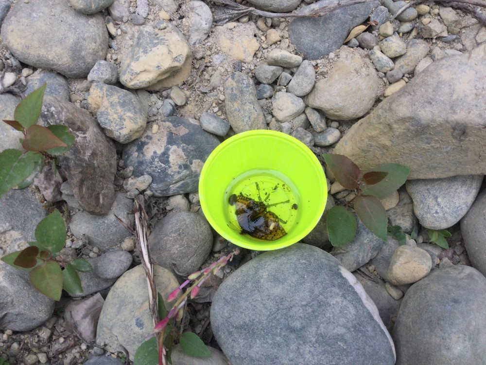

```{r, include=FALSE}
source("../../share/setup.R")
```

```{r, child="../../share/header_html.Rmd"}
```

# Metabarcoding pollinators on Kenai National Wildlife Refuge, Kenai Peninsula, Alaska

*by Matt Bowser^[USFWS Kenai National Wildlife Refuge, Soldotna, Alaska, matt_bowser@fws.gov], Anya Bronowski, and Dom Watts^[USFWS Kenai National Wildlife Refuge, Soldotna, Alaska]*

## Introduction

Pollinating insects provide important ecosystem services in Alaska [@Fulkersonetal2021] and the pollinators themselves are wildlife that the Kenai National Wildlife Refuge (KNWR or the Refuge) was established in part to conserve [@KenaiNWR2010CCP].  Because pollinators appear to be generally declining [@Pottsetal2010; @Cameronetal2011; @Kohetal2016], we wanted to begin documenting pollinator diversity on the Refuge.

The Alaska Bee Atlas [@Fulkersonetal2021, <https://accs.uaa.alaska.edu/wildlife/ak-bee-atlas>] is a sampling program designed to provide information on the biodiveristy of pollinators in Alaska. In 2022, KNWR biologists participated in the Alaska Bee Atlas effort.

## Methods

### Sampling Design

We followed the guidance of the sampling plan of @Fulkersonetal2021. Most of KNWR lies within lowest priority hexagons of @Fulkersonetal2021, but the southernmost part of the Refuge lies within a medium priority hexagon. We prioritized sampling in this area, but access in this region is difficult. We surveyed only at Emerald Lake in this medium priority hexagon.

We surveyed for insect pollinators at a variety of other sites on the Refuge, trying to sample in diverse habitats (Figure \@ref(fig:pollinatorsmap)). We sampled dry, rocky slopes off of Skilak Lake Road following the advice of Justin Fulkerson.

We accessed sites by road and floatplane.

```{r pollinatorsmap, fig.alt="A map of the western Kenai Peninsula showing sampling locations near Point Possession in the north to Emerald Lake in the south.", fig.cap="Map of Alaska Bee Atlas sampling priority hexagons as of May 11, 2022 and sites we surveyed for pollinators in 2022. KNWR: Kenai National Wildlife Refuge boundary. The map was generated with R, version 4.2.2 [@RCoreTeam2022] using the R packages sf, version 1.0-9 [@Pebesma2018] and pdftools, version 3.3.3 [@Ooms2023]."}

```

### Field Methods

We sampled pollinators using bee bowl traps (Figure \@ref(fig:pollinatorsbowl)), blue vane traps (Figure \@ref(fig:pollinatorsBVT)), and aerial nets (Figure \@ref(fig:pollinatorsTwin)), generally following the field methods of @Fulkersonetal2021 with the exception that we collected specimens into SK picglobal 99.9% pure propylene glycol.

```{r pollinatorsbowl, fig.alt="A yellow cup rests among low plants on a rocky slope.", fig.cap="A bee bowl trap, part of a set of nine bee bowls off of the Bear Mountain Trail, June 27, 2022 (credit: Matt Bowser/USFWS)."}

```

```{r pollinatorsBVT, fig.alt="Two blue vane traps hang from aspen trees.", fig.cap="Two blue vane traps near Hidden Lake Campground, June 17, 2022 (credit: Matt Bowser/USFWS)."}
knitr::include_graphics('img/pollinators_BVT.jpg')
```

```{r pollinatorsTwin, fig.alt="A man netting insects in a lush alpine meadow.", fig.cap="Dominique Watts collecting pollinators using an aerial net above Twin Lakes, August 3, 2022 (credit: Matt Bowser/USFWS)."}
knitr::include_graphics('img/pollinators_Twin.jpg')
```

### Specimen Processing

Samples were stored in a -23&deg;C freezer except when samples were being processed. Invertebrates were separated from debris by hand under a dissecting microscope. Care was taken to reduce possible cross-contamination of DNA among samples. 

We separated samples that were all or mostly bees from samples that were mostly flies and other invertebrates. We shipped 12 samples of bees to the Alaska Center for Conservation Science^[<https://accs.uaa.alaska.edu/>], University of Alaska Anchorage, Anchorage, Alaska to be processed. 

We homogenized the remaining 19 samples plus one legacy bulk pollinator sample from a previous project [@Bowser2012] using a blender and cleaning between samples with DIY-DS cleaning solution as described by @Buchneretal2021. Our sample homogenization protocol is included below.

> We homogenized samples using a Nutri Ninja QB3000SS blender [@EuroProOperating2015].
> 
> DIY-DS recipe
>
- 20 g NaOH 
- 20 g Alconox 
- 15.1 g NaHCO~3~ 
- 267 ml 4.5% bleach
- deionized water to fill to 2 l
>
>Preparation
>
>1. 120 ml plastic cups should be washed with DIY-DS and rinsed before sampling. Finish by rinsing inside the 120 ml cup with deionized water. Hand dry 120 ml cup with paper towel.
> 
>Homogenize samples
>
1. Before running samples, rinse blender by running 100 ml of deionized water for 20 s.
1.	Pre-label a 10 ml plastic vial with the specimen GUID and add a barcode vial label. Also pre-label and add a barcode label to a 120 ml specimen cup.
2.	Clean forceps with DIY-DS.
3.	Take the label out of the original container with the cleaned forceps and place into the new 120 ml sample container. 
4. Add the contents of the sample vial to the blender. 
5. Rinse original sample vial with cold, clean propylene glycol and pour rinsate in the blender with the rest of the sample.
6. Fill blender to 100 ml with cold, clean propylene glycol.
7. Blend for 90 s.
8. Using a new disposable pipette, fill the pre-labelled 10 ml plastic vial with about 9.5 ml of homogenate.
9. Pour the rest of the sample into the pre-labeled 120 ml specimen cup.
10. Rinse blender by running 100 ml tap water for 10 s. 
11. Wash blender by running 100 ml of DIY-DS for 10 s.
12. Rinse this out in the lab sink with tap water.
13. Rinse blender by running 100 ml deionized water for 10 s.

We shipped 9 ml of homogenate from each of the 20 homogenized samples to Molecular Research Laboratory^[<https://www.mrdnalab.com/>], Shallowater, Texas for metabarcoding.

### Molecular Methods

We chose to use the *mlCOIintF*/*jgHCO2198* (GGWACWGGWT GAACWGTWTA YCCYCC / TAIACYTCIG GRTGICCRAA RAAYCA) primer set of @Lerayetal2013 for PCR, targeting a 313 bp region of the COI DNA barcoding region. 

The *mlCOIintF*/*jgHCO2198* primer pair was used with barcodes on the forward primer in 30&ndash;35 PCR cycles using the HotStarTaq Plus Master Mix Kit (Qiagen, USA) under the following conditions: 94&deg;C for 3 minutes, followed by 30&ndash;35 cycles of 94&deg;C for 30s, 53&deg;C for 40 seconds and 72&deg;C for 1 minute, after which a final elongation step at 72&deg;C for 5minutes was performed.  After amplification, PCR products were checked in 2% agarose gel to determine the success of amplification and the relative intensity of bands. Multiple samples were pooled together in equal proportions based on their molecular weight and DNA concentrations. Pooled samples were purified using calibrated Ampure XP beads. The pooled and purified PCR product was used to prepare an illumina DNA library. Sequencing was performed at MR DNA on a MiSeq following the manufacturer’s guidelines.

### Bioinformatics

The bioinformatics pipeline was run on the Yeti supercomputer [@USGSARC2021]. We used the MetaWorks pipeline, version 1.11.3 [@PorterHajibabaei2022] with the RDP classifier [@Wangetal2007] and the Eukaryote CO1 reference set for the RDP Classifier, version 4.0.1 [@PorterHajibabaei2018]. We processed data in R, version 4.2.2 and 4.2.3 [@RCoreTeam2022; @RCoreTeam2023] using the R packages
 ape, version 5.7-1 [@ParadisSchliep2019];
 Biostrings, version 2.66.0 [@Pagesetal2022];
 bold, version 1.2.0 [@Chamberlain2021];
 ips, version 0.0.11 [@Heibl2008];
 msa, version 1.30.1 [@Bodenhoferetal2015]; and 
 reshape2, version 1.4.4 [@Wickham2007]. 
We compared our sequences to sequences from a local reference library [@Bowser2022COIlib] using the `vsearch --usearch_global` command of vsearch, version 2.21.1 [@Rognesetal2016].

## Results

### Data Availability

Project data and project photos are available on Arctos via an Arctos project record (<https://arctos.database.museum/project/10003917>), and specimen records can be viewed via an Arctos search^[<https://arctos.database.museum/search.cfm?project_id=10003917&collection_id=46>].  Project information is also available from a project record on ServCat (<https://ecos.fws.gov/ServCat/Reference/Profile/148742>). Raw sequence data from this project are available from @Bowser2022pollinatorraw.

### Non-native Species

We documented occurrences of six non-native species. The European honey bee, *Apis mellifera* Linnaeus, 1758, was detected in bee bowls set out at Headquarters lake wetland near Soldotna from July 28 to August 2. The thrips *Odontothrips loti* (Haliday, 1852) was detected in bee bowls deployed in a meadow off of Skilak Lake Road from June 30 to July 7. *Pollenia vagabunda* (Meigen, 1826) was collected in bee bowls at Kenai National Wildlife Refuge headquarters in Soldotna. We detected the earthworm *Dendrobaena octaedra* (Savigny, 1826) in bee bowls set at Picnic Lake. Sequences we obtained of the slug *Deroceras agreste* (Linnaeus, 1758) from bee bowls set at multiple locations were 99.35&ndash;99.68% identical to sequences identified by @ZajacStec2020 as *Deroceras agreste*. We found *Arion fuscus* (O.F.Müller, 1774) off of the Vista Trail.

## Discussion

### Identification Notes

Some of our reads were 100% similar to sequences both identified as *Spilogona alticola* (Malloch, 1920) (Diptera: Muscidae) and *Spilogona contractifrons* (Zetterstedt, 1837) in BOLD BIN BOLD:AAB5278^[<https://doi.org/10.5883/BOLD:AAB5278>]. @Huckett1965 expressed his doubt that these two species were distinct. We assigned these to *Spilogona contractifrons* as we have done in previous work [@Bowseretal2020]. Other reads were 100% similar to sequences of *Spilogona* sp. 12AKR *sensu* @Renaud2012, which had also been documented locally by @Bowseretal2020.

### New Distribution Records

*Ero canionis* Chamberlin & Ivie, 1935; 
*Atomaria testacea* Stephens, 1830; 
*Liriomyza baptisiae* (Frost, 1931); 
*Megaselia hirticrus* (Schmitz, 1918); and 
*Aspistes spathis* (Cook, 1965) and the non-native species 
*Odontothrips loti* (Haliday, 1852)
appear to be new records for Alaska.

*Fannia neopolychaeta* Chillcott, 1961 (Diptera: Anthomiidae) had been known from as close to Alaska as British Columbia [@Chillcott1960] and Yukon Territory [@GBIF2023Fannianeopolychaeta], but our record appears to be new for Alaska. *Phaonia protuberans* Malloch, 1923 (Diptera: Muscidae) was known from the Northwest Territories and Yukon Territory [@Huckett1965; @GBIF2023Phaoniaprotuberans], but it had not been reported from Alaska. *Phaonia serva* (Meigen, 1826) occurs in the Northwest Territories [@Huckett1965], but ours appears to be the first record from Alaska. *Tachypeza fenestrata* (Say, 1823) (Diptera: Hybotidae) appears to be a new record for Alaska, but this species is present nearby in Yukon Territory. *Aspistes spathis* (Cook, 1965) (Diptera: Scatopsidae) had been reported from Alaska by @Cook1965, but we found no georeferenced Alaskan occurrences [@GBIF2023Aspistesspathis]. 

### Non-native Species

*Pollenia vagabunda* had been found at the Kenai National Wildlife Refuge headquarters area previously [@Bowser2015].  The epigeic earthworm *Dendrobaena octaedra* is nearly ubiquitous near roads on KNWR [@Saltmarshetal2016] and this worm does climb [@Rombkeetal2017], so its presence in a bee bowl was not surprising. 
*Deroceras agreste* had previously been found in the Ski Hill Road area by @Bowseretal2020; its occurrence at Picnic Lake in the Mystery Creek area was new. Our finding of *Arion fuscus* was the first record of an arionid slug on KNWR. *Arion fuscus* had previously been identified in Alaska from Sitka.

## Acknowledgments

We thank Justin Fulkerson (Alaska Center for Conservation Science) for sending us bee bowls, for providing the Alaska Bee Atlas hexagons as vector data, and for sharing helpful advice.

## References
