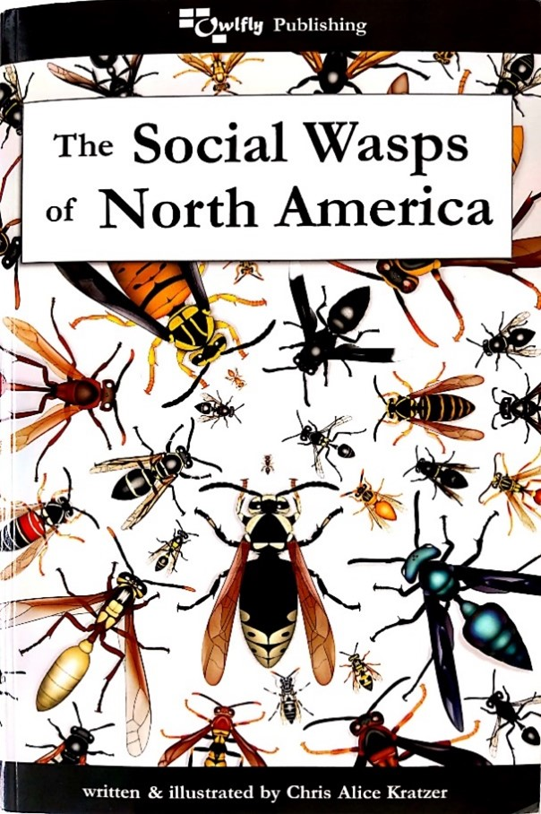

```{r, include=FALSE}
source("../../share/setup.R")
```

```{r, child="../../share/header_html.Rmd"}
```

# An Alaska review of *The Social Wasps of North America*

*by Alexandria Wenninger^[University of Alaska Fairbanks Cooperative Extension Service Integrated Pest Management Program, akwenninger@alaska.edu]*

*The Social Wasps of North America*, written and illustrated by Chris Alice Kratzer, is a visual guide to all 208 species of social vespines, polistines, and crabronids known from North America, from Alaska east to Greenland and south to Panama. Alaska is home to 11 of these species belonging to the genera *Dolichovespula* (6 species) and *Vespula* (5 species), which we often call ‘yellowjackets’. Yellowjackets provide important ecosystem services in Alaska through their roles in predation, pollination, and decomposition. Despite their importance, public perception of yellowjackets is often negative due to their propensity to sting in defense of their nest. It is refreshing to see these important insects receive some positive media attention through this guide, and to see it written in a way that is accessible to a general audience.

```{r waspbook, fig.alt="A book cover with illustrations of wasps on it", fig.cap="Cover of *The Social Wasps of North America*"}

```

The first part of the guide focuses on the ecology and evolution of social wasps. This section is informative but also written in a conversational tone and peppered with small bits of humor, making it an enjoyable read. Also included is a chapter about why wasps sting and how to avoid it, which is written in a way that gives some context of a wasp’s perspective of humans and how our own behavior can elicit a defensive reaction from social wasps. While this section is short, this may be one of the most helpful sections for a general audience, as having some understanding of the mechanisms behind why wasps sting can give folks a sense of agency over their interactions with social wasps.

For those who already have some familiarity with social wasps the highlight of the book is the illustrating. Each species includes a dorsal illustration, often one for each male and female wasp, as well as an illustration of the face. What is particularly impressive about the illustrations for the vespines is that each illustration is split down the middle with one side showing a melanic color form and the other side showing a xanthic, ferruginous, or leucistic color form as applicable. Our yellowjackets found in Alaska often tend to lean more melanic, so it was elating to find some of the intraspecific color variation represented in this guide, and cleverly shown in a way that doesn’t take up extra space. The illustrations are truly a delight and future illustrators working with groups of insects that exhibit color variability should consider this style of illustration. 

Overall this is an excellent visual introduction to the social wasps of North America that both wasp enthusiasts and entomologists can appreciate. As a visual guide, you won’t find a depth of information about any individual species nor identification keys, but you will find careful attention to illustration detail and an impressive comprehensiveness of taxa for such a large geographic area of interest.  
