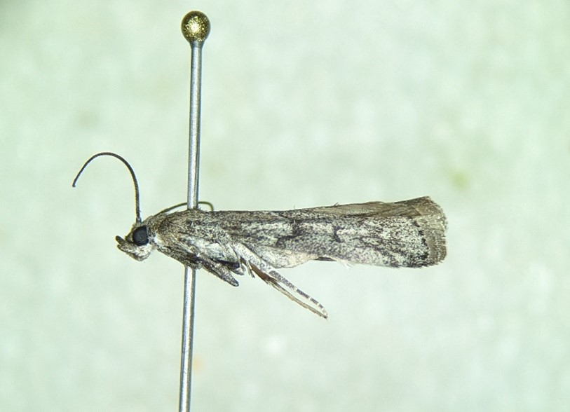

```{r, include=FALSE}
source("../../share/setup.R")
```

```{r, child="../../share/header_html.Rmd"}
```

# The beehive honey moth as a pest of stored honey bee comb in Alaska

*by Alexandria Wenninger*^[University of Alaska Fairbanks Cooperative Extension Service Integrated Pest Management Program, akwenninger@alaska.edu]

(ref:beehivecombalt) A honeycomb with caterpillars, webbing, and frass on it.

(ref:beehivecombcap) Larvae, webbing, and frass on stored honey bee comb photographed by beekeeper Tim Huffman. Anchorage, AK, April 2021.

```{r beehivecomb, fig.alt="(ref:beehivecombalt)", fig.cap="(ref:beehivecombcap)"}
knitr::include_graphics('img/beehive_comb.jpg')
```

## Background

The beehive honey moth, *Vitula serratilineella* Ragonot, 1887, has been found to be a pest of stored comb of managed honey bees (*Apis mellifera* Linnaeus, 1758) in Alaska. In spring of 2021, an Anchorage beekeeper reached out regarding suspected wax moth activity in stored frames of drawn honeycomb. Lepidopteran larvae were found tunneling through masses of silk webbing and frass built on top of the comb (Figure \@ref(fig:beehivecomb)). There are two well-known species of wax moths that infest domestic bee hives in North America: the greater wax moth *Galleria mellonella* (Linnaeus, 1758) and the lesser wax moth *Achroia grisella* (Fabricius, 1794), neither of which are known from Alaska. Wax moths are destructive pests of stored comb, however, they are not known for being particularly cold-hardy which makes most regions of Alaska unsuitable for their establishment; temperatures below 20 °F kill all life stages within a few hours [@GulatiKaushik2004]. Interestingly, several beekeepers have found similar damage on stored comb in both Anchorage and Fairbanks, Alaska, both areas that regularly see winter temperatures well below 20 °F for extended periods of time, leading to suspicion that the apiculture pest seen by Alaska beekeepers was neither of the well-known wax moth species. Upon rearing and examination, the specimens collected by the Anchorage beekeeper in 2021 were identified as a common but lesser-known native pest of bee nests, the beehive honey moth, *Vitula serratilineella*^[Rearing and morphological identification were done by A. Wenninger. Molecular identification was conducted by Jozef Slowik, IPM Technician, University of Alaska Fairbanks Cooperative Extension Service, following the methods of @Hebertetal2003]. 

## Beehive honey moth, *Vitula serratilineella* 

The beehive honey moth is native to Western North America where it is known to feed on pollen, honey, and/or larval remains in nests of bumble bees (*Bombus* spp.), leafcutter bees (*Megachile* spp.), domestic honey bees (*Apis mellifera*), and occasionally in association with nests of other Hymenoptera such as yellowjackets (subfamily Vespinae) [@Spencer1960; @Williams1978; @Winstonetal1981; @Neunzig1990]. The beehive honey moth is also a minor pest of dried fruit, including apples, prunes, raisins, etc., and is referred to as the ‘driedfruit moth’ in some literature [@Neunzig1990]. 

*Vitula serratilineella* was first described in 1887 but the species description did not include any information about ecology or known feeding habits [@Ragonot1887]. In 1920, a beekeeper from British Columbia discovered larvae feeding on honey in stored frames that were only partially capped before harvest; after rearing the larvae the beekeeper was able to identify the pest as *V. serratilineella* which he referred to as “a honey-feeding larva” [@Cockle1920]. The beehive honey moth is recognized as a substantial pest of honeycomb in British Columbia [@Winstonetal1981; @GovernmentofBritishColumbia2020], however this moth seems to be somewhat of a forgotten beekeeping pest in recent American literature, despite being regarded during the 1960’s and 70’s as a common and economically important pest of beekeeping in the Western United States [@Okumura1966; @Williams1978]. While the greater wax moth (*G. mellonella*) is considered to be the most important lepidopteran pest of stored honey bee comb globally [@Williams1978], its inability to tolerate prolonged subfreezing temperatures precludes it from being a significant pest for Southcentral and Interior Alaska beekeepers. The beehive honey moth is likely to be the most significant lepidopteran pest of stored comb in Alaska. 

## Identification

The larvae of the beehive honey moth (subfamily Phycitinae) (Figure \@ref(fig:beehivelarva)) can be distinguished from the larvae of both the greater and lesser wax moths (subfamily Galleriinae) by the presence of a sclerotized ring surrounding the seta above the spiracle (SD1) on the second thoracic segment (T2) [@ByrneMoyle2019]. See @Weisman1991 for distinguishing among lepidopteran larvae as pests of stored products.

(ref:beehivelarvaalt) A pale caterpillar in a vial.

(ref:beehivelarvacap) A close-up of a larva collected from stored comb, 22 April 2022.

```{r beehivelarva, fig.alt="(ref:beehivelarvaalt)", fig.cap="(ref:beehivelarvacap)"}

```

The adult beehive honey moth forewings are greyish brown in color with distinct dentate transverse lines (Figure \@ref(fig:beehiveadult)) [@Ferguson1991]. The adult is ~1.3 cm in length. Vitula edmandsii is similar in appearance but is native to Eastern North America and has brown hindwings as opposed to the white hindwings of V. serratilineella. See @Neunzig1990 for distinguishing among genera of Phycitinae; see @Ferguson1991 for distinguishing among adult moths found as stored product pests.

The Mediterranean flour moth (Ephestia kuehniella Zeller, 1879) also looks similar to the beehive honey moth and there is one record of this species collected from beehive components in Alaska (December 2009, Arctos record UAMObs: Ento: 113244). The Mediterranean flour moth is a cosmopolitan pest of cereal products that is known to occasionally infest stored comb containing pollen however it is unable to develop on brood comb or dead insects and is not considered to be a serious pest of beehives (Williams 1978). The keys provided by Weisman (1991) and Ferguson (1991) can be used to distinguish between larvae and adults (respectively) of the Mediterranean flour moth and the beehive honey moth, as well as several other lepidopteran pests of various stored products. (Note that the aforementioned keys reference the Mediterranean meal moth using the synonym Anagasta kuehniella and the beehive honey moth using the synonym Vitula edmandsii serratilineella.) Okumura (1966) also provides an abbreviated key specifically to distinguish between larvae of these two species. 

(ref:beehiveadultalt) A small, slender, mottled gray moth preserved on an insect pin.

(ref:beehiveadultcap) An adult beehive honey moth, reared from a larva infesting stored comb (larva collected 22 April 2022, adult emerged 12 May 2021).

```{r beehiveadult, fig.alt="(ref:beehiveadultalt)", fig.cap="(ref:beehiveadultcap)"}

```


## References
