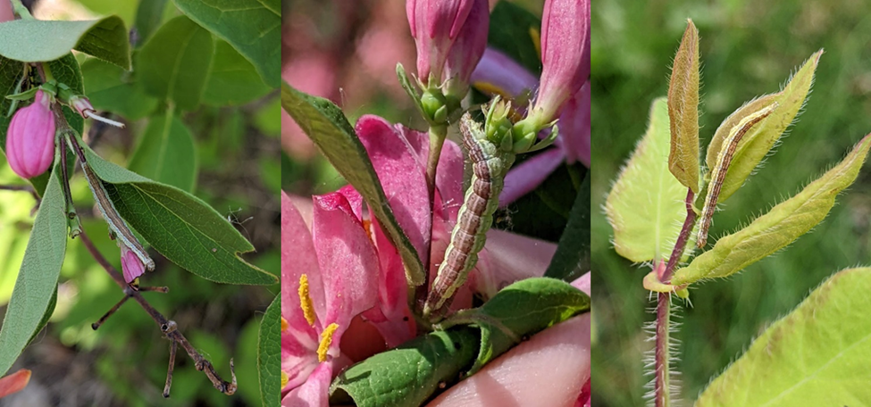

```{r, include=FALSE}
source("../../share/setup.R")
```

```{r, child="../../share/header_html.Rmd"}
```

# Defoliation of haskap shoots by the honeysuckle moth in Southcentral Alaska

*by Alexandria Wenninger*^[University of Alaska Fairbanks Cooperative Extension Service Integrated Pest Management Program, akwenninger@alaska.edu]

The honeysuckle moth (*Ypsolopha dentella* (Fabricius, 1775)) has been identified as a defoliator of developing shoots on haskap (aka ‘honeyberry’ or ‘blue honeysuckle’, *Lonicera caerulea* Linnaeus) in Southcentral Alaska. Haskap is a cold-hardy ornamental shrub that is grown for its edible berries in Alaska, however little information is available regarding insect pests of haskap in North America. Several instances of shoot defoliation on haskaps and ornamental honeysuckles were reported from Anchorage and the Matanuska-Susitna Valley in late May and early June of 2022 leading to an investigation into the identity and life history of this non-native defoliator (Figure \@ref(fig:honeysuckledamage)). 

(ref:honeysuckledamagealt) Three pictures of green and brown striped caterpillars on honeysuckles.

(ref:honeysuckledamagecap) Left and Middle: Late instar larvae blending in with stems on ornamental Tatarian honeysuckle. Photographed 8 June 2022 in Anchorage, AK by A. Wenninger. Right: Late instar larva on a haskap shoot, note the two-toned color pattern of the reddish stripe up the green haskap stem. Photographed 14 June 2022 by A. Wenninger.

```{r honeysuckledamage, out.width='100%', fig.alt="(ref:honeysuckledamagealt)", fig.cap="(ref:honeysuckledamagecap)"}

```


## References
