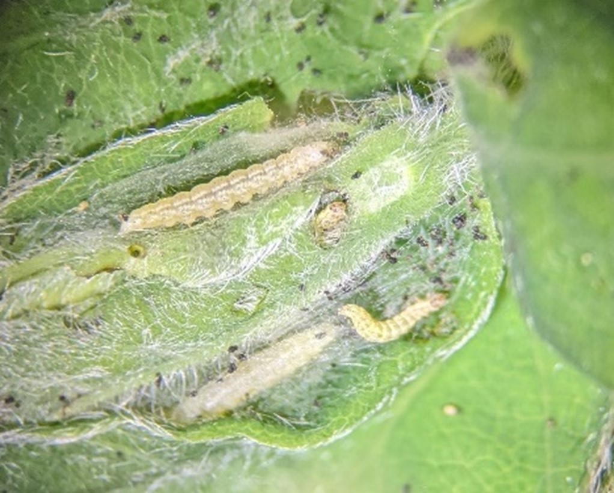
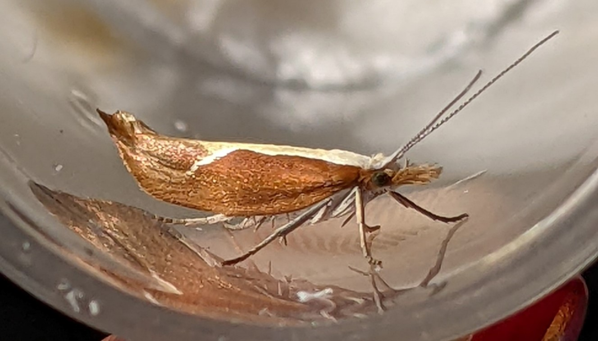

```{r, include=FALSE}
source("../../share/setup.R")
```

```{r, child="../../share/header_html.Rmd"}
```

# Defoliation of haskap shoots by the honeysuckle moth in Southcentral Alaska

*by Alexandria Wenninger*^[University of Alaska Fairbanks Cooperative Extension Service Integrated Pest Management Program, akwenninger@alaska.edu]

The honeysuckle moth (*Ypsolopha dentella* (Fabricius, 1775)) has been identified as a defoliator of developing shoots on haskap (aka ‘honeyberry’ or ‘blue honeysuckle’, *Lonicera caerulea* Linnaeus) in Southcentral Alaska. Haskap is a cold-hardy ornamental shrub that is grown for its edible berries in Alaska, however little information is available regarding insect pests of haskap in North America. Several instances of shoot defoliation on haskaps and ornamental honeysuckles were reported from Anchorage and the Matanuska-Susitna Valley in late May and early June of 2022 leading to an investigation into the identity and life history of this non-native defoliator (Figure \@ref(fig:honeysuckledamage)). 

(ref:honeysuckledamagealt) Three pictures of green and brown striped caterpillars on honeysuckles.

(ref:honeysuckledamagecap) Left and Middle: Late instar larvae blending in with stems on ornamental Tatarian honeysuckle. Photographed 8 June 2022 in Anchorage, AK by A. Wenninger. Right: Late instar larva on a haskap shoot, note the two-toned color pattern of the reddish stripe up the green haskap stem. Photographed 14 June 2022 by A. Wenninger.

```{r honeysuckledamage, out.width='100%', fig.alt="(ref:honeysuckledamagealt)", fig.cap="(ref:honeysuckledamagecap)"}
knitr::include_graphics('img/honeysuckle_image1.png')
```

## Honeysuckle Moth Life History

Honeysuckle moth caterpillars were found feeding on host plants late May through mid-June in both Anchorage and the Matanuska-Susitna Valley. Early instar caterpillars feed within developing leaf shoots, producing silk which keeps the developing leaves loosely clasped together into a retreat, protecting the feeding caterpillars (Figure \@ref(fig:honeysucklefeeding)). The early instar caterpillars are pale yellowish in color with green longitudinal stripes down the dorsum and many long, dark setae speckling their abdomens. Later instar caterpillars develop a wide, reddish stripe down the dorsum, which appears to mimic the two-toned coloration of haskap and ornamental honeysuckle stems (Figure \@ref(fig:honeysuckledamage)). The caterpillars display notable quick and erratic “wiggling” movements when disturbed, and upon reaching the edge of the leaf may leap from the host plant by a silken thread affixed to their retreat in a process other authors have named “bungee-jumping” [@Eisneretal2005]; soon after making the leap they return to the retreat by pulling themselves up by their mouthparts, folding the silken thread as they go. Pupation occurs within a spindle-shaped silken covering on or near the host plant. Adults at rest are ~12 mm long and appear reddish brown laterally with a pale dorsal band that makes a ventral turn posteriorly; when viewed laterally the posterior end appears upturned (“apically falcate”) and the face features a brush of setae projected forward (Figure \@ref(fig:honeysuckleadult)). Adults have been observed in Anchorage from early July through August (University of Alaska Museum records accessed 6 June 2022 via Arctos and iNaturalist records accessed 15 July 2022). Information about the overwintering of this species is scarce, but it is thought that eggs are laid on the host plant in late summer and the species overwinters as an egg [@Wall2005; @Montgomeryshiremothgroup2009]. 

(ref:honeysucklefeedingalt) Small caterpillars and frass inside an opened bud.

(ref:honeysucklefeedingcap) Early instar larvae feeding within a silk-tied haskap shoot; the outer leaves have been removed to reveal the larvae within. Photographed 23 May 2022 by A. Wenninger.

```{r honeysucklefeeding, fig.alt="(ref:honeysucklefeedingalt)", fig.cap="(ref:honeysucklefeedingcap)"}

```

(ref:honeysuckleadultalt) A slender brown moth witha dorsal green stripe on its wings rests in a vial.

(ref:honeysuckleadultcap) Adult honeysuckle moth. Reared from a caterpillar, photographed 23 June 2022 by A. Wenninger.

```{r honeysuckleadult, fig.alt="(ref:honeysuckleadultalt)", fig.cap="(ref:honeysuckleadultcap)"}

```


## References
