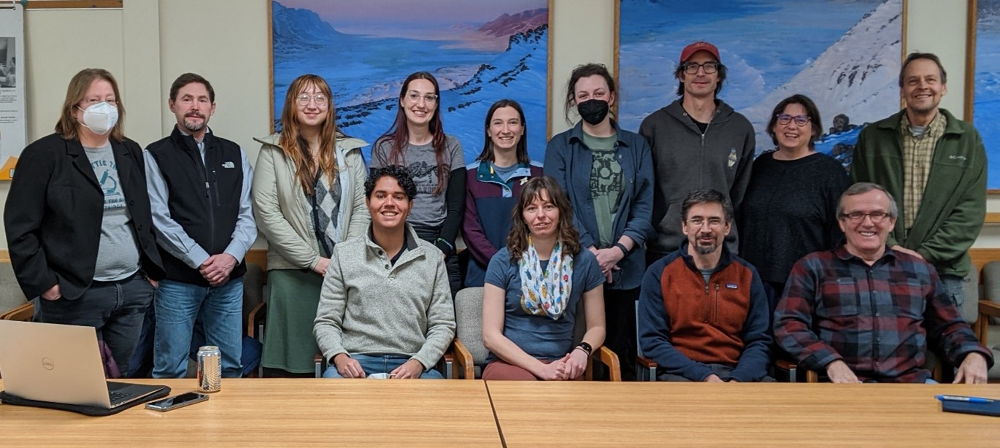

```{r, include=FALSE}
source("../../share/setup.R")
```

```{r, child="../../share/header_html.Rmd"}
```

# Review of the sixteenth annual meeting

*by Dana Brennan^[Alaska Department of Natural Resource, Anchorage, Alaska, <danambrenn@gmail.com>]*

The sixteenth annual Alaska Entomological Society meeting was held at the Department of Natural Resources building in Fairbanks and virtually via Zoom on February 17, 2023. We are grateful to the Fairbanks DNR group for offering us the space.

```{r meeting, out.width='100%', fig.alt="A picture of two rows of people in a conference room.", fig.cap="Members present at the meeting. Back row, from left: Robin Andrews, Curtis Knight, Jina Malone, Alex Wenninger, Sayde Ridling, Taylor Kane, Joey Slowik, Julie Riley, Dennis Fielding. Front row, from left: Thalles Pereira, Dana Brennan, Derek Sikes, Roger Burnside."}

```

## Presentations

**Jason Grant**, a plant taxonomist based in Switzerland, regularly returns to Fairbanks and spends time documenting moths and other organisms he finds outside using iNaturalist. In his talk, “Notable observations and potential range extensions of moths in Alaska,” Grant discussed methods for attracting and documenting moths, making identifications, and some exciting finds, including species not previously documented in Alaska. In the future, Grant plans to continue looking for moths, possibly starting a moth week sampling event, and depositing reference specimens for museum curation. 

**Alex Wenninger** looped us in on the goings on at Cooperative Extension Service in Anchorage in her IPM highlight reel. Her presentation showed exciting, new, and unusual finds, including: honeysuckle moth, a well-documented pest of haskaps; pale green weevil; California horntail; pear slug; raspberry leafminer&mdash;though only a eulophid parasitoid was reared; black-beaked green weevil; apple seed Chalcid, which causes dimpling in crab apples; and biological control agents for yellow toadflax: a flower feeding beetle and a seed capsule feeding weevil.

In another talk on the citizen science application, iNaturalist, **Sayde Ridling** presented “Using iNaturalist as a Bioblitz Tool.” Ridling discussed the benefits and costs of using iNaturalist for bioblitz events and some of the cool things found during these events. For instance, the Beaver Creek iNaturalist-based bioblitz had more taxa recorded than all area efforts from 1912 to present combined! While using the application makes for easy open access data and community involvement, iNaturalist bioblitz events can lack the networking opportunities and physical collections important for novel area species. It is likely that more bioblitz events will use iNaturalist, so it is important to account for the weaknesses of an application-based bioblitz when planning.

**Derek Sikes** gave us a call to action in his talk, "How many species? A comparison of Alaska’s to Sweden’s entomofauna.” When comparing Alaska entomofauna to Sweden’s, Sweden has four times the documented species, even though Alaska is substantially larger in size! Sikes gave several reasons that could explain this difference. When comparing species richness, Hymenoptera are most specious in Sweden while Diptera are most specious in Alaska. Looking forward, if we want to better document the species diversity in Alaska, Sikes emphasizes we need to substantially increase our documenting efforts now, as many of our species will be impacted by the changing climate.

**Liz Graham** filled us in on recent hemlock sawfly and western blackheaded budworm activity in Southeast Alaska. Since first being reported from the public in 2018, the hemlock sawfly outbreak peaked in 2019 before the population crashed in 2020. At this time, western blackheaded budworm populations began to increase, leading to detectable hemlock mortality and topkill in 2021. In 2022, western blackheaded budworm feeding shifted more to Sitka spruce. Diseased caterpillars have been found on the landscape, suggesting natural population controls are taking course to bring an end to the outbreak. For now, surveying will continue and various projects related to these outbreaks are in the works.

In “2022 Southcentral Forest Health Roundup,” **Jason Moan** updated participants on the goings on in his office. The rusty tussock moth outbreak is now over, and egg masses sent for study returned with heavy parasitism from a new Alaska record, *Telenomus dalmani*. Whether this parasitoid has always been here and or is a new arrival into Alaska is unclear. The spruce beetle outbreak continues, with 48,800 acres of new mortality mapped, mostly in Chugach National Forest and the Cantwell area. Damage in black spruce is being observed, where failed spruce beetle galleries and Ips galleries have been found, suggesting they may be working synergistically in smaller diameter spruce trees.

**Jackson Audley** gave us an update on continued spruce beetle tree protection research in his presentation, “Development of a semiochemcial repellent to protect spruce trees from spruce beetle in Alaska.” For the last few years, the USFS Pacific Southwest Research Station has been testing various semiochemical treatments applied to trees in many western states to determine what is most effective at protecting spruce from spruce beetle mass attacks. Various formulations have been tested, and there’s promising results that could provide single tree protection from attacks. Research is ongoing and more trials will be conducted in 2023; look for papers from this group to learn more!

In, “Discovery of gnat snakeworms in Alaska: a new species of *Sciara* Meigen (Diptera: Sciaridae) based on morphological, molecular, and citizen science data,” **Thalles Pereira** gave us a look into some exciting research he is in the process of publishing regarding these flies and their unusual behaviors. Since the paper is in progress to describe this new species, we will save the details of the talk for now, so be on the lookout for Pereira’s paper coming soon!

Thanks to our sole student presenter, **Robin Andrews**, who returned to the AKES meeting to present her recent work, “Chasing ^13^C labeled recent photosynthate through belowground soil fauna food webs and finding it almost everywhere.” After collecting soil cores at various times after dosing trees with ^13^C and comparing those values to baseline data, trophic levels can be determined and grouped. Future work will focus on validating those groupings and separating fungivores from faunivores. We are happy to learn more about her work and congratulate her on winning the student presentation award.  


## Business items – highlights

The society discussed the idea of having the meeting over two days, which would allow for a shorter time commitment for each day to accommodate for those who must take time off work to attend. Ideas for a split day meeting included having a keynote or social event or student presentations the evening before and the main meeting the following day.

-	Replacement for Bioquip gift awards for science fair winners was discussed. It was agreed to give recipients $25 cash.
-	Creating AKES t-shirts was discussed again, a committee was formed to finalize a design, and an amount was agreed upon for the commission of a new design.
-	AKES newsletters will be databased with the UAF library so they are available in perpetuity.
-	In the future, there may be funding available for travel for society members that would like financial assistance to attend meetings. 
-	Current officers were retained: Dana Brennan (president), Robin Andrews (vice president), Taylor Kane (secretary), and Roger Burnside (treasurer).

Minutes from our business meeting are available on the website.


