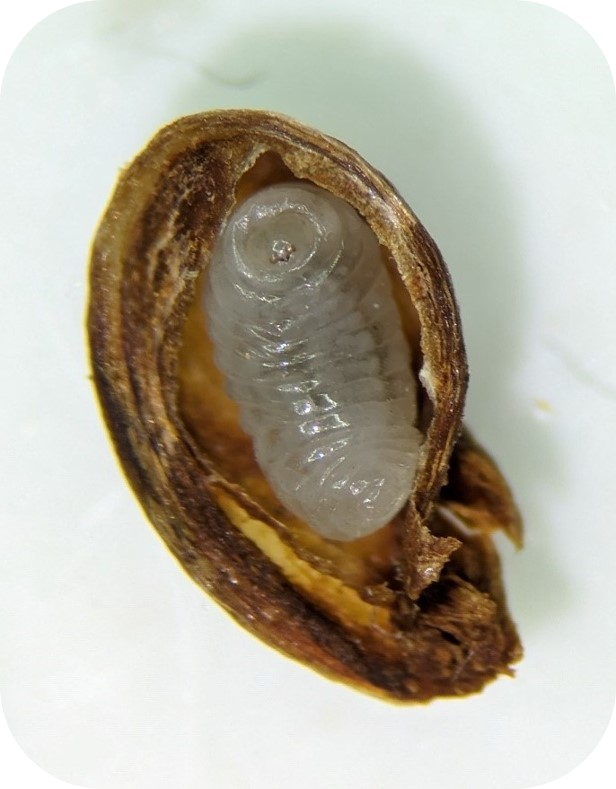
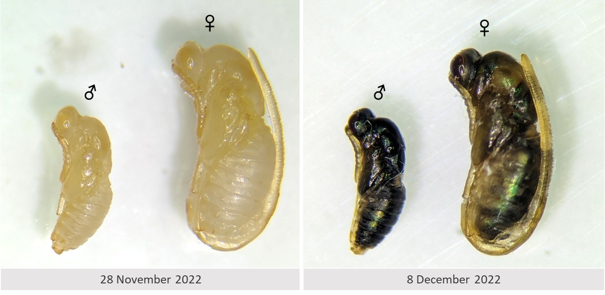
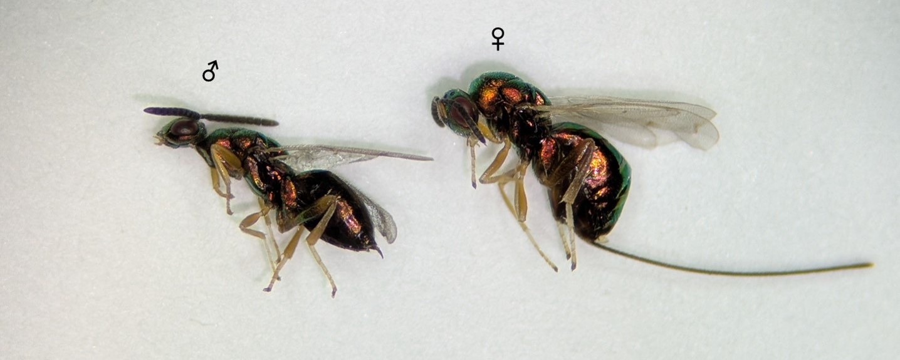
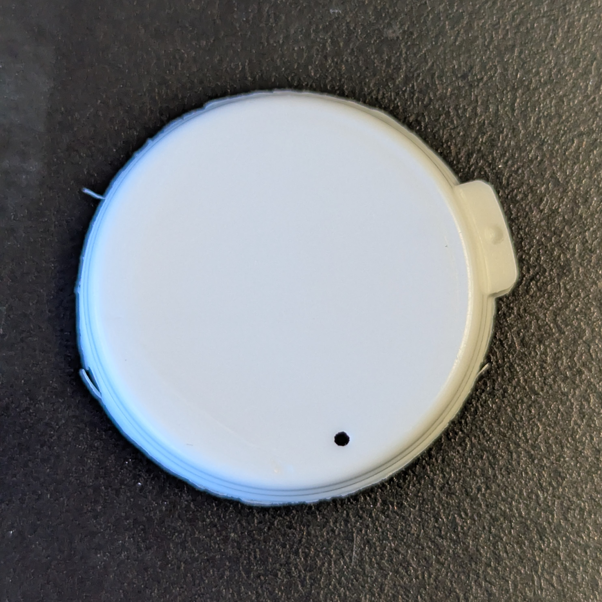
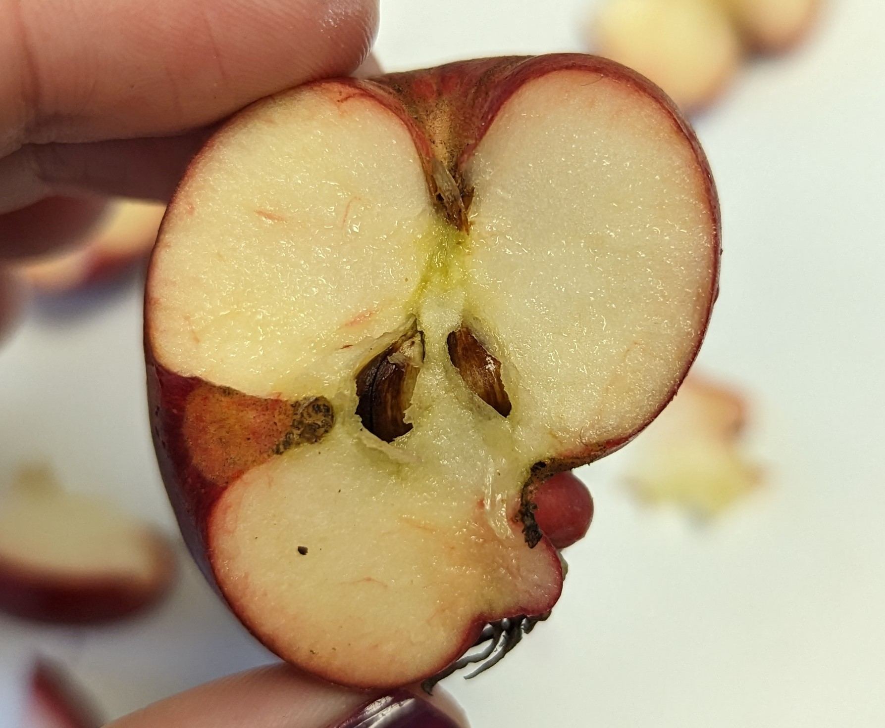

```{r, include=FALSE}
source("../../share/setup.R")
```

```{r, child="../../share/header_html.Rmd"}
```


# Seed-feeding and fruit deformity of crabapple caused by the apple seed chalcid in Southcentral Alaska

*by Alexandria Wenninger*^[University of Alaska Fairbanks - Institute of Agriculture, Natural Resources, and Extension - Integrated Pest Management Program, akwenninger@alaska.edu]

(ref:chalcid1alt) A brown apple seed opened lengthwise with a white grub-like larva inside.

(ref:chalcid1cap) An apple seed that has been partially opened to reveal the chalcid larva inside. Photographed 13 December 2022.

```{r chalcid1, fig.alt="(ref:chalcid1alt)", fig.cap="(ref:chalcid1cap)"}

```

## Introduction

The apple seed chalcid (*Torymus druparum* @Boheman1834) has been identified as a seed-feeding insect of apple (*Malus* sp.) in Southcentral Alaska. Small larvae were initially discovered in the seeds while processing apples grown in Wasilla, Alaska in October 2022 (Figure \@ref(fig:chalcid1)). The affected Alaska apples were reported to be of the variety Kerr, which is an edible crabapple that was developed in Manitoba, Canada in 1952 by cross breeding the Dolgo crabapple (Siberia, Russia) with the Haralson apple (Minnesota, USA). Reared specimens were sent to chalcidoid taxonomist Dr. Petr Janšta for identification.

## Apple Seed Chalcid Description & Life History

The apple seed chalcid oviposits into a host fruit in spring; work in Eastern North America found that the eggs are laid in June into developing apples that are ~1–1.5 cm in diameter [@Crosby1909]. The female wasp inserts her long ovipositor through the fruit, ovipositing directly into the developing seed [@Crosby1909]. Larvae of the apple seed chalcid are white in color, translucent, and reach ~3–5 mm in length^[Earlier literature describes the larvae as 2.5–3.5 mm in length, dependent upon the size of the seed [@Crosby1909]. The Alaska larvae I measured range slightly larger at 3–5 mm. The apple seeds I measured ranged 7–9 mm in length. The Alaska seeds were from the apple variety Kerr which an edible crabapple developed by cross breeding a Dolgo (crabapple) with a Haralson (apple); it’s possible that this crab variety could produce larger seeds than the crabapples examined by [@Crosby1909]. It is also worth noting that the larvae measure 1–2 mm longer when alive compared to their length after preservation in 70% ethyl alcohol.] (Figure \@ref(fig:chalcid1)). They are legless but feature sclerotized, pointed mandibles. The larvae feed within the seed, consuming the entirety of the kernel. While several eggs may be laid and hatch into larvae within a single seed, only one larva is typically able to develop to a fifth instar within one seed; the ultimately maturing larva kills and consumes the additional larvae within the seed [@Cushman1916]. The species overwinters as a late-instar larva before pupating and emerging as an adult. Pupation may occur either the following spring (annual life cycle) or in the second spring (biennial life cycle); delayed emergence to the second spring may be more typical when the fruit does not substantially decay off of the core before the first spring [@Turnipseed1960]. @Cushman1916 suspects this delayed emergence in some offspring may be an adaptation to overcoming seasons of poor fruit set. Female pupae (~4 mm) are larger than male pupae (~3 mm) and can be distinguished by the presence of the ovipositor which is held folded up over the dorsum (Figure \@ref(fig:chalcid2)). Initially, pupae are entirely a pale off-white color; as time proceeds the eyes turn a bright red color, and next the pupae begin to darken to brown and a greenish reflection becomes visible through the thin, clear pupal casing (Figure \@ref(fig:chalcid2)). Adult wasps have a shiny metallic green to brown body color with yellow to orange legs and reach ~4–5 mm in length, with males being slightly smaller than females (Figure \@ref(fig:chalcid3)).

(ref:chalcid2alt) A box on the left labeled “28 November 2022” shows two pale off-white pupae. The pupa labeled “male” is about two-thirds the length of the pupa labeled “female”. The two pupae look morphologically similar except the pupa labeled “female” has a long ovipositor which is visible starting posteriorly and wraps up along the dorsum, reaching the mesosoma. A box on the left labeled “8 December 2022” shows the same two pupae except their color is now a dark brown with hints of greenish refulgence.

(ref:chalcid2cap) Pupal development. Left – the first day pupae were observed (28 November 2022). Right – the same pupae photographed 10 days later (8 December 2022). (These two pupae both eclosed by 13 December 2022.)

```{r chalcid2, fig.alt="(ref:chalcid2alt)", fig.cap="(ref:chalcid2cap)"}

```


(ref:chalcid3alt) Two adult wasps, with the male shown on the left and the female on the right, over a white background. Both wasps have a metallic brown to green appearance with pale, yellow legs. 

(ref:chalcid3cap) Adult apple seed chalcid wasps, male (left) and female (right).

```{r chalcid3, fig.alt="(ref:chalcid3alt)", fig.cap="(ref:chalcid3cap)"}

```

## Records & Distribution 

Apple seed chalcids were first recorded in North America in 1906 [@Crosby1908] from both native and cultivated crabapples in Ithaca, New York, USA.  Early records list the species as *Torymus druparum* Boheman, 1834 (syn. *Syntomaspis druparum*). Later reviews of *Torymus* consider *T. druparum* to be Palearctic in distribution and treat the Holarctic species *Torymus varians* [@Walker1833] as the species that occurs in apple seeds in North America [@Grissell1976]. While both *T. varians* and *T. druparum* occur in Europe, the European review of *Torymus* [@DeVereGraham1998] puts *Malus* (apple) as the host for *T. druparum* and *Crataegus* (hawthorn) as the host for *T. varians*, conflicting with the North American records which place *T. varians* on both *Malus* and *Crataegus* spp. hosts [@Noyes2019]. The published morphological differences between these two species are relatively minor, described as small differences in the shape of the antennal anellus and head width [@DeVereGraham1998]. 

To help sort out some of the confusion about which species we may have here in Alaska I consulted Dr. Petr Janšta, Hymenoptera Curator at the State Museum of Natural History in Stuttgart, Germany (Staatliches Museum für Naturkunde Stuttgart). Dr. Janšta has experience with both species and has found that while typically *T. varians* develops on *Crataegus* hosts and *T. druparum* develops on *Malus*, uncommonly they can switch hosts, and further complicating matters, the two species may also hybridize (Dr. Petr Janšta, personal communication 29 November 2022). In January 2023, I sent several male and female specimens to Dr. Janšta for identification. Dr. Janšta identified the specimens as *T. druparum* based on morphological features, and added that his opinion is that the two species are more host-specific (*T. druparum* on *Malus* sp. and *T. varians* on *Crataegus* sp.) than is mentioned in the literature (Dr. Petr Janšta, personal communication 16 March 2023).


## Rearing Methods

I use the general methods outlined by @Eiseman2016 for rearing. The samples I received 21 October 2022 included a variety of plain seeds, cores, and whole apples that were suspected to contain the larvae, and came from apples that had been stored outside in a tote after harvest where temperatures fluctuated between 20 °F to 45 °F according to the donor of the samples. To simulate a continuation of winter diapause, all samples were held in the refrigerator without any further preparation until 16 November 2022. On 16 November I prepared the insects for rearing by separating the seeds from the apple or core sample and briefly rinsed the seed in water to remove most of the decaying fruit from the outside of the seed. A few larvae were removed from their seeds for observation. Each larva or rinsed seed was placed singly in a prepared vial; for this species I used 5-dram clear polystyrene plastic vials (Thornton Plastics) with 1 sheet of toilet paper crumpled and pressed into the bottom of the vial and moistened with a couple drops of water. The prepared vials were separated into 3 subsets: one subset that was held at room temperature (~68 °F to 72 °F) and two subsets that went back in the refrigerator to be removed at a later time in case a longer diapause was required for development. If mold appeared in the vial I moved the specimen into a clean, newly prepared vial. (To prevent data loss through the vial changing process I find it easiest to put the collection data on the lid, keeping the same lid with the specimen through each vial change.) Note that adults of this species need to be removed from the vials promptly after emergence; within a day or two the adult wasps are capable of releasing themselves from captivity by chewing a 1 mm circular hole in the lid of the snap caps on the vials (Figure \@ref(fig:chalcid4)), much to my chagrin.

(ref:chalcid4alt) A white circular cap with a tiny circular hole near the rim in front of a black background.

(ref:chalcid4cap) An escape hatch measuring 1 mm in diameter created by an adult apple seed chalcid. These escapes largely occurred with wasps which had emerged over weekends when I was not at the office to monitor them. 

```{r chalcid4, fig.alt="(ref:chalcid4alt)", fig.cap="(ref:chalcid4cap)"}

```

For the first subset of samples which were removed from refrigeration on 16 November, pupae were first observed on 28 November and first adults emerged 13 December. The pupal development period has previously been reported to take ~4 weeks time [@Cushman1916], however, many wasps were able to develop in nearly half that time under the rearing conditions described here. The first larvae to develop to adults were those that were removed from their seeds, suggesting that a larva removed from its seed may develop more quickly. By 16 December all 4 larvae which had been removed from their seed had emerged so I went ahead and opened the remaining 24 seeds. All 24 seeds contained a larva, none had advanced to the pupal stage, which is consistent with the idea that they may develop more quickly when removed from the seed. All remaining 24 larvae were removed from their seed and placed back into their respective vials to continue development, the adults of which had a more extended emergence period that continued until 7 April 2023. Another advantage of removing the larva from the seed is that the wasps can then be sexed at the pupal stage rather than waiting for adult emergence (Figure \@ref(fig:chalcid2)). On 13 December I removed a second subset of the larvae from the refrigerator; I extracted all larvae from their respective seeds, returned each insect to its respective vial, and kept them at room temperature to develop. All adults from this subset emerged between 9-11 January 2023.

(ref:chalcid5alt) A misshapen apple cut in half lengthwise; a clear divot reaching to the core is visible on the left side of the apple and the bottom right side is underdeveloped.

(ref:chalcid5cap) A cross-section of an apple that contains several chalcid larvae within the seeds. Repeated oviposition by this species can cause scars on the developing fruit and can lead to dimpling of the fruit once developed. Photographed 16 November 2022.

```{r chalcid5, fig.alt="(ref:chalcid5alt)", fig.cap="(ref:chalcid5cap)"}

```

## Integrated Pest Management

The apple seed chalcid is generally not considered to be a pest of economic importance as infested apples typically are still marketable and often don’t show signs of infestation [@Cushman1916]. Crabapples and other small-size apple varieties may be more prone to heavy infestation than others, possibly because the wasp’s ovipositor is better able to reach the seed through the fruit in these smaller varieties [@Crosby1909; @Cushman1916]. Heavy infestation can cause scarring or dimpling of the fruit (Figure \@ref(fig:chalcid5)). @Crosby1909 describes the damage caused by oviposition punctures as “distinct depressions [that] give the apple a decidedly knotty form”. The damage from apple seed chalcid can be mistaken for other conditions such as poor pollination or damage from other insects. Distorted fruit from the chalcid can be distinguished from poor pollination by opening the apple and checking the seeds: if the core lacks developed seeds then poor pollination is likely [@Turnipseed1955].  

Because crabapples are a popular choice in Alaska due to their cold-hardiness, Alaska has the potential to be disproportionately affected by this insect relative to other areas of the United States. One way to help manage damage in orchards is to rake up any dropped apples off the ground and dispose of or destroy them in the fall, thereby reducing the number of wasps able to emerge in spring to infest new apples on the tree [@Pettit1922]. 

The apple seed chalcid previously was an economic concern for those gathering seeds from which to grow nursery stock. Loss from infested seed was managed by obtaining seeds from apples that had gone through processing at cider mills; the process by which the machines wash out the pomace eliminates the seeds containing larvae as the infested seeds are lighter weight than the viable seeds [@Crosby1909]. 


## Reporting

Observations of the apple seed chalcid can be submitted directly to Integrated Pest Management Technician Alex Wenninger via email at <akwenninger@alaska.edu> or via our monitoring portal at <https://alaskapestreporter.org>.  Please include the variety of apple in your report if known – I am curious to monitor which apple varieties in Alaska may be affected by the apple seed chalcid.  

## Acknowledgments

Thank you to Dr. Petr Janšta, Hymenoptera Curator at State Museum of Natural History Stuttgart, Germany, for identifying the species of Torymus. Thank you to Robert Mennis for providing the affected apple samples. Reference specimens will be deposited into the University of Alaska Museum of the North Insect Collection. This work was supported by funds from the Western Region of the National Plant Diagnostic Network and the Crop Protection and Pest Management Program (grant no. 2024-70006-43668) of the USDA National Institute of Food and Agriculture.

## References
