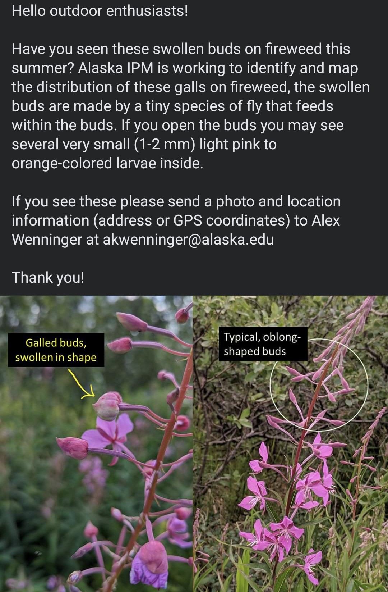
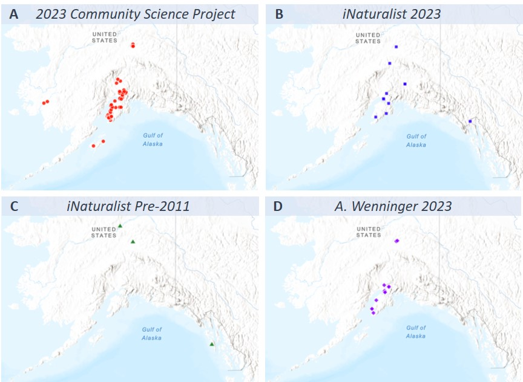

```{r, include=FALSE}
source("../../share/setup.R")
```

```{r, child="../../share/header_html.Rmd"}
```


# Community science collaboration enhances understanding of fireweed flower gall midge distribution in Alaska

*by Alexandria Wenninger*^[University of Alaska Fairbanks - Institute of Agriculture, Natural Resources, and Extension - Integrated Pest Management Program, Anchorage, Alaska, akwenninger@alaska.edu]

(ref:fireweedgall1alt) A three-panel photo; on the left is a fireweed stalk with several blooms on the lower two-thirds, a galled bud on the left side above the blooms, and a few developing buds toward the top the spire. The middle photo shows a closeup of two swollen, galled buds on a dwarf fireweed plant. The photo on the right is a view through a microscope ocular of an opened bud gall with several small, orange larvae visible inside the bud.

(ref:fireweedgall1cap) Left: Fireweed (*C. angustifolium*) with a galled bud on left side of flower spire (Anchorage, 23 August 2023). Middle: Galled buds on dwarf fireweed (*C. latifolium*) (Butte, 26 July 2023). Right: An opened bud gall reveals several small, orange fireweed flower gall larvae within (27 July 2023). 

```{r fireweedgall1, fig.alt="(ref:fireweedgall1alt)", fig.cap="(ref:fireweedgall1cap)"}

```

## Introduction

In late summer 2023 swollen flower buds containing small, orange larvae on fireweed (*Chamaenerion angustifolium* (L.) Scop.) and dwarf fireweed (*C. latifolium* (L.) Sweet) were initially noticed in several areas of Southcentral Alaska (Figure \@ref(fig:fireweedgall1)). Evidence of prior records of this insect in Alaska were lacking which led to two predominant questions: what is the identity of this gall-maker and what is its distribution in Alaska? Initially, I suspected that this may be an insect called the fireweed flower gall midge (*Dasineura epilobii* [@Low1889]) which produces galls with the same morphology on fireweed in Europe but previously was not recorded from North America. I quickly began collecting galls to rear out in an effort to obtain adults for identification (Figure \@ref(fig:fireweedgall2)). While the identity of the gall-maker was not known at the time this distribution project was undertaken, a combination of morphological and genetic examination of specimens from Alaska, Washington, and Denmark have since confirmed the identity of the causal organism as the fireweed flower gall midge, now redescribed as a Holarctic species [@Gagne2024]. *D. epilobii* is presumed to be a native species, which is supported by its dependence on a native plant species, its association with Beringia, and its widespread distribution within the state (including coastal and inland areas) [@Gilligan2020]. Gall-forming organisms and their ecological interactions have long been understudied which likely contributed to this species’ evasion of the scientific record for so long.

Distribution can be a difficult question to address quickly, especially considering Alaska’s large size and limited road access. In an effort to try to map the distribution of the galls as best as I could with what remained of the summer I enlisted the help of the public through social media to record locations where these galls occur. Community science, in which volunteers participate in scientific projects without requirement of formal training nor employment in the sciences, has been increasingly recognized over the past several years for its successes in advancing scientific knowledge [@Bonney2009; @Acorn2017]. Two primary challenges to the success of community science projects are concerns over data quality (e.g. observer biases, misidentifications) and lack of public interest [@Dickinson2010; @Mckinley2017; @Gardiner2022]. While community-collected distributional data can be prone to spatial bias, with more populated areas receiving more observation effort than remote areas, spatial biases are not unique to community-driven data collection; professionally-collected data also contends with spatial bias though often in the opposite direction, with urban or fragmented habitats receiving less sampling effort [@Binley2023]. Misidentification as a data quality issue is a common concern in projects involving insects due to their wide diversity and small physical size, but in this case, the distinct morphology of the fireweed flower galls lends a low barrier to accurate identification and also allows for professionals to verify the identification via photographs. While challenges with data quality can often be mitigated by careful study design and interpretation, public interest can be more difficult to control or predict. Unfortunately, the fireweed flower gall midge itself is not particularly charismatic and is unlikely to garner public interest, however, Alaskans do have a longstanding appreciation for fireweed and its iconic seas of pink blooms that cover our roadsides and post-burn areas in late summer. All of the aforementioned concerns considered, a project aimed at broadening our understanding of the distribution of the fireweed flower gall midge seemed to be a good opportunity for community science involvement in the data collection process. 

(ref:fireweedgall2alt) Two adult fireweed flower gall midges. On the left is a female specimen which has a larger, more robust body shape. On the right is a male specimen which has a more flattened body shape and long bead-like antennae. A metric ruler is placed behind the specimens for scale.

(ref:fireweedgall2cap) Adult fireweed flower gall midge (*Dasineura epilobii*) female (left) and male (right) under approximately 25x magnification. Vertical scale lines indicate one-millimeter intervals. 

```{r fireweedgall2, fig.alt="(ref:fireweedgall2alt)", fig.cap="(ref:fireweedgall2cap)"}

```

## Methods

### 2023 Community Science Project

On August 17th, 2023, I made a post on the social media platform Facebook soliciting photos and location information for sightings of the fireweed flower galls from the general public via email. The post included a description of the galls and larvae, as well as an infographic comparing the appearance of the galled buds and typical fireweed buds (Figure \@ref(fig:fireweedgall3)). This post was initially shared on two pages: the “Alaska IPM” page and the “Matanuska Experiment Farm and Extension Center” page (both of which are managed by the University of Alaska Fairbanks Institute of Agriculture, Natural Resources, and Extension).

(ref:fireweedgall3alt) A post which reads “Hello outdoor enthusiasts! Have you seen these swollen buds on fireweed this summer? Alaska IPM is working to identify and map the distribution of these galls on fireweed; the swollen buds are made by a tiny species of fly that feeds within the buds. If you open the buds you may see several very small (1-2 mm) light pink to orange-colored larvae inside. If you see these please send a photo and location information (address or GPS coordinates) to Alex Wenninger at a-k-w-e-n-n-i-n-g-e-r at Alaska dot e-d-u. Thank you!” An infographic below the text shows an arrow pointing out galled buds on a fireweed plant on the left and a circle around typical fireweed buds on the right. 

(ref:fireweedgall3cap)  Text and infographic shared on social media soliciting records of the galled fireweed buds from the public (August 17th, 2023). 

```{r fireweedgall3, fig.alt="(ref:fireweedgall3alt)", fig.cap="(ref:fireweedgall3cap)"}

```

I visually inspected all submitted photos to confirm presence of galls. The location data was provided in the form of GPS coordinates, street address, or milepost; I standardized all location data to GPS coordinates (decimal degrees) for processing.

### 2023 Community Science Data via iNaturalist

I also collected records of the fireweed flower gall midge from the online community science platform iNaturalist. iNaturalist is a social network which crowdsources both organism occurrences and species identifications on those occurrence records; individual users upload photos of organisms along with corresponding data, and other users are able to view and add comments and identifications to those records. Typically, to use iNaturalist data for research-purposes one would download the data that has met the quality assessments for inclusion in the Global Biodiversity Information Facility (GBIF), however, because this species did not have a confirmed name at the time, the records of the fireweed flower gall midge were not identified to species-level and thus were ineligible for inclusion in GBIF, so I exported the data directly from iNaturalist. Gallformers administrator Ramsey Sullivan created a unique “Gallformers Code” with the value “c-angustifolium-flower-gall” [@Gallformers2024] which allowed observations of this particular species to be tracked in the iNaturalist database despite not having a species name. Throughout the season, Ramsey and I labeled observations of the fireweed flower gall midge with the unique Gallformers code; before data export, I visually inspected all records to confirm presence of the target galls. I exported data from all “c-angustifolium-flower-gall”-coded records from 2023 that met the criteria for the quality grade of “verifiable” on iNaturalist [@iNaturalist2024]. (Four criteria must be met for verifiable-grade status: the observation must contain a valid date, a location, an attached photo or audio recording, and the organism cannot be captive or cultivated.) I excluded all of my own observations from this data as well as any duplicate observations that were also submitted to me directly via the solicitation for observations posted to Facebook. 

### Pre-2011 Record-tracing via iNaturalist

To trace back past records of the fireweed flower gall in Alaska I conducted a visual search of fireweed records collected through the community science online platform iNaturalist that meet the data quality requirements for inclusion in the Global Biodiversity Information Facility (GBIF). For iNaturalist records to be included in GBIF they must meet two criteria; first, the observation must be published under a CC0, CC-BY, or CC-BY-NC license, and second, they must have a quality grade of “research” on iNaturalist. (Within iNaturalist, five criteria must be met for research-grade status: the observation must contain a valid date and location, include an attached photo or audio recording, the organism cannot be captive or cultivated, and there must be a two-thirds consensus on a species-level identification.) My goal was to target the oldest records, so I narrowed the search to records identified as fireweed (*C. angustifolium*) in Alaska that were observed between January 1, 1950 and December 31, 2010. I visually inspected the photographs for all records that fit those parameters looking for the presence of the bud galls. 

### 2023 Wenninger Data Collection

For comparative purposes, I also include location records that I was able to collect myself opportunistically; I stopped to check fireweed for the presence of galls in as many locations as I could during travel for work on other projects or recreation. 

## Results

### 2023 Community Science Project

Eighty-eight reports of the galled fireweed buds were submitted by eighty different members of the public, and only one of those reports had to be excluded from further analysis due to lack of sufficient location information (n = 87, observers = 80, average reports per observer = 1.1) (Figure \@ref(fig:fireweedgall4)A). These reports came from six different boroughs/census areas: Bethel Census Area (n = 2), Fairbanks North Star Borough (n = 5), Kenai Peninsula Borough (n = 43), Kodiak Island Borough (n = 2), Matanuska Susitna Borough (n = 21), and the Municipality of Anchorage (n = 14). The observations ranged as far south as Kodiak Island, as far north and east as Fairbanks, and as far west as Bethel. 

Community scientists were exceptionally adept at recognizing the bud galls on fireweed; all 114 photos of galls I received matched the targeted gall morphology. Some community scientists went so far as to include photos of the dissected galls as well, showing the larvae inside.

(ref:fireweedgall4alt) Four maps displaying the locations where fireweed flower galls were observed via each of the four different data collection methods.

(ref:fireweedgall4cap)  Map of all fireweed flower gall known locations in Alaska. A: Each red circle represents one report submitted by a community member in response to the Facebook post (n = 87). B: Each blue square represents one report from iNaturalist in 2023 (n = 13). C: Each green triangle represents one pre-2011 observation from iNaturalist/GBIF (n = 3). D: Each purple diamond represents one location recorded by me (n = 19). This map was generated using ArcGIS Online software by Esri and incorporates the ‘Terrain with Labels’ basemap (basemap credits & sources: Esri, USGS |Esri, TomTom, Garmin, FAO, NOAA, USGS, EPA, USFWS).

```{r fireweedgall4, fig.alt="(ref:fireweedgall4alt)", fig.cap="(ref:fireweedgall4cap)"}

```

### 2023 Community Science Data via iNaturalist

Fifteen reports of the galled fireweed buds were submitted by five different iNaturalist contributors, however two records were excluded due to duplication with observations submitted to me directly (n = 13, observers = 3, average reports per observer = 4.3) (Figure \@ref(fig:fireweedgall4)B). These reports came from six different boroughs/census areas: Denali Borough (n = 1), Fairbanks North Star Borough (n = 1), Haines Borough (n = 1), Kenai Peninsula Borough (n = 3), Matanuska Susitna Borough (n = 3), and the Municipality of Anchorage (n = 4).

### Pre-2011 Record-tracing via iNaturalist

A total of 78 observations of fireweed (*C. angustifolium*) made before 2011 were recorded on iNaturalist that meet the criteria for inclusion in the Global Biodiversity Information Facility [@GBIF2024]; from these records I identified three that included visible galled buds in the photos (n = 3, 3.8%) (ranging in date from 2007-2010) (Figure \@ref(fig:fireweedgall4)C). These three observations were recorded by three separate observers in three boroughs/census areas: Fairbanks North Star Borough (2010), City and Borough of Sitka (2007) and Yukon-Koyukuk Census Area (2010). 

### 2023 Wenninger Data Collection

I opportunistically recorded 19 observations of the fireweed flower gall midge in 2023 (n = 19) (Figure \@ref(fig:fireweedgall4)D) from four different boroughs/census areas: Fairbanks North Star Borough (n = 3), Kenai Peninsula Borough (n = 5), Matanuska-Susitna Borough (n = 6), and Municipality of Anchorage (n = 5).

### Geographic distribution of the fireweed flower gall midge

Combining all above methods of data collection, the fireweed flower gall midge has been mapped at 122 locations in Alaska (Figure \@ref(fig:fireweedgall5)) across 10 boroughs/census areas thanks to contributions from 87 unique observers. Of these records, 84% (n = 103) were contributed through community science. 

(ref:fireweedgall5alt) A single map showing all observed locations of the fireweed flower galls; the symbols indicate which data collection method contributed the point.

(ref:fireweedgall5cap) Map of all fireweed flower gall known locations in Alaska combined into one map. Each red circle represents one report submitted by a community member in response to the Facebook post (n = 87), each blue square represents one report from iNaturalist in 2023 (n = 13), each green triangle represents one pre-2011 observation from iNaturalist/GBIF (n = 3), and each purple diamond represents one location recorded by me (n = 19). Some points are not visible due to overlap. This map was generated using ArcGIS Online software by Esri and incorporates the ‘Terrain with Labels’ basemap (basemap credits & sources: Esri, USGS |Esri, TomTom, Garmin, FAO, NOAA, USGS, EPA, USFWS).

```{r fireweedgall5, fig.alt="(ref:fireweedgall5alt)", fig.cap="(ref:fireweedgall5cap)"}
knitr::include_graphics('img/fireweedgall5.jpg')
```

## Discussion

Community science contributions rapidly advanced the scientific understanding of the distribution of the fireweed flower gall midge in Alaska. Not only did community science capture 5 ½ times as many observations of the midge as I was able to over the same time span, but it also captured data from an impressive third of the state’s boroughs/census areas (10 out of 30).  Given the large size and limited access of much of the state of Alaska this is no small feat. The location data provided here is not exhaustive, absence data was not tracked in this project so it’s very likely that this species is present in many other locations that are yet to be recorded, however, this data does show that the species is much more widespread than was known from the data that I collected alone. Community participation is truly what made this work possible; more traditional data-collection methods can be financially burdensome, especially in Alaska which is not only vast but also has limited area that can be surveyed by ground travel. For me to have personally surveyed all community-science contributed locations I estimate that it would have taken me 3.5 weeks (140 hours) of work time and incurred ~$13,440 in travel and salary expenses (mileage, airfare, lodging, salary, benefits, etc.); without the contributions from the community this work simply would not have occurred. Encouraging public participation in data collection toward the goal of answering questions that are of public interest has been shown to yield mutually beneficial outcomes in other projects as well [@Bonney2016] and is a method I certainly will continue to consider for future projects.

Community science contributors also inspired me to trace back records of the fireweed flower gall midge by looking at past records of fireweed added to iNaturalist. The first time I showed the galled buds to my husband he was surprised they were insect-induced; he remembered seeing the rounded buds on fireweed since childhood and thought that was just how some fireweed buds are. When I started the community science project I received a few additional comments from the public about the rounded buds being “nothing new”. As scientists we sometimes tend to brush these insights off as anecdotes but I found it intriguing that the swollen buds were noticed by many yet the species had evaded scientific record for so long. I spend a lot of time mulling over what seemed to be an impossible task: how could I find past evidence of a species that not only wasn’t known from Alaska, but also didn’t yet have a confirmed identity? Out of curiosity I turned to some of my own observations on fireweed first; while I don’t take many photos of fireweed I do have an interest in aculeate Hymenoptera visitation on native plants, so I went through my photos of pollinating bees and wasps looking for fireweed. To my own bemusement I found a photo I took in 2018 of a bumble bee resting on a fireweed flower with several galled buds clearly visible (Figure \@ref(fig:fireweedgall6)). I was so preoccupied by the bee I had missed the galls, and those galls wouldn’t come to my attention for another five years! I promptly duplicated the record on iNaturalist to record the presence of the galls in the photo, to which another iNaturalist contributor, Matt Muir, pointed out that there are 3000+ observations of fireweed recorded on iNaturalist that could be checked, inspiring the record-tracing piece of this project. I didn’t have the time nor inclination to wade through thousands of observations of fireweed, but since I was interested in the oldest records I settled on going through the fraction of the records that were from before 2011. This is not a perfect method; iNaturalist was first created in 2008 so data prior to this time is sparse and limited to records that contributors uploaded from their photo history which is a bit more onerous than uploading data in real time. The relatively young age of iNaturalist makes it difficult trace records back very far but the value of using iNaturalist for this purpose will likely continue to increase in the coming decades^[I also attempted to take this record tracing a step further by searching for fireweed photos within Alaska’s Digital Archives, a website which includes digital content from 17 museum, library, and university collections around the state [@AlaskasDigitalArchivesND]. There are not many photos included, and of those that are, several are missing precise date and location information and/or lack adequate focus or resolution for confident identification, however two photos clearly show the galls: the first is from an unknown date and location in Alaska between 1964-1992 [@StewartsPhotoND], and the second was taken in 1999 at Chugach National Park [@Taft1999], both included in the Archives by the University of Alaska Anchorage Consortium Library.]. I think the biggest lesson to be learned here is when conducting community science there is value in being open to allow contributor input to lead the research question in additional directions. 

(ref:fireweedgall6alt) A fireweed plant with an open bloom in the center which is being visited by a bumble bee. Several galled buds are visible surrounding the open bloom.

(ref:fireweedgall6cap) Photo I took in 2018 of a bumble bee resting on a fireweed bloom with several galled buds in clear view. 

```{r fireweedgall6, fig.alt="(ref:fireweedgall6alt)", fig.cap="(ref:fireweedgall6cap)"}

```

Through this work I was also interested to see how the effectiveness of different community-based participatory research approaches would compare, in this case the comparison of the direct solicitation of specific data from the more general public versus the use of crowd-sourced data from iNaturalist, a community whose members share an interest in local biodiversity but individuals are contributing data across a range of taxa and with varying motive (i.e. contributors are not necessarily contributing data with the intent of mapping the distribution of the fireweed flower gall midge). In this study, each of the different community-science contributed methods uniquely enhanced the recorded distribution of the fireweed flower gall midge in Alaska by providing data from regions that were not captured by other methods. The Community Science Project uniquely provided data from Bethel, Akiak, Kodiak, and Talkeetna, and the observations from iNaturalist uniquely provided data from Denali Park, Lake Louise, Seward, and Haines. Even the pre-2011 iNaturalist visual search of fireweed observations, a method in which I co-opted observations intended to record one organism (fireweed) to search for evidence of another (the gall midge), contributed both the northernmost (Yukon River) and southernmost (Sitka) records of the species, despite also being the smallest dataset. While the direct-solicitation method resulted in both a greater number of data points and involved a higher number of observers, the iNaturalist approach offered a higher ratio of contributions per observer. Despite these differences, ultimately each dataset provided additional value to our understanding of the distribution of the fireweed flower gall midge. 

It can be difficult to recruit participation from the broader public in data collection projects, however, there are two aspects of this project that I think contributed its success: public interest in the host plant, fireweed, and the ease with which the galls can be identified. Social media platforms like Facebook make it possible to share information widely; not only are we able to post information to be seen by the people who follow our Alaska IPM page, but anyone can share that original post to groups they participate in or directly with friends and family. However, not all community science projects garner public interest, without which it can be difficult to recruit participation in a project [@Mckinley2017]. Most published entomological community science projects have focused on the more charismatic insects: butterflies, bees, and lady beetles [@Gardiner2022]. I was initially surprised at the size of the response to this project; the tiny gall fly investigated in this project is not charismatic and several of my previous attempts at community science participation for assessing distribution of insects that feed on plants have fallen flat (e.g. chokecherry gall midge, toadflax seed capsule weevil, and toadflax flower-feeding beetle projects). The broad interest shown for this project was likely due to strong local fondness for fireweed as well as coincidental timing with environmental conditions that negatively impacted fireweed bloom in 2023. Fireweed is a well-loved native perennial with many traditional uses; the young shoots can be harvested for greens or sautéed like asparagus, the leaves can be steeped into a tea with a light, sweet flavor or prepared medicinally for their mild laxative properties, and the flower petals can be used to add a light, floral flavor to jellies and syrups [@Lewis2023]. Additionally, fireweed is the subject of local folklore which purports that once the fireweed blooms reach the top of the spire summer has ended and winter is on its way [@Reamer2020]. Fireweed did not produce many blooms in 2023, a phenomenon which raised public concern about the lack of pink blooms along roadsides. This unusual fireweed year likely fueled interest in the gall midge as the public wanted answers, however, the gall midge was not the cause of the lack of fireweed bloom; in many cases fireweed was not producing buds at all and the gall midge needs fireweed to produce buds to be able to complete its development. The lack of fireweed bloom was likely caused by a particularly cool spring [@Neyman2023; @Thoman2023]. The second aspect of this project that facilitated broader public participation is the ability to use the distinct morphology of the gall to identify the presence of the fly. The rounded buds serve as an “extended phenotype” of the fly [@Stone2003] and allow for identification of the flies without need for a microscope nor knowledge of insect anatomy, increasing the accessibility of participation in a project which requires identification.

Gall-inducing organisms have received relatively little research attention for how diverse they are, but on the bright side interest in these organisms has been growing in part due to the recently developed Gallformers project. Gallformers is a relatively new online database devoted to cataloguing known species of gall-inducing organisms in North America along with photos and known biology of the organisms [@Kranz2024]. As of January 2025, the Gallformers catalogue contains 3472 species entries of which 1321 (38%) are undescribed. I think one of the larger challenges in working with gall-inducing organisms is that the study of these organisms is inherently multidisciplinary; describing these organisms requires attention to both the inducing organism and its plant host. Many of us ecologists begin our careers working with a narrow taxonomic group of organisms or working in a specific habitat or system but galls are induced by a wide variety of not only arthropods but also fungi and bacteria. Developing the skills to not only identify and rear or culture those gall-inducing organisms, but also to understand the morphology of plant species well enough to notice when tissue growth appears abnormal, takes dedication and time. These kinds of projects often benefit from collaboration which the Gallformers project has played a role in facilitating by creating a forum where gall-enthusiasts from across North America can share their observations or projects they’re working on and get feedback from others. As more people have gotten involved in the project the increase in gall interest has also led to designation of “gall weeks” during which local gall enthusiasts organize bioblitzes and other educational activities. In 2023, Ramsey Sullivan and I organized a gall walk event for gall week at a local park in Anchorage. Chelsea Niles even designed a beautiful commemorative sticker for participants of the gall week which featured the fireweed flower gall midge (Figure \@ref(fig:fireweedgall7)). It’s my hope that these sparks of interest will bring new scientists into the field in the coming years to help improve the collective understanding of gall-inducing organisms.  

(ref:fireweedgall7alt) A vertically-oriented watercolor illustration of fireweed in bloom featuring galled buds among the blooms. The fireweed is in front of a white center background in the shape of a diamond surrounded by light pink background filling the rest of the rectangle and a bright green border which matches the leaves of the fireweed in the center. At the top text reads “GALL WEEK” in all capital letters and below it in smaller font text reads “Sept. 2023”. An inspection of the pink background reveals watermarked illustrations of adult fireweed flower gall midges”.

(ref:fireweedgall7cap) 2023 Gall Week artistic design by Chelsea Niles featuring fireweed with galled buds and adult fireweed flower gall midges watermarked in the background. Participants of the Gall Walk held in September in Anchorage were each given a sticker with this design.

```{r fireweedgall7, fig.alt="(ref:fireweedgall7alt)", fig.cap="(ref:fireweedgall7cap)"}

```

## Acknowledgments

Many thanks to all those who submitted records of the fireweed flower galls, your contributions have quickly expanded our understanding of the distribution of this insect in Alaska and are much appreciated: Kasey Aderhold, Helena Albrite, Stephanie Bakk, Maria Ballard, Jackie Ballou, Karen Benson, Margi Blanding, Sydney Brannoch, Dana Brennan, Mark Bulte, Kierre Childers, Stacie Clarke, Molly Connelly, Brittany Cook, Tonya Coplin, Link Davis, Garret Dubois, Tasha Dunlap, Christianne Dunn, Mike Ellis, Michelle Ely, Nina Faust, Lynice Firey, Kaysha Gabay, Susan Garris, Marion Glaser, Kelly Gordon, Sherry Graebe, Nadia Ham, Christie Hill, Tia Hollowood, Laura Huling, Matthew James, Maya Jones, Frederick Kanayurak, Ashley Larsen, Julia Lavin, Candace Leroux, Sheila Lettis, Becky Lyon, Heather Malutin, Crisi Matthews, Paula McCarroll, Jenn McMullan, Sarah Moon, Rachel Morin, Patricia Morrison, Matt Muir, Jennifer Munro, Kacidi Nelson, Jenny Neyman, Luann Nogle, Jessica Nyce, Esther Odermann, Masumi Palhof, Jolene Petticrew, Roxanne Roberts, Dave Ronchetto, Kris Rutledge, Katelyn Sarvela, Beth Schneider, Andria Semmler, Sabine Simmons, Mike Skupniewitz, Josh Smith, Carolyn Spencer, Joan Splinter, Liz Stewart, Panda Stroman, Ramsey Sullivan, Hubert Szczygieł, Stacy Thissell, Anna Tobin, Marcus Trapp, Adrienne Tveit, Bruce VanPelt, Steven Veldstra, Elaine Velsko, Lindsey Wilkey, Eva Washburn, Carolyn Wehr, Mark Whatley, Corrie Whitmore, Cassondra Windwalker, Roland Wirth, Mack Wood, Leilani Zywicki, and others.

Thank you to Ray Gagné, USDA Systematic Entomology Laboratory, Smithsonian National Museum of Natural History, for all his work identifying the Alaska specimens and redescribing *Dasineura epilobii* based on specimens from both North America and Europe. Thank you to Joey Slowik, UAF IANRE Integrated Pest Management Program, for all his work processing and interpreting molecular data for this species. Thank you to Ramsey Sullivan, Gallformers administrator, for his efforts in marking iNaturalist observations with the Gallformers code, making it much easier to keep track of relevant observations in the database. Reference specimens were deposited into the University of Alaska Museum of the North Insect Collection^[Arctos records [UAM:Ento:505108](<https://arctos.database.museum/guid/UAM:Ento:505108>);  [UAM:Ento:505111](<https://arctos.database.museum/guid/UAM:Ento:505111>); [UAM:Ento:505112](<https://arctos.database.museum/guid/UAM:Ento:505112>); [UAM:Ento:505113](<https://arctos.database.museum/guid/UAM:Ento:505113>)]. This work was supported by funds from the Western Region of the National Plant Diagnostic Network and the USDA National Institute of Food and Agriculture's Crop Protection and Pest Management Program (grant no. 2024-70006-43668).

## References
