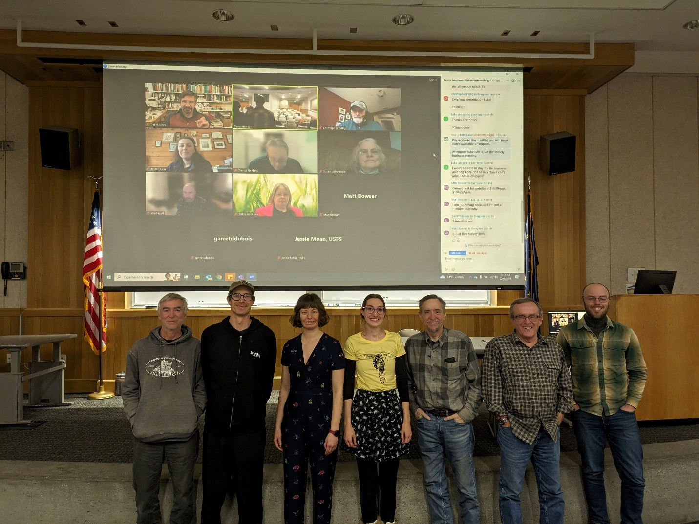

```{r, include=FALSE}
source("../../share/setup.R")
```

```{r, child="../../share/header_html.Rmd"}
```

# Review of the seventeenth annual meeting

*by Dana Brennan^[Washington Department of Natural Resource, Colville, Washington, <danambrenn@gmail.com>]*

(ref:meeting24alt) A row of people standing in front of a projector screen showing virtual attendees.

(ref:meeting24cap) Figure 1: Members present at the business meeting. Virtual attendees from top left: Derek Sikes, Chris Fettig, Taylor Kane, Dennis Fielding, Susan Wise-Eagle, Adam Haberski, Robin Andrews, Matt Bowser, Garret Dubois, Jessie Moan. In-person attendees from left: Dan Bogan, Joey Slowik, Dana Brennan, Alex Wenninger, Mike Baldwin, Roger Burnside, Ramsey Sullivan.

```{r meeting24, fig.alt="(ref:meeting24alt)", fig.cap="(ref:meeting24cap)"}

```

## Presentations

In his talk titled, “The Museum Research Apprenticeship Program at the University of Alaska Museum,” **Derek Sikes** discussed the museum’s efforts to collect more representative non-marine arthropod specimens through a research apprenticeship program. What began in 2011 has seen many students gain relevant research experience working with a curator to finish a project. Recent student efforts include digitizing the pinned insect collection and better verifying the accuracy of guesstimate counts of specimens in the museum wet collections, which found true numbers to be about double what guesstimates were.

**Jackson Audley** gave the meeting an update on continued spruce beetle semiochemical research in Alaska in his talk titled, “Semiochemical interruption of spruce beetle host searching and aggregation behaviors to protect spruce trees in Alaska.” In 2023 continued work was done on the Kenai Peninsula, this year evaluating different dosages of SPLAT (a biodegradable paste infused with spruce beetle anti-aggregation pheromone MCH) and comparing SPLAT against MCH pouches for spruce protection from spruce beetle. Promising results showed reduced spruce beetle colonization with final assessments occurring in 2024. Also up for 2024 is a trapping assay to see how far SPLAT is reducing beetle catches from treatment trees.

With the Cooperative Extension IPM office, **Alex Wenninger** shared some of her work and findings in 2023. Fireweed blossom gall midge was quite prolific the summer of 2023 with lots of observations submitted to Extension. Genetic analysis of these gall formers appears to match a European species which brings up the question: is this part of the midge’s native range? In a sampling of aculeate pollinators on native and nonnative plants, it was found that native plants had increased species richness and visitation. Pollinator presence will be resampled in 2024 and the impacts of residual herbicides from invasive plant management on restoration will be evaluated.

In “Way up north (to Utqiagvik): An update on the Diptera of the northernmost point in the U.S.A.,” **Thalles P. L. Pereira** discussed work in an area highly impacted by climate change: the arctic. Understanding arctic species diversity is an urgent need and Pereira discussed his efforts to quantify Dipteran diversity near Utqiagvik, the sources of information used to determine species presence, and areas where more information is needed. 

**Adam Haberski** discussed his dissertation work in “A long way from home: species common to Alaska and the southern Appalachian Mountains.” Haberski’s work took him to the southern-most spruce forest in Appalachia, which can be used as a boreal forest analogue that shares 73% of plants with northern spruce forests. The southern spruce forests are threatened by balsam wooly adelgid, which feeds on spruce but kills Fraser fir. Haberski compared southern Appalachia insect species and Alaska specimens, which were cross referenced in Arctos with distributions compared in GBIF and found about 8 percent of species from Appalachian litter traps were species shared in Alaska. Future desired work includes phylogenetic and phylogeography work to determine if these shared species were part of the Beringia refugia or if their presence happened post glaciation.

With an update on *Lygus* bugs in peonies and root maggot in turnips, **Dennis Fielding** shared findings on *Lygus* bug identifications and noted *Lygus*-related damage to peonies when introduced in a mesh enclosure. To understand the phenology of turnip root maggot, Fielding planted pupae in soil and recorded emergence compared to degree day accumulation and calendar date to determine which is the best predictor for maggot emergence. A weekly maggot census was done in which a subset of plants were dug up and cut to look for maggots. Overall, calendar dates might work as well as degree days for predicting maggot emergence with the recommendation to begin monitoring for eggs in late June. Maggot controls should be applied when eggs are first seen and crop residues should be buried or otherwise cleaned up immediately after harvest as maggots remain viable into September.

“An unusual grasshopper outbreak in Wood River, Alaska: A relic population of the presumed extinct Rocky Mountain Locust, *Melanoplus spretus*?” In this talk by **Luke Lawson**, a brief history of the American west’s great herds (Rocky Mountain locust, *Melanoplus spretus*) was presented as well as a recent outbreak of grasshoppers in Wood River, Alaska and efforts to identify these species. Fortunately, this presumed extinct species has been preserved in glaciers, allowing genetic and morphological comparison. The cause of extinction is not understood, though it is possible this is the migratory phase of *M. sanguinipes*. Specimens from the recent outbreak in Wood River were identified as *M. sanguinipes*, showing resemblance to the extinct *M. sprectus*. When comparing the Wood River specimens to UAM specimens, there was a significant difference between tegmina, supporting the hypothesis that Wood River specimens may be distinct from what is already known in the collection. Future genetic work to determine differences could be difficult because many of these specimens are genetically similar. 

Thanks to Luke for his student presentation this year which earned him the 2024 Student Presentation Award. Congratulations Luke!


## Business items - highlights

- The AKES t-shirt committee was revisited, an email loop will be started regarding design options.
- Matt Bowser will be stepping down from his role in managing the AKES newsletter and website after leading it for many years. We thank Matt for all he has done to maintain the AKES digital footprint! Alex Wenninger and Adam Haberski will take on these roles moving forward.
- Joey Slowik was voted in as the new secretary, all other current officers were retained: Dana Brennan (president), Robin Andrews (vice president), and Roger Burnside (treasurer).

Minutes from our business meeting are available on the website.

