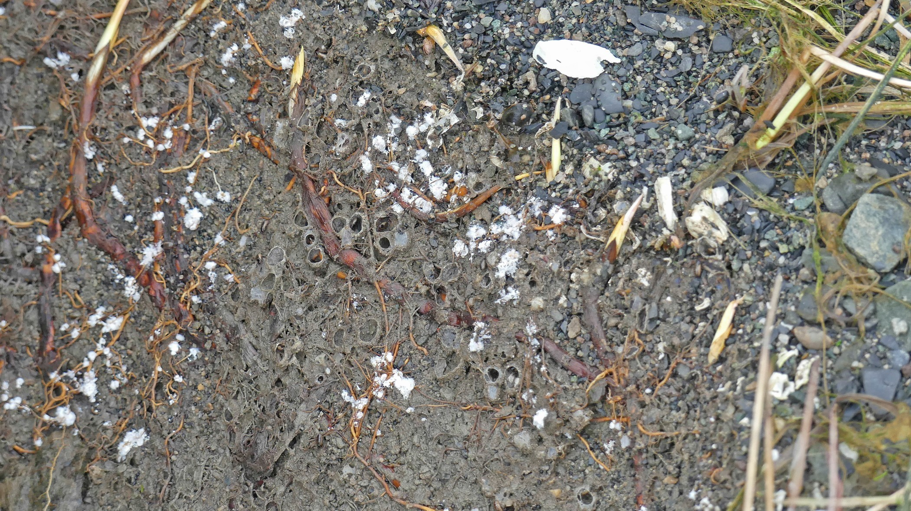
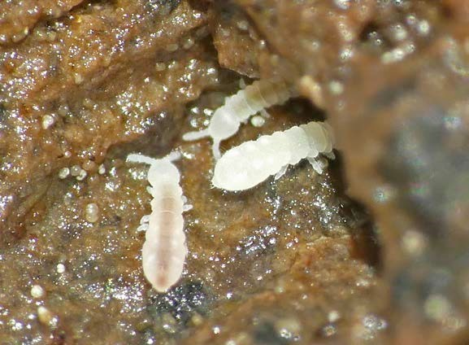
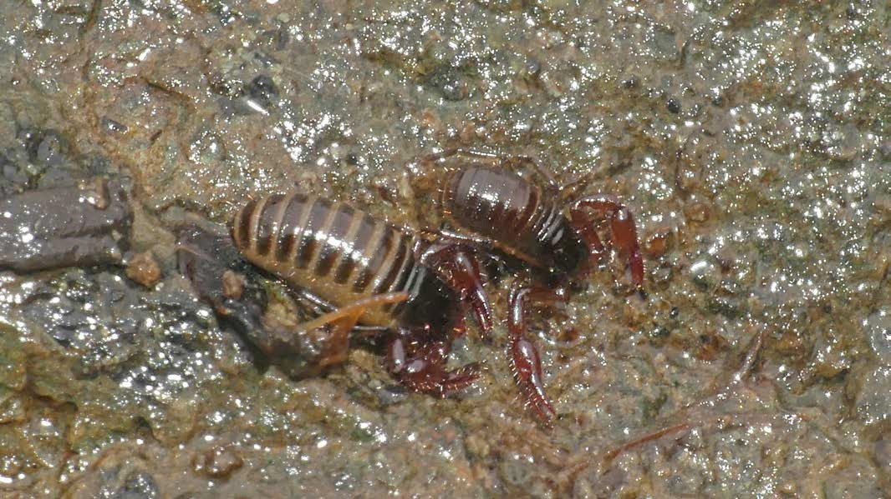
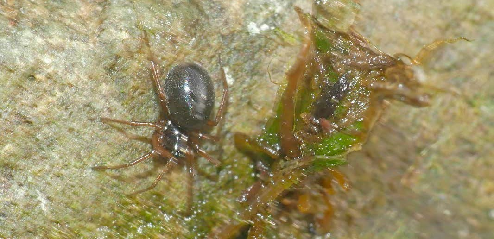

```{r, include=FALSE}
source("../../share/setup.R")
```

```{r, child="../../share/header_html.Rmd"}
```


# Marine Intertidal Pseudoscorpions in Juneau, Alaska

*by Bob Armstrong^[Juneau, Alaska, <bob@discoverysoutheast.org>] & John Hudson^[Juneau, Alaska, <odonatak@gmail.com>]*

(ref:pseudoscorpions01alt) cover photo - a pseudoscorpion with outstretched pedipalps

(ref:pseudoscorpions01cap) Marine intertidal pseudoscorpions in Juneau, Alaska

```{r pseudoscorpions01, fig.alt="(ref:pseudoscorpions01alt)", fig.cap="(ref:pseudoscorpions01cap)"}

```

## Introduction

Pseudoscorpions, or false scorpions, are small scorpion-like members of the Class Arachnida, which includes spiders, mites, scorpions, and ticks, among others. They lack the tail-like appendage found on true scorpions and do not bite or sting people or pets. Most pseudoscorpions are less than 8 mm long. Like their cousins, pseudoscorpions have 8 legs. The body is reddish or brown in color and pear-shaped. Extending from the head are 2 long pedipalps, each ending in a pincer that is used to grab prey. Venom in the pedipalps paralyze prey.

Pseudoscorpions can be found on land and the intertidal zone. To avoid contact with water when the tide floods their habitat, marine pseudoscorpions enter silk-lined retreats. Mating and molting (shedding of the exoskeleton) also take place in these retreats.

According to the literature a single pseudoscorpion species lives in the marine intertidal areas in Juneau. It belongs in the family Neobisiidae. Its scientific name is *Halobisium occidentale*. In fact it is the only representative of *Halobisium* in North America. It is known to occur in Alaska, California, Oregon, Washington and British Columbia.

It is a fascinating creature and we have been trying to document its behavior and life cycle with photographs. Here is what we have learned so far.


## Where they live

(ref:pseudoscorpions02alt) A folding chair and table in an area where the tide has receded, leaving scattered seaweed and rocks exposed.

(ref:pseudoscorpions02cap) Intertidal habitat where pseudoscorpions have been found under rocks in Tee Harbor, Juneau.

```{r pseudoscorpions02, fig.alt="(ref:pseudoscorpions02alt)", fig.cap="(ref:pseudoscorpions02cap)"}

```


(ref:pseudoscorpions03alt) A rocky beach with scattered seaweed. Snow-capped mountains and a patch of conifer trees are visible in the background.

(ref:pseudoscorpions03cap) Some of the intertidal habitat in the Fish Creek Park has numerous pseudoscorpions under the rocks.

```{r pseudoscorpions03, fig.alt="(ref:pseudoscorpions03alt)", fig.cap="(ref:pseudoscorpions03cap)"}

```


(ref:pseudoscorpions04alt) Two rocks sitting on a folding table, one of which has barnacles covering one side.

(ref:pseudoscorpions04cap) We usually find them under rocks. The lower portion of the rocks can be buried up to about 6 inches in the sediment.

```{r pseudoscorpions04, fig.alt="(ref:pseudoscorpions04alt)", fig.cap="(ref:pseudoscorpions04cap)"}

```


(ref:pseudoscorpions05alt) A pseudoscorpion near the edge of a rock with pedipalps outstretched.

(ref:pseudoscorpions05cap) On the underside of these fairly small rocks we usually see the Pseudoscorpions moving about.

```{r pseudoscorpions05, fig.alt="(ref:pseudoscorpions05alt)", fig.cap="(ref:pseudoscorpions05cap)"}

```


(ref:pseudoscorpions06alt) A pseudoscorpion with its front half reaching out from a crevice in a rock.

(ref:pseudoscorpions06cap) We occasionally see them partially in a small hole on the underside of the rock.

```{r pseudoscorpions06, fig.alt="(ref:pseudoscorpions06alt)", fig.cap="(ref:pseudoscorpions06cap)"}

```


(ref:pseudoscorpions07alt) The same as figure 6 except the camera is angled toward the face of the pseudoscorpion.

(ref:pseudoscorpions07cap) We occasionally see them partially in a small hole on the underside of the rock (continued).

```{r pseudoscorpions07, fig.alt="(ref:pseudoscorpions07alt)", fig.cap="(ref:pseudoscorpions07cap)"}

```


(ref:pseudoscorpions08alt) A large, square rock on top of smaller rocks with sparse patches of seaweed and other vegetation.

(ref:pseudoscorpions08cap) Under the larger rocks we often find them associated with their cocoons. 

```{r pseudoscorpions08, fig.alt="(ref:pseudoscorpions08alt)", fig.cap="(ref:pseudoscorpions08cap)"}

```


(ref:pseudoscorpions09alt) The large, square rock from Figure 8 is turned over, revealing the soil below. An arrow labeled "cocoons" is pointing at an area of the soil beneath the rock.

(ref:pseudoscorpions09cap) They typically build these cocoons to overwinter in and mating and molting (shedding of the exoskeleton) also take place in these retreats.

```{r pseudoscorpions09, fig.alt="(ref:pseudoscorpions09alt)", fig.cap="(ref:pseudoscorpions09cap)"}

```


(ref:pseudoscorpions10alt) A closeup of the soil from beneath the rock from figures 8 and 9 showing a small, rounded divot.

(ref:pseudoscorpions10cap) Two cocoons attached to the sand under the rock.

```{r pseudoscorpions10, fig.alt="(ref:pseudoscorpions10alt)", fig.cap="(ref:pseudoscorpions10cap)"}

```


(ref:pseudoscorpions11alt) A pseudoscorpion inside of a small, rounded divot in the soil.

(ref:pseudoscorpions11cap) A pseudoscorpion inside one of these cocoons.

```{r pseudoscorpions11, fig.alt="(ref:pseudoscorpions11alt)", fig.cap="(ref:pseudoscorpions11cap)"}

```


(ref:pseudoscorpions12alt) A wall of soil and debris forming a circular concretion (cocoon) with an empty center.

(ref:pseudoscorpions12cap) We also see their cocoons attached to the large rocks we have turned over. Probably turning over these rocks causes some to remain attached to the rock and some to the sand. 

```{r pseudoscorpions12, fig.alt="(ref:pseudoscorpions12alt)", fig.cap="(ref:pseudoscorpions12cap)"}

```


(ref:pseudoscorpions13alt) A coccoon attached to a rock with a pseudoscorpion inside.

(ref:pseudoscorpions13cap) Also we usually see a pseudoscorpion inside the cocoon attached to the rock.

```{r pseudoscorpions13, fig.alt="(ref:pseudoscorpions13alt)", fig.cap="(ref:pseudoscorpions13cap)"}

```


(ref:pseudoscorpions14alt) A very large rock on a beach with a white arrow pointing at it.

(ref:pseudoscorpions14cap) At the Fish Creek Park we often find numerous cocoons on the underside of these larger rocks.

```{r pseudoscorpions14, fig.alt="(ref:pseudoscorpions14alt)", fig.cap="(ref:pseudoscorpions14cap)"}

```


(ref:pseudoscorpions15alt) A closeup of a few pseudoscorpion cocoons under a rock, with pseudoscorpions tucked inside each cocoon. Above the coccoons is a small, white springtail.

(ref:pseudoscorpions15cap) This shows some of the cocoons attached to this rock with pseudoscorpions in them. At the top of the cocoons is a whitish beach springtail, one of their favorite foods.

```{r pseudoscorpions15, fig.alt="(ref:pseudoscorpions15alt)", fig.cap="(ref:pseudoscorpions15cap)"}

```


(ref:pseudoscorpions16alt) At least a dozen coccoons visible on the substrate where a large rock has been turned over. Plant roots intertwine with the cocoons at the surface.

(ref:pseudoscorpions16cap) This shows numerous cocoons attached to the substrate when we turned over one of the larger rocks at the Fish Creek Park.

```{r pseudoscorpions16, fig.alt="(ref:pseudoscorpions16alt)", fig.cap="(ref:pseudoscorpions16cap)"}

```


(ref:pseudoscorpions17alt) A closer view of figure 16 shows the pseudoscorpions nestled inside the cocoons.

(ref:pseudoscorpions17cap) A closer view of a few of the cocoons attached to the substrate.

```{r pseudoscorpions17, fig.alt="(ref:pseudoscorpions17alt)", fig.cap="(ref:pseudoscorpions17cap)"}

```

## What they eat

According to the literature they feed on these Beach Springtails which we often see on the same rocks as the pseudoscorpions.


(ref:pseudoscorpions18alt) A lateral, close-up view of a white springtail.

(ref:pseudoscorpions18cap) Beach Springtail.

```{r pseudoscorpions18, fig.alt="(ref:pseudoscorpions18alt)", fig.cap="(ref:pseudoscorpions18cap)"}

```

For good information about springtails look at <http://www.collembola.org/> These springtails belong to the subfamily Onychiurinae. Some are called Beach Springtails. According to the literature some in this family have no eyes and do not possess a furcula for jumping. The ones without eyes and a furcula were the ones we see on the same rocks. They typically can live under the water for at least four hours. When the tide goes out they emerge under rocks for feeding.

(ref:pseudoscorpions19alt) A pseudoscorpion with a beach springtail near its chelicerae.

(ref:pseudoscorpions19cap) Pseudoscorpion and beach springtail.

```{r pseudoscorpions19, fig.alt="(ref:pseudoscorpions19alt)", fig.cap="(ref:pseudoscorpions19cap)"}

```


(ref:pseudoscorpions20alt) A pseudoscorpion with a beach springtail near its pedipalp.

(ref:pseudoscorpions20cap) Pseudoscorpion and beach springtail.

```{r pseudoscorpions20, fig.alt="(ref:pseudoscorpions20alt)", fig.cap="(ref:pseudoscorpions20cap)"}

```


(ref:pseudoscorpions21alt) A closeup of three, white beach springtails in a crevice.

(ref:pseudoscorpions21cap) Beach springtails.

```{r pseudoscorpions21, fig.alt="(ref:pseudoscorpions21alt)", fig.cap="(ref:pseudoscorpions21cap)"}

```


Also according to the literature they eat these red velvet mites. We often see them on the same rocks. 

(ref:pseudoscorpions22alt) A close-up of a bright red velvet mite.

(ref:pseudoscorpions22cap) A red velvet mite.

```{r pseudoscorpions22, fig.alt="(ref:pseudoscorpions22alt)", fig.cap="(ref:pseudoscorpions22cap)"}

```


(ref:pseudoscorpions23alt) A pseudoscorpion about to grab a mite.

(ref:pseudoscorpions23cap) A pseudoscorpion about to grab a mite.

```{r pseudoscorpions23, fig.alt="(ref:pseudoscorpions23alt)", fig.cap="(ref:pseudoscorpions23cap)"}

```


(ref:pseudoscorpions24alt) A pseudoscorpion eating an unknown prey item.

(ref:pseudoscorpions24cap) A pseudoscorpion eating an unknown prey item.

```{r pseudoscorpions24, fig.alt="(ref:pseudoscorpions24alt)", fig.cap="(ref:pseudoscorpions24cap)"}

```


(ref:pseudoscorpions25alt) A pseudoscorpion eating an unknown prey item.

(ref:pseudoscorpions25cap) A pseudoscorpion eating an unknown prey item.

```{r pseudoscorpions25, fig.alt="(ref:pseudoscorpions25alt)", fig.cap="(ref:pseudoscorpions25cap)"}

```


## How they reproduce and care for their young

(ref:pseudoscorpions26alt) Two pseudoscorpions next to each other, one slightly smaller than the other but otherwise very similar in appearance.

(ref:pseudoscorpions26cap) Two intertidal pseudoscorpions next to each other. We wonder if they are a male and female.

```{r pseudoscorpions26, fig.alt="(ref:pseudoscorpions26alt)", fig.cap="(ref:pseudoscorpions26cap)"}

```


(ref:pseudoscorpions27alt) Two pseudoscorpions in one coccoon.

(ref:pseudoscorpions27cap) Both of these pseudoscorpions in this cocoon appeared to have eggs.

```{r pseudoscorpions27, fig.alt="(ref:pseudoscorpions27alt)", fig.cap="(ref:pseudoscorpions27cap)"}

```

The female carries a silken egg pouch of 12 to 24 eggs on her belly for about 3 weeks.

(ref:pseudoscorpions28alt) A female pseudoscorpion with a pouch of pale yellow eggs under her abdomen.

(ref:pseudoscorpions28cap) This shows a female pseudoscorpion in Auke Bay carrying its eggs (photo by Aaron Baldwin).

```{r pseudoscorpions28, fig.alt="(ref:pseudoscorpions28alt)", fig.cap="(ref:pseudoscorpions28cap)"}

```


(ref:pseudoscorpions29alt) A female pseudoscorpion in a coccoon on a rock with a yellow pouch of eggs under her abdomen.

(ref:pseudoscorpions29cap) We found this female with her egg pouch under a rock in Auke Nu Cove on June 2, 2024.

```{r pseudoscorpions29, fig.alt="(ref:pseudoscorpions29alt)", fig.cap="(ref:pseudoscorpions29cap)"}

```


(ref:pseudoscorpions30alt) A large rock turned over on a rocky beach bordered by a grassy area. A large, white arrow points at the rock.

(ref:pseudoscorpions30cap) The rock in Auke Nu Cove that had a cocoon with a psudoscorpion with eggs and one with her young. (Figure 29 shows the rock turned over and Figure 31 shows before being turned over).

```{r pseudoscorpions30, fig.alt="(ref:pseudoscorpions30alt)", fig.cap="(ref:pseudoscorpions30cap)"}

```


(ref:pseudoscorpions31alt) A large rock next to a 32 ounce Nalgene bottle for scale - the rock is slightly taller than the bottle.

(ref:pseudoscorpions31cap) The rock in Auke Nu Cove that had a cocoon with a psudoscorpion with eggs and one with her young before being turned over.

```{r pseudoscorpions31, fig.alt="(ref:pseudoscorpions31alt)", fig.cap="(ref:pseudoscorpions31cap)"}

```


(ref:pseudoscorpions32alt) A coccoon under a rock with a female pseudoscorpion and many (more than 10) young pseudoscorpions inside. While the female pseudoscorpion is a reddish brown color, the young pseudoscorpions have yellow abdomens and almost bluish transleucent pedipalps.

(ref:pseudoscorpions32cap) Under the rock in Auke Nu Cove we found a cocoon with a pseudoscorpion and her kids on June 2, 2024.

```{r pseudoscorpions32, fig.alt="(ref:pseudoscorpions32alt)", fig.cap="(ref:pseudoscorpions32cap)"}

```

From @Hughes2017: Pseudoscorpions have 3 juvenile instars (termed protonymph, deutonymph and tritonymph) followed by the adult life stage. The lifestage of a typical pseudoscorpion is easily discerned by examining the movablefinger of the pedipalp chelae which will have 1, 2, 3, or 4 trichobothria dependingon if the specimen is a protonymph, deutonymph, tritonymph or adult [@Chamberlin1931]. When pseudoscorpions molt, they use silk from their chelicerate mouthparts to construct small, protective chambers within their confined habitat [@Kew1914]."


## Other invertebrates that occur on the same rocks

See @Baldwin2015: this is a good report on our intertidal sea life.


(ref:pseudoscorpions33alt) A closeup of a pale-colored tubular invertebrate.

(ref:pseudoscorpions33cap) *Hemipodus borealis* – Northern iridescent worm. The pink body and long pointed head are distinct. When disturbed large proboscis extends with four black teeth at end.

```{r pseudoscorpions33, fig.alt="(ref:pseudoscorpions33alt)", fig.cap="(ref:pseudoscorpions33cap)"}

```


(ref:pseudoscorpions34alt) A pinkish-purple slug-like invertebrate.

(ref:pseudoscorpions34cap) On the right - *Amphiporus angulatus* – Many-eyed ribbon worm. Pink to purple on top, white to orange underneath. Head with distinct markings (see inset). Up to 10 cm (4”) long, 1-2 cm (.4”-.8”) wide.


```{r pseudoscorpions34, fig.alt="(ref:pseudoscorpions34alt)", fig.cap="(ref:pseudoscorpions34cap)"}

```


(ref:pseudoscorpions35alt) A dark, smooth spider with reddish legs.

(ref:pseudoscorpions35cap) This Dwarf Spider, subfamily Erigoninae, was under a rock we turned over close to a Pseudoscorpion.

```{r pseudoscorpions35, fig.alt="(ref:pseudoscorpions35alt)", fig.cap="(ref:pseudoscorpions35cap)"}

```


(ref:pseudoscorpions36alt) A grey invertebrate with an armor-like back made of many segmented plates.

(ref:pseudoscorpions36cap) Rockweed isopod *Pentidotea wosnessenskii*

```{r pseudoscorpions36, fig.alt="(ref:pseudoscorpions36alt)", fig.cap="(ref:pseudoscorpions36cap)"}

```


(ref:pseudoscorpions37alt) A long, yellow centipede with over 45 pairs of legs.

(ref:pseudoscorpions37cap) Order Geophilomorpha – Beach Centipede. This may be an undescribed species. Very narrow body, reaching about 4 cm long. 30 or more pairs of legs. Upper intertidal, under rocks.

```{r pseudoscorpions37, fig.alt="(ref:pseudoscorpions37alt)", fig.cap="(ref:pseudoscorpions37cap)"}

```


(ref:pseudoscorpions38alt) Pale mites with a smooth, bloated appearance.

(ref:pseudoscorpions38cap) We see a wide variety of mites on the same rocks with the pseudoscorpions. Even some that look like eggs (with tiny legs).

```{r pseudoscorpions38, fig.alt="(ref:pseudoscorpions38alt)", fig.cap="(ref:pseudoscorpions38cap)"}

```


(ref:pseudoscorpions39alt) A pale invertebrate with an armor-like back made of many plates.

(ref:pseudoscorpions39cap) This is one of the oniscoid isopods.  

```{r pseudoscorpions39, fig.alt="(ref:pseudoscorpions39alt)", fig.cap="(ref:pseudoscorpions39cap)"}

```


(ref:pseudoscorpions40alt) The same invertebrate from Figure 39 walking near a white, cotton-like substance.

(ref:pseudoscorpions40cap) The oniscoid isopod from Figure 39 walking by a small cotton-like ball which we sometimes see attached to the beach rocks. These cotton-like balls may be made by one of the spiders.

```{r pseudoscorpions40, fig.alt="(ref:pseudoscorpions40alt)", fig.cap="(ref:pseudoscorpions40cap)"}

```


(ref:pseudoscorpions41alt) Two flat, pale beetles near a pseudoscorpion coccoon.

(ref:pseudoscorpions41cap) This shows two Rove Beetle adults in or near one of the cocoons. According to Derek Sikes they are in the subfamily Aleocharinae and the Tribe Liparocephalini.

```{r pseudoscorpions41, fig.alt="(ref:pseudoscorpions41alt)", fig.cap="(ref:pseudoscorpions41cap)"}

```

## Useful References

@Anthony2016: Thermal biology and immersion tolerance of the Beringian pseudoscorpion *Wyochernes asiaticus*. 

@Buddle2005: A primer on pseudoscorpions and taxonomic status in Canada. 

@Gallant2024: Elemental characterization of the cuticle in the marine intertidal pseudoscorpion, *Halobisium occidentale*.

@Hughes2017: Taxonomy, systematics, and venom components of neobisiid pseudoscorpions (Pseudoscorpiones: Neobisiidae).


## Life Cycle

From @Hodgson2008.

Pseudoscorpions have an extended life cycle of 1 to 3 years, depending on the location and temperature.

The mating ritual for pseudosporpions is similar to the dance of true scorpions. The male pseudoscorpion produces a spermatophore, or sperm packet, and pulls the female over it during the mating dance.

The female carries a silken egg pouch of 12 to 24 eggs on her belly for about 3 weeks.

The hatched brood ride on the females back until they get older.

The young look like the adults except smaller; they will molt three times over several years before becoming adults.

Adults live for 2 to 3 years and females may produce several broods a year.

Pseudoscorpions overwinter in silken cocoons.


## References
