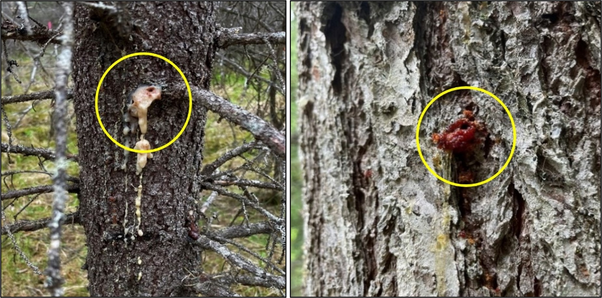
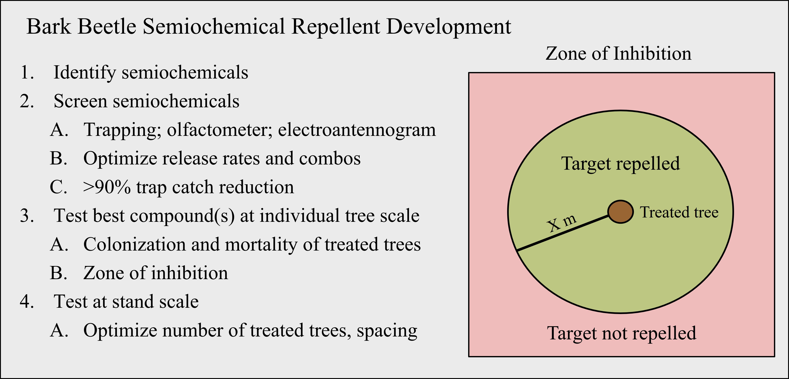

```{r, include=FALSE}
source("../../share/setup.R")
```

```{r, child="../../share/header_html.Rmd"}
```


# "No Vacancy": Masking spruce trees from spruce beetles with semiochemicals on the Kenai Peninsula

*by Jackson P. Audley*^[Pacific Southwest Research Station, USDA Forest Service, 1323 Club Drive, Vallejo, CA 94592, jackson.audley@usda.gov], *Christopher J. Fettig*^[Pacific Southwest Research Station, USDA Forest Service, 1323 Club Drive, Vallejo, CA 94592, christopher.fettig@usda.gov], *Jason E. Moan*^[Alaska Division of Forestry and Fire Protection, 550 West 7th Avenue, Anchorage, AK 99501], *Jessie Moan*^[Forest Health Protection, USDA Forest Service, 161 East First Avenue, Anchorage, AK 99501], *Steve Swenson*^[Forest Health Protection, USDA Forest Service, 161 East First Avenue, Anchorage, AK 99501], *Elizabeth E. Graham*^[Forest Health Protection, USDA Forest Service, 11175 Auke Lake Way, Juneau, AK 99801], and *Agenor Mafra-Neto*^[ISCA Inc., 1230 Spring Street, Riverside, CA 92507]

## Introduction

Bark beetles (Coleoptera: Curculionidae: Scolytinae) are a globally distributed and diverse sub-family of weevils comprised of >6,000 species worldwide, with ~550 species in North America [@Fettig2021]. They are small, (~1&ndash;8 mm) cylindrical beetles that feed and reproduce beneath the bark of host trees. Most bark beetle species colonize recently dead and dying trees and are not considered pests; however, ~25 species - including spruce beetle, *Dendroctonus rufipennis* (Kirby) (Figure \@ref(fig:sprucebeetle1)) - are major “tree killers”. These tree-killing species primarily occur in North America and Europe [@Fettig2021] and represent some of the most significant pests of trees as, from time to time, populations can irrupt to epidemic levels causing widespread tree mortality. 

(ref:sprucebeetle1alt) Left, A close up of an adult beetle viewed laterally with a black head and thorax and reddish-brown elytra. Right, yellow circle indicates an area where a small beetle with a black head and red elytra is walking on the bark of a spruce tree.

(ref:sprucebeetle1cap) Left, adult spruce beetle as seen under a stereo microscope. Right, adult spruce beetle (in yellow circle) crawling on bark. Photo credits: J.P. Audley, Pacific Southwest Research Station.

```{r sprucebeetle1, fig.alt="(ref:sprucebeetle1alt)", fig.cap="(ref:sprucebeetle1cap)"}

```

A *semiochemical* is a compound or mixture of compounds that affects the behavior of receiving individuals [@Seybold2018]. Some bark beetles evolved pheromone-mediated (a *pheromone* is a semiochemical that mediates intraspecific (within species) interactions) aggregation which allows these species to overwhelm the defenses of healthy host trees. Aggregation pheromones are typically produced by adults of both sexes as they bore into the bark of viable host trees. Today, aggregation pheromones for many of the tree-killing bark beetle species are well studied and commercially synthesized to produce baits and lures [@Seybold2018]. For example, aggregation pheromone components for spruce beetle include frontalin, seudenol, and MCOL. Spruce beetle lures for spruce beetle populations in western North America include frontalin, MCOL, and host cues consisting of spruce terpenes like $\alpha$-pinene, $\beta$-pinene, camphene, and/or 3-carene [@Keeling2021]. It has been demonstrated that several species of bark beetles recognize and distinguish among volatile compounds from host and non-host trees [@Huber2021], allowing individuals, particularly the first few individuals that encounter a potential host tree (*pioneering individuals*), to locate and select viable hosts to colonize. 

While large numbers of bark beetles are necessary to overwhelm the defenses of healthy trees, too many can result in high levels of intraspecific competition for the limited food source (phloem) negatively affecting beetle populations. Accordingly, some species also produce antiaggregation pheromones. As the name implies, these semiochemicals illicit the opposite behavioral effect of aggregation pheromones, essentially serving as a “no vacancy” sign for the host tree. Individuals receiving the antiaggregation pheromone either orient to a portion of the tree bole with lower concentrations of antiaggregation pheromone or to another host entirely. The primary antiaggregation pheromone of spruce beetle, 3-methylcylcohex-2-en-1-one (MCH), has been known since the 1970s, yet development of MCH as a tree protection tool for spruce beetle has remained elusive. Conversely, verbenone is well known for its use as a semiochemical repellent for mountain pine beetle, *D. ponderosae* Hopkins, in Canada and the United States [@Progar2014]. Verbenone was first discovered in the 1960s and has since evaluated for management of several bark beetle species in North America, Europe, and Asia [@Fruhbrodt2024]. 

Spruce beetle poses the most significant threat to mature spruce in North America. In general, the beetle’s range tracks the distribution of spruce across Canada and the United States [@Bleiker2021]. Spruce beetle can attack all species of spruce native to North America; however, regional host preferences are observed. Primarily Sitka spruce is attacked in the temperate rainforests of the Pacific Coast, white and hybrid spruce in boreal forests, and Engelmann spruce in the Rockies [@Bleiker2021]. Lutz and white spruce are the primary hosts in Alaska. Black and blue spruce are considered rare hosts [@Bleiker2021; @Ott2021]. Like other tree-killing bark beetle species, during outbreaks, spruce beetle occasionally attacks other tree species typically thought of as non-hosts (Figure \@ref(fig:sprucebeetle2)). 

(ref:sprucebeetle2alt) Left, a yellow circle indicates an area of cream-colored sap running down the center of a spruce trunk. Right, a yellow circle indicates a reddish glob of pitch with a small hole in the center on a spruce trunk.

(ref:sprucebeetle2cap) Left, spruce beetle attacks (pitch tube and frass, in yellow circle) on Lutz spruce, a host, near Soldotna, 2021. Photo credit J.P. Audley, Pacific Southwest Research Station. Right, spruce beetle attack on mountain hemlock, considered a non-host, near Cooper Landing, 2023. Photo credit: C.J. Fettig, Pacific Southwest Research Station.

```{r sprucebeetle2, fig.alt="(ref:sprucebeetle2alt)", fig.cap="(ref:sprucebeetle2cap)"}

```

Management options for bark beetles broadly fall into two categories: direct and indirect control [@Fettig2015]. Direct control targets reducing a population in a local area. These measures are typically reactionary to a local population irruption or outbreak and are short-termed strategies that include the use of insecticides, semiochemical repellents, trap trees, and sanitation to name a few [@Holsten1999; @Bentz2000]. 

The use of semiochemical repellents is a direct control strategy whereby the chemical ecology of a target organism is manipulated to alter its behavior. In bark beetle systems, this typically involves the use of synthetic antiaggregation pheromone(s) and/or non-host volatiles. For example, this strategy has been successfully applied to Douglas-fir beetle, *D. pseudotsugae* Hopkins, utilizing MCH, its primary antiaggregation pheromone [@Ross2021]. In some cases, additional semiochemical repellents are necessary to complement the primary antiaggregation pheromone. For example, in western pine beetle, *D. brevicomis* LeConte, its primary antiaggregation pheromone (verbenone) alone is insufficient for tree protection. However, the addition of non-host compounds (acetophenone, (E)-2-hexen-1-ol, and (Z)-2-hexen-1-ol) to verbenone yields sufficient repellency to impart tree protection [@Fettig2023]. 

Discussions with resource managers, policy makers, and others prompted our team to investigate the effectiveness of novel semiochemical repellents to protect spruce trees from mortality attributed to spruce beetle. In general, developing bark beetle semiochemical repellents is a tedious process involving several steps conducted over many years (Figure \@ref(fig:sprucebeetle3)). 

(ref:sprucebeetle3alt) An infographic showing a numbered list of the steps to develop bark beetle semiochemicals. One, identify semiochemicals. Two, Screen semiochemicals. Three, test the best compounds at the individual tree scale. Four, test at stand scale. On the right is a diagram showing a treated tree with a radius around it labeled "target repelled" and a box around that radius labeled "Zone of Inhibition".

(ref:sprucebeetle3cap) General steps for developing bark beetle semiochemical repellents.

```{r sprucebeetle3, fig.alt="(ref:sprucebeetle3alt)", fig.cap="(ref:sprucebeetle3cap)"}

```

## Related Studies

We began work on an effective semiochemical repellent for spruce beetle following availability of SPLAT® MCH (Figure \@ref(fig:sprucebeetle4)), a biodegradable formulation containing 10.0% MCH by weight (ISCA Inc.), and its demonstration as an effective semiochemical repellent for Douglas-fir beetle [@Foote2020]. We began in 2021 by evaluating potential repellents (Table \@ref(tab:sprucebeetle)) in trapping assays (Figure \@ref(fig:sprucebeetle3), Step 2) near Soldotna. Twenty-one, 12-unit funnel traps were suspended from metal conduit poles with a spruce beetle lure attached to each trap (Figure \@ref(fig:sprucebeetle5)). Traps were then assigned to one of seven treatments, each replicated three times. Traps were left in place for 24 hr after which samples were collected and traps were re-randomized. 

```{r sprucebeetle}
sprucebeetle <- read.csv("sprucebeetle.csv")
knitr::kable(sprucebeetle, 
  longtable = TRUE, 
  booktabs = TRUE,
  col.names = c("Treatment", "Semiochemicals", "Assay/Study"),
  caption = "Treatments and corresponding semiochemicals used in trapping assays and tree protection studies."
)
```

(ref:sprucebeetle4alt) A yellow circle indicates a dollop of Splat MCH on a spruce trunk.

(ref:sprucebeetle4cap) A dollop of SPLAT® MCH (in yellow circle) on Lutz spruce with the SPLAT® MCH tube and deployment device shown. Photo credit: C.J. Fettig, Pacific Southwest Research Station. 

```{r sprucebeetle4, fig.alt="(ref:sprucebeetle4alt)", fig.cap="(ref:sprucebeetle4cap)"}

```

(ref:sprucebeetle5alt) Left, a yellow circle indicates the center of a Lindgren Funnel trap where two white plastic pouches are visible hanging from the trap. Right, a man wearing an orange vest and white hardhat holds up three Lindgren funnel traps in the foreground, with dead, brown spruce trees in the background.

(ref:sprucebeetle5cap) Left, 12-unit funnel trap used in two trapping assays for screening semiochemical repellents near Soldotna, 2021. All semiochemicals (in yellow circle), including SPLAT® MCH, were attached to the center of the trap. Photo credit: J.P. Audley, Pacific Southwest Research Station. Right, J.P. Audley re-randomizing funnel traps near Soldotna, 2021. Photo credit: C.J. Fettig, Pacific Southwest Research Station. Dead spruce in the background were colonized and killed by spruce beetle during a recent outbreak.

```{r sprucebeetle5, fig.alt="(ref:sprucebeetle5alt)", fig.cap="(ref:sprucebeetle5cap)"}

```

Spruce beetle trap captures were reduced by 87% across all semiochemical repellent treatments compared to the control and no significant differences were observed among semiochemical repellent treatments (Figure \@ref(fig:sprucebeetle6)) [@Audley2024]. While we were encouraged by the results from our June trapping assay, we amended the treatments (Table \@ref(tab:sprucebeetle)) and conducted a second assay in July 2021 using the same location and methods. Once again, all semiochemical repellent treatments significantly reduced spruce beetle trap catches compared to the control and no significant differences were observed among semiochemical repellent treatments (Figure \@ref(fig:sprucebeetle6)). We observed a slightly greater reduction in trap catch (94% versus 87%) during the July assay [@Audley2024].

(ref:sprucebeetle6alt) Two bar graphs.

(ref:sprucebeetle6cap) Left, June 2021 trapping assay. Right, July 2021 trapping assay. Both assays were conducted along Funny River outside of Soldotna. Different letters indicate statistically significant differences.

```{r sprucebeetle6, fig.alt="(ref:sprucebeetle6alt)", fig.cap="(ref:sprucebeetle6cap)"}

```

Informed by data from our trapping assays, we established a tree protection study (Figure \@ref(fig:sprucebeetle3), Step 3)  near Tern Lake in 2022. We selected 100 Lutz spruce and randomly assigned each to one of five treatments (Table \@ref(tab:sprucebeetle)). Trees were treated in May 2022, assessed for spruce beetle colonization in August 2022 based on the presence of boring dust and/or pitch tubes (Figure \@ref(fig:sprucebeetle2)), and assessed for mortality in August 2023 based on crown fade. All semiochemical repellent treatments significantly reduced spruce beetle colonization and tree mortality compared to the control (Figure \@ref(fig:sprucebeetle7)) [@Audley2024].

(ref:sprucebeetle7alt) Two bar graphs.

(ref:sprucebeetle7cap) Results from the 2022–2023 tree protection study near Tern Lake. Left, number of treated Lutz spruce colonized by spruce beetles. Right, number of treated Lutz spruce killed by spruce beetles. Different letters indicate statistically significant differences.

```{r sprucebeetle7, fig.alt="(ref:sprucebeetle7alt)", fig.cap="(ref:sprucebeetle7cap)"}

```

In 2023, we established two new tree protection studies near Cooper Landing. Trees were treated in May 2023, assessed for spruce beetle colonization in August 2023, and assessed for mortality in 2024. No tree mortality was observed in any semiochemical repellent treatment in the first study (Figure \@ref(fig:sprucebeetle8)). Interestingly, in the second study we observed a difference in tree protection between SPLAT® MCH and the MCH bubble caps (Synergy Semiochemicals Cop., Burnaby, BC) with more spruce beetle colonization occurring on trees treated with SPLAT® MCH (Figure \@ref(fig:sprucebeetle9)). However, all three doses of SPLAT® MCH and MCH bubble caps significantly reduced tree mortality compared to the control (Figure \@ref(fig:sprucebeetle9)). Mortality in the control was lower than anticipated, suggesting a decline in spruce beetle populations in the area.

(ref:sprucebeetle8alt) Two bar graphs.

(ref:sprucebeetle8cap) Results from the first 2023–2024 tree protection study near Cooper Landing. Left, number of treated Lutz spruce colonized by spruce beetles. Right, number of treated Lutz spruce killed by spruce beetles. Different letters indicate statistically significant differences.

```{r sprucebeetle8, fig.alt="(ref:sprucebeetle8alt)", fig.cap="(ref:sprucebeetle8cap)"}

```

(ref:sprucebeetle9alt) Two bar graphs.

(ref:sprucebeetle9cap) Results from the 2023–2024 SPLAT® MCH versus MCH bubble cap (BC) tree protection study. Left, number of treated Lutz spruce colonized by spruce beetles. Right, number of treated Lutz spruce killed by spruce beetles. Different letters indicate statistically significant differences.

```{r sprucebeetle9, fig.alt="(ref:sprucebeetle9alt)", fig.cap="(ref:sprucebeetle9cap)"}

```

Following several years of successful tree protection studies (including related efforts conducted in the Rockies [@Audley2024 and J.P.A. et al., unpublished data]), we sought to delineate the distance from repellent point sources at which each combination interrupted spruce beetle host searching and aggregation behavior, or what we like to call the “zone of inhibition” (Figure \@ref(fig:sprucebeetle3), Step 3). To accomplish this, we created trapping arrays around treated Lutz spruce trees with concentric rings of trapping stations at five distances (2, 4, 8, 12, and 16 m from treated trees) along five azimuths (0, 72, 144, 216, and 288° from treated trees) for a total of 25 stations per array. Each array received five 12-unit funnel traps, each with a spruce beetle lure. Trap placement within each array was randomly assigned so that there was one trap per distance and azimuth per day. Three replicates of arrays were established. We assessed the zone of inhibition for SPLAT® MCH (3.5 g A.I.) alone, SPLAT® MCH with AKB, and SPLAT® MCH with PLUS (Table \@ref(tab:sprucebeetle)). Samples were collected and trapping positions were re-randomized daily for 10 d. Analyses of trap catches revealed that all three semiochemical repellent treatments significantly reduced spruce beetle catches within 4 m. The same result was obtained from a similar assay conducted for spruce beetle in Colorado in 2023 (J.P.A. et al., unpublished data). It appears the zone of maximum inhibition provided by the semiochemical repellents is ~4 m, after which levels of repellency decline (J.P.A. et al., unpublished data). This finding is useful for optimizing the number of treated trees for stand protection in future studies (Figure \@ref(fig:sprucebeetle3), Step 4). 

## Conclusions and Future Work

Having observed consistent reductions in trap catches, spruce beetle colonization and tree mortality, we are very encouraged by the results of our work, especially considering that our tree protection studies used a baited design (i.e., each tree is baited to induce spruce beetle colonization). A particularly interesting result is the efficacy of SPLAT® MCH alone (Figures \@ref(fig:sprucebeetle8) & \@ref(fig:sprucebeetle9)); both doses significantly reduced spruce mortality. In earlier studies, the efficacy of MCH alone (bubble cap formulations) for protecting spruce from spruce beetle was mixed, with consensus being that MCH alone is ineffective [@Jenkins2014]. However, these early studies evaluated much lower doses of MCH than in our studies (Table \@ref(tab:sprucebeetle)), as they were informed by work on Douglas-fir beetle where low doses are effective for tree protection [@Ross2021]. Early failures to protect spruce from spruce beetle with MCH alone may simply be an artifact of the low MCH doses used. We hope to further evaluate this by investigating various doses of SPLAT® MCH alone in trapping assays in 2025. Our research team is committed to delivering a semiochemical repellent for protecting spruce from mortality attributed to spruce beetle in Alaska. 

## Acknowledgments

We thank C. Das, A. Gilchrist, A. List, R. Progar, and M. Shepard (USDA Forest Service), D. Brennan, M. Schoofs, and D. Whitcomb (Alaska Division of Forestry & Fire Protection), A. Wenninger (University of Alaska), and C. Bernardi, V. Soria, D. Jimenez and J. Saroli (ISCA Inc.) for technical assistance. We thank S. Munson (USDA Forest Service, retired) for his review of an earlier version of this manuscript. Funding was provided, in part, by the USDA Forest Service Pesticide Impact Assessment Program (R10-2021-NP).

## References
