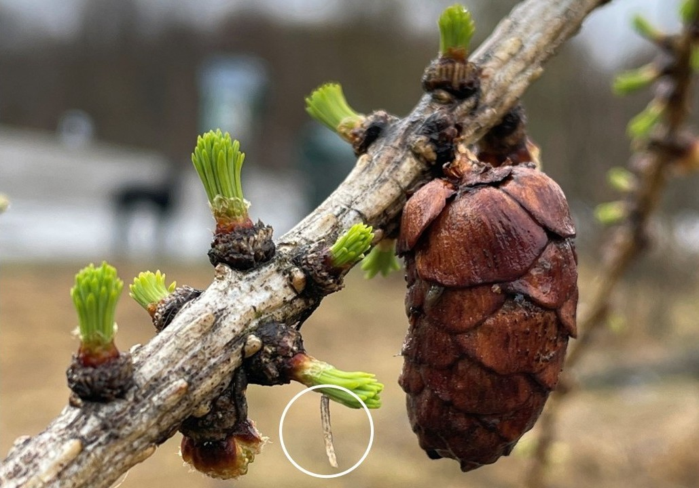
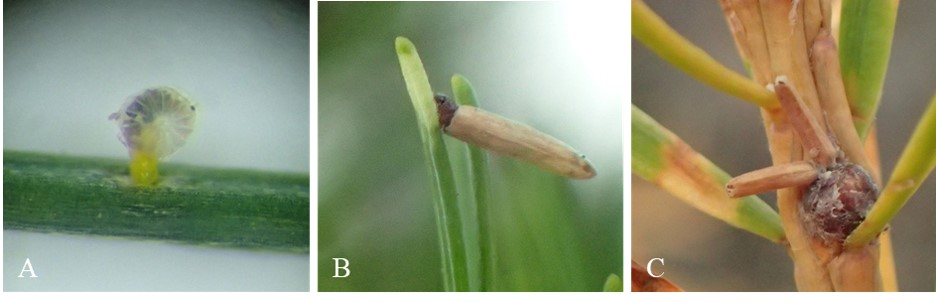
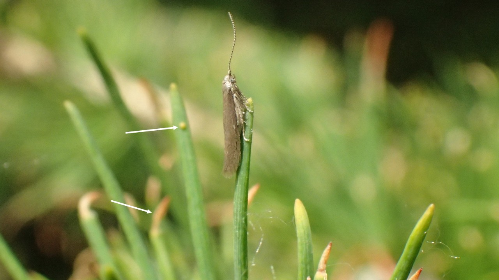
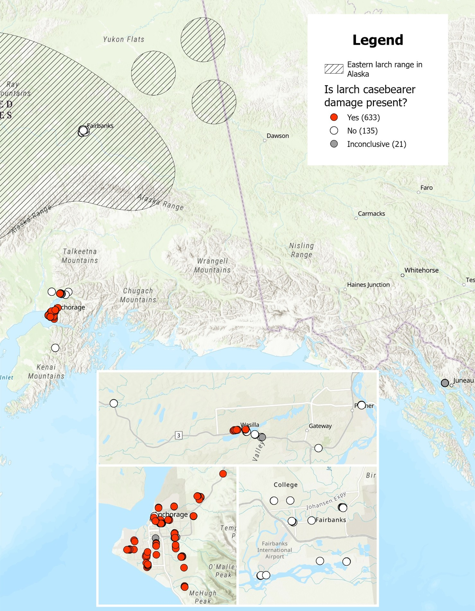
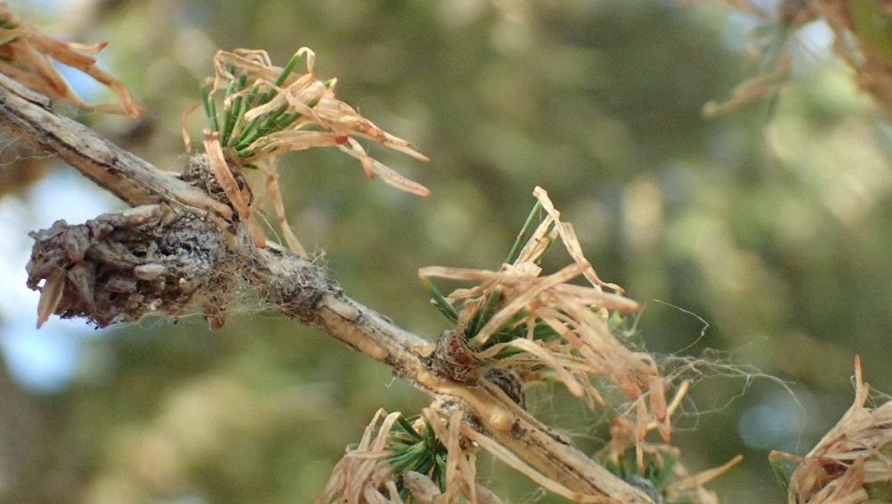

```{r, include=FALSE}
source("../../share/setup.R")
```

```{r, child="../../share/header_html.Rmd"}
```


# Larch casebearer confirmed in Southcentral Alaska

*by Grace Graham*^[Alaska Division of Forestry & Fire Protection, Anchorage, Alaska, <grace.graham@alaska.gov>]

(ref:larchcasebearer1alt) A close up photograph of a tree branch with short green needles emerging from nodes in bundles. A white circle is drawn around a small tan cylinder hanging down at about a 90 degree angle from a needle bundle.

(ref:larchcasebearer1cap) A larch casebearer larva (circled) feeds on recently flushed ornamental larch needles in Anchorage. Photographed 29 April 2025.

```{r larchcasebearer1, out.width='75%', fig.alt="(ref:larchcasebearer1alt)", fig.cap="(ref:larchcasebearer1cap)"}

```

## Introduction

In April 2025, larch casebearer, *Coleophora laricella* Hübner (Lepidoptera: Coleophoridae), larvae were found infesting ornamental Siberian larch (*Larix sibirica* Ledeb.) in Anchorage, Alaska (Figure \@ref(fig:larchcasebearer1)). This is the first confirmed detection of this invasive moth in Alaska, though tree damage consistent with infestation by larch casebearer was initially noted in June 2023. In summer 2025, the Alaska Division of Forestry & Fire Protection (AKDFFP) Forest Health team conducted a survey of larch trees in urban areas across the state in collaboration with US Forest Service Region 10 Forest Health Protection. Staff conducted these surveys to determine the distribution of larch casebearer in Alaska, with a focus on the Anchorage Bowl, and the potential threat to native larch stands in the Interior. Additionally, staff maintained two moth traps baited with larch casebearer pheromone lures to obtain specimens and establish the primary flight period for larch casebearer in Alaska. Moth collection was successful and species identification was confirmed by Coleophora specialist Dr. Jean-Francois Landry, research scientist with the Canadian National Collection of Insects, Arachnids, and Nematodes.


## Description & Life History

Larch casebearers are univoltine and complete their life cycles entirely on the branches and foliage of larch trees. In Alaska, native eastern larch (*Larix laricina* (Du Roi) K. Koch) and non-native ornamental larches, predominantly Siberian larch (*Larix sibirica*), are susceptible species. Female moths lay tiny (< 0.5 mm) yellow eggs singly on larch needles in summer. First instar larvae bore directly into and feed from within the needle during their first stage of development (Figure \@ref(fig:larchcasebearer2)B). Several weeks later, second instar larvae emerge and hollow out a larch needle to wear as their namesake protective case (Figure \@ref(fig:larchcasebearer2)B). They continue to feed on larch needle tips from within this case through the autumn. Larch trees are deciduous conifers and undergo an annual foliar senescence in the fall. As larch needles yellow and prepare to drop, third instar larvae line their cases with silk threads and move from the needles to the twigs. Overwintering larvae resemble old brown needles and are often found, singly or in groups, firmly attached to branch and twig crotches or needle fascicles (Figure \@ref(fig:larchcasebearer2)C). 

(ref:larchcasebearer2alt) A: A photo taken through a microscope of a green larch needle. A small yellow caterpillar sticks up halfway from a hole in the needle with a clear mottled with brown circular egg case obscuring its head. B: A close up of a larch needle with a small caterpillar inside a tan tubular case attached by its head at a 50 degree angle from the needle. Only the head of the caterpillar is visible outside the case and the needle is a pale green color at the tip. C: A close up of a larch branch with two small cylinders attached to a circular needle bud. The cylinders are the same color tan as the larch branch.

(ref:larchcasebearer2cap) Three different stages of larch casebearer larvae in Anchorage, Alaska: A) first instar needleminer, photo taken 22 July 2025; B) second instar feeding casebearer, photo taken 29 July 2025; C) third instar overwintering casebearer, photo taken 10 October 2025.

```{r larchcasebearer2, out.width='100%', fig.alt="(ref:larchcasebearer2alt)", fig.cap="(ref:larchcasebearer2cap)"}

```

Larvae activate in the spring soon after new larch needles begin to flush. During this time, larvae molt into their fourth and final instar and immediately start feeding on extending needle bundles. Although small (~5 mm in length), larvae stand out during this phase as they look like brown cylinders sticking out at odd angles from the new, bright green needles (Figure \@ref(fig:larchcasebearer1)). After about six weeks of feeding, most larch casebearers will pupate, widening their case with silk and attaching to needle bundles. Delicate-looking, silver moths (8 mm wingspan) emerge two to three weeks later, taking flight during warm, dry weather to find mates and lay eggs (Figure \@ref(fig:larchcasebearer3)).


(ref:larchcasebearer3alt) A small silvery moth sits with wings closed on the tip of a green larch needle with antennae outstretched. Brown needle tips and a tiny yellow circle attached to a green needle tip are visible, but blurred in the background.

(ref:larchcasebearer3cap) An adult larch casebearer sits on a larch needle in Anchorage, Alaska. A larch casebearer egg and damaged needle tips can be seen in the background. Photo taken 1 July 2025.

```{r larchcasebearer3, out.width='75%', fig.alt="(ref:larchcasebearer3alt)", fig.cap="(ref:larchcasebearer3cap)"}

```


The specific timing of life events for invasive populations of larch casebearer in the lower 48 varies geographically. Most notably, western North American populations activate more than a week earlier and require less than half as many cumulative degree-days above 5 °C (DD) to begin foraging as those from the Great Lakes Region under equivalent experimental conditions (66 DD for Oregon vs 172 DD for Minnesota [@Ward2020]). The influence of phenological, genetic, or host factors on these observed discrepancies has not been conclusively established (S.F. Ward, Ohio State University, personal communication). In Alaska, active casebearers were observed on April 29 (54.7 DD) shortly after host bud break, and most insects were pupating by May 29. The first adult moth was captured in traps on June 10, and the highest moth trap catch occurred in the week leading up to July 1. Second instar case-bearing larvae were first noted July 29. Even after most larch needles had turned yellow, active third instar casebearers could be found on lingering green needles as late as October 7. 

## Records & Distribution 

Larch casebearer is native to the southern mountainous regions of Central Europe where its primary host is European larch (*Larix decidua* Mill.). As early as the 1700s, larch casebearer populations expanded into Northern Europe, the British Isles, and Scandinavia as infested host trees were planted in new areas [@DaRonch2016]. Initially introduced to Eastern North America in the 1880s via the importation of nursery stock, larch casebearer quickly spread to native eastern larch stands in the US and Canada as far west as the Great Lakes Region. In 1957, larch casebearer of unknown origin was discovered on native western larch (*Larix occidentalis* Nutt.) in Idaho. By the mid-1960s, larch casebearer had established in natural larch stands throughout Montana, Idaho, Washington, and southern British Columbia [@Ryan1987].

It is unknown how larch casebearer originally entered Alaska. Given its previous invasion history and presence on trees throughout its lifecycle, infested nursery stock is the most plausible source of introduction for larch casebearers in Alaska. During our survey, larch casebearer was found throughout the Anchorage Bowl and as far north as Wasilla (Figure \@ref(fig:larchcasebearer4)). There are no native larch trees in Southcentral Alaska and larch casebearer was not detected in the Interior during inspections of ornamental and natural larch in Fairbanks. Almost all surveyed trees (97%) in Anchorage exhibited damage from larch casebearer, indicating the insect is well established and has likely been present in Anchorage for several years. At most survey locations (71%) this damage was categorized as trace or light, but three geographically disparate hotspots of heavier damage (Figure \@ref(fig:larchcasebearer5)) suggest there was not a single point source introduction for larch casebearer in Anchorage. This population of larch casebearer may have originated from multiple infested shipments or a single infested import outplanted in multiple locations. 


## Host Damage & Integrated Pest Management

Foliar damage from larch casebearer is distinct and presents as hollowed out needle tips that turn brown and droop or curl (Figure \@ref(fig:larchcasebearer5)). This injury is most apparent in early summer after feeding by fourth instar larvae. In Southcentral Alaska, larch casebearer will likely remain a cosmetic nuisance rather than a tree mortality agent as larch are deciduous and generally more resilient to defoliation compared to other conifers. Trees can withstand many years of minor defoliation. Chemical control options may be available for individual, high-value trees.

Historically, successful introductions of insect parasites of larch casebearer, namely *Agathis pumila* Ratzeburg (Hymenoptera: Braconidae) and *Chrysocharis laricinellae* Ratzeburg (Hymenoptera: Eulophidae), have occurred in the eastern US and Canada, the Lake States Region, and the Intermountain West. After the establishment of these biological control agents, the rate and severity of larch casebearer outbreaks declined rapidly [@Ryan1987]. Recently, however, larger outbreaks of larch casebearer have been observed in Minnesota and western states despite continued parasitism from both introduced wasps [@Ward2019]. While these wasps are not known to exist in Alaska, it is possible they may have entered Alaska with their host.

Of greatest concern is the spread of larch casebearer into native larch stands in the Interior. There, multi-year outbreaks or concurrent infestations with larch sawfly, *Pristiphora erichsonii* Hartig (Hymenoptera: Tenthredinidae), could result in severe growth losses or predisposal of trees to mortality from the native eastern larch beetle, *Dendroctonus simplex* LeConte (Coleoptera: Curculionidae). Larch casebearer is extremely cold hardy and can survive temperatures as low as -40 °C [@Ward2020]. As such, winter temperatures cannot be relied upon to hamper establishment of larch casebearer in Interior Alaska. Given the patchy distribution of ornamental larch in urban areas and the insect’s low dispersal rate, the chance of larch casebearer naturally spreading beyond Southcentral Alaska is small. However, should the insect be introduced via nursery stock to Fairbanks or other Interior towns within the range of native larch, there is a higher risk of spread into natural forests given the proximity to more abundant hosts. As such, we suggest that transport of larch trees or foliage to the Interior from Southcentral be avoided when possible.

(ref:larchcasebearer4alt) A map of the state of Alaska with the range of eastern larch visible in the interior of the state, including around Fairbanks. Red dots representing trees with larch casebearer damage are only present in Anchorage and Wasilla. Three inset maps zoom in on Fairbanks, Anchorage, and Wasilla respectively. All data points in Fairbanks are white representing no detections of larch casebearer.

(ref:larchcasebearer4cap) Larch casebearer damage survey locations in Southcentral and Interior regions with the range of native eastern larch (*Larix laricina*) in Alaska overlaid. Numbers in parentheses represent the number of surveyed trees with each value. Points labelled “inconclusive” had larch trees with damage, but the damage was not definitively attributable to larch casebearer.

```{r larchcasebearer4, out.width='80%', fig.pos="H", fig.alt="(ref:larchcasebearer4alt)", fig.cap="(ref:larchcasebearer4cap)"}

```

## Continued Monitoring

The continuation and improvement of survey efforts will allow AKDFFP staff to monitor shifts in the distribution or severity of larch casebearer in Southcentral Alaska and evaluate potential changes to the known range of larch casebearer statewide. Future tree damage surveys will be completed within a narrower temporal window. New surveys will investigate the effects of the northern climate and photoperiod on the phenology of larch casebearer. Additional work determining if the biocontrol parasitoids established for this invasive moth in the lower 48 are present in Alaska is also a priority.

(ref:larchcasebearer5alt) A close up of a larch branch with needle bundles that are green and rigid at the base, but brown, dry and drooping at the tip. Every needle in frame has this damage.

(ref:larchcasebearer5cap) Heavy larch casebearer feeding damage on ornamental Siberian larch in Anchorage. Photo taken 22 July 2025. 

```{r larchcasebearer5, out.width='80%', fig.alt="(ref:larchcasebearer5alt)", fig.cap="(ref:larchcasebearer5cap)"}

```

## References
