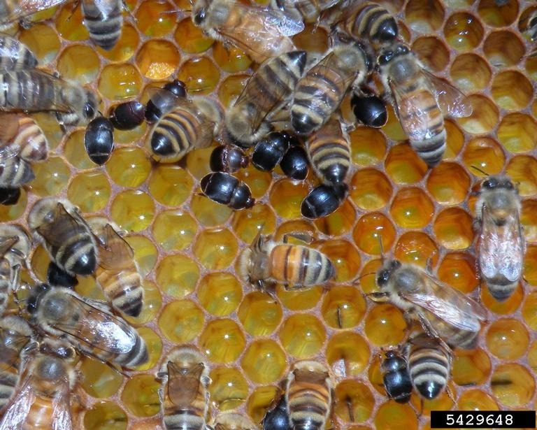
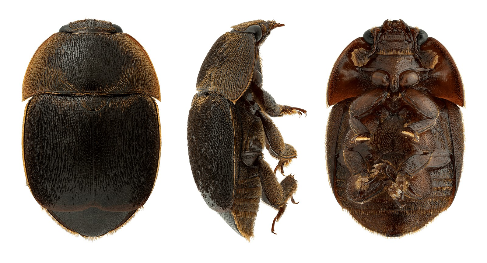

```{r, include=FALSE}
source("../../share/setup.R")
```

```{r, child="../../share/header_html.Rmd"}
```

# First detection of small hive beetle, *Aethina tumida* (Coleoptera: Nitidulidae), in Alaska
*by Ramsey Sullivan*^[Alaska Department of Natural Resources, Division of Agriculture, Palmer, Alaska, <ramsey.sullivan@alaska.gov>]

## Background

Since 2018, the Alaska Division of Agriculture (DoAg) has participated in the annual National Honey Bee Disease Survey (NHBS)^[https://ushoneybeehealthsurvey.info/]. This effort is managed by the Honey Bee Lab at University of Maryland, College Park, and has been funded by the United States Department of Agriculture Animal Plant Health Inspection Service (USDA-APHIS) since its inception in 2009. During the 2025 NHBS, small hive beetle (SHB), *Aethina tumida* Murray, was detected at an apiary in the Copper River Census Area. The identification was made by DoAg staff, confirmed by USDA-AHIS identifiers, and constitutes the first recorded detection of SHB in Alaska^[https://arctos.database.museum/guid/UAMObs:Ento:247837]. 

(ref:smallhivebeetle1alt) Bees and small hive beetles intermingle on honeycomb.

(ref:smallhivebeetle1cap) Small hive beetle adults in comb. Image credit: Jessica Loque, Smithers Viscient, Bugwood.org.

```{r smallhivebeetle1, out.width='70%', fig.alt="(ref:smallhivebeetle1alt)", fig.cap="(ref:smallhivebeetle1cap)"}

```

Small hive beetle (Figures \@ref(fig:smallhivebeetle1) & \@ref(fig:smallhivebeetle2)), an economically significant pest of honey bees, *Apis mellifera* Linnaeus, was first introduced into the United States from its native range of sub-Saharan Africa in 1996 [@Sheridan2020; @Caron2016]. Since then, it has spread across the contiguous United States, Canada, Mexico, Australia, Italy, and South Korea [@Noorulane2020]. A review of life history, steps if detected, and prevention and control can be found on the pest alert released by DoAg in collaboration with the University of Alaska Fairbanks Cooperative Extension Service (UAF CES) [@Sullivan2025]. SHB negatively impacts honey bee colonies by consuming brood and fouling honey stores, which can result in financial losses for the beekeeper through colony loss and reduced honey production.

(ref:smallhivebeetle2alt) Three images of a preserved small hive beetle (SHB) in a row. Dorsal view of SHB with limbs tucked (left), lateral view (middle), and ventral view (right). Each image shows a brown beetle covered in fine hairlike structures. Legs are only visible in the lateral and ventral views while its clubbed antennae are only visible from the ventral view.

(ref:smallhivebeetle2cap) Adult SHB dorsal view (left), right lateral view (middle), and ventral view (right). Image credit: Chris Hedstrom, Oregon Department of Agriculture.

```{r smallhivebeetle2, out.width='80%', fig.alt="(ref:smallhivebeetle2alt)", fig.cap="(ref:smallhivebeetle2cap)"}

```

## Response

The DoAg investigated the apiary where the detection occurred and found that the beekeeper had not registered their hives within the required 72 hour window of acquiring their bees nor had the importer submitted health certificates as required by Alaska state statutes. After requesting and receiving the registration and health certificate, it was determined that the health certificate did not come from an apiary certified free from pests at the time of inspection, and stated that SHB was endemic to the source state, which would have led to corrective action by DoAg had the health certificate been submitted within the required 72 hour window after the importer received their bees. DoAg requested the beekeeper not move their hives until a follow up inspection could be conducted which occurred in May 2026 and yielded a negative detection for SHB. 

Additionally, DoAg, in collaboration with the UAF CES, initiated a public outreach campaign, developing and distributing a pest alert and presenting at the Alaska Invasive Species Partnership’s 2025 Invasive Species Workshop and at local and regional bee keeping meetings and events.


## Discussion

Preventing the introduction of honey bee pests and diseases begins before bees arrive in Alaska. A person importing bees into the state shall, within 72 hours after the bees arrive, send the Division a copy of the health certificate required by AS 03.47.020^[https://www.akleg.gov/basis/statutes.asp#03.47.020] (11 AAC 35.020^[https://www.akleg.gov/basis/aac.asp#11.35]). Additionally, Alaska state statutes require that a person keeping bees shall notify the DoAg of the existence and whereabouts of the bees within 72 hours after acquiring them, and annually after that, on forms available from the Division (11 AAC 35.020). The importance of beekeepers registering their bees cannot be understated. Registrations are used to perform tracebacks, identify areas of risk for pest and disease spread, conduct robust survey efforts, and provide data for the beekeeping industry in Alaska. While bee registration data across the state is likely incomplete, registrations the DoAg has received show the interconnectedness of Alaska apiaries and the far-reaching potential for apiaries to spread disease and pests to one another (Figure \@ref(fig:smallhivebeetle3)).

(ref:smallhivebeetle3alt) A map titled "Apiary Density & Pest/Disease Spread Potential in AK" shows large dense areas up to 80 miles long of apiaries that are within a small hive beetle range and some apiaries that are connected over 40 miles via two mile bee forage buffers.

(ref:smallhivebeetle3cap) Apiary density and disease spread potential in Alaska. Buffers were rendered around each apiary with overlapping boundaries merged. The 10 mi SHB Buffer is based on the distance within which SHBs can detect honey bee hives. Map derived from 2006-2025 bee registration data. Some apiaries may no longer be active, and not all active apiaries have registered. Produced by Ramsey Sullivan, State Survey Coordinator, AK Department of Natural Resources, Division of Agriculture.

```{r smallhivebeetle3, out.width='100%', fig.alt="(ref:smallhivebeetle3alt)", fig.cap="(ref:smallhivebeetle3cap)"}
knitr::include_graphics('img/smallhivebeetle3.jpg')
```


## References
