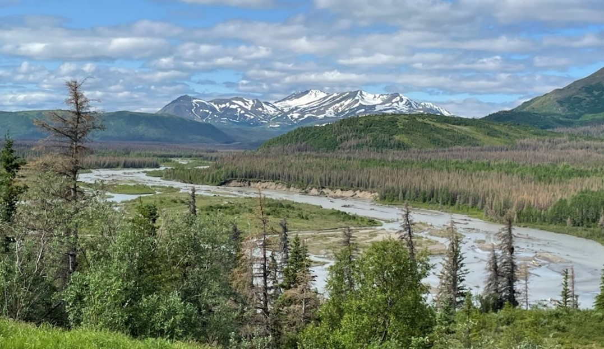
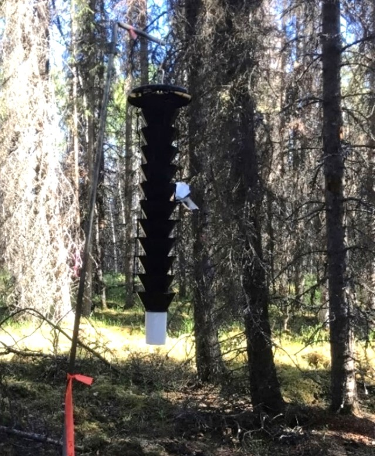
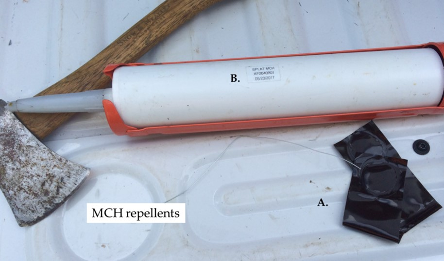
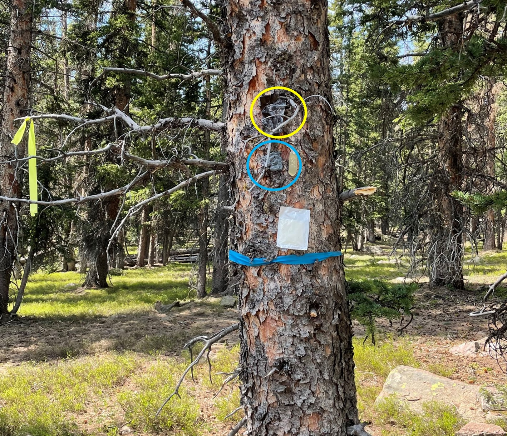

```{r, include=FALSE}
source("../../share/setup.R")
```

```{r, child="../../share/header_html.Rmd"}
```


# Chemical ecology of spruce beetle

*by Christopher J. Fettig^[Pacific Southwest Research Station, USDA Forest Service, Woodland, CA 95695, <christopher.fettig@usda.gov>], Jackson P. Audley^[Department of Plant Sciences, University of California, Davis, CA 95616, <jackson.audley@usda.gov>], and A. Steven Munson^[Forest Health Protection, USDA Forest Service, Ogden, UT 94403 <fsstevemunson@gmail.com>]*

## Introduction

Spruce beetle, *Dendroctonus rufipennis* (Kirby), is a major cause of spruce, *Picea* spp., mortality in North America (Figure \@ref(fig:sprucebeetle1)). All North American species of spruce and known hybrids of spruce are hosts, with large-diameter, mature trees preferred. Preferred host species include Lutz spruce (*P. x lutzii* Little) and white spruce (*P. glauca* (Moench) Voss) in Alaska, white spruce and Engelmann spruce (*P. engelmannii* Parry ex. Engelm.) in western Canada, Engelmann spruce in the Rocky Mountains, and white spruce and red spruce (*P. rubens* Sargent) in eastern North America. Spruce beetle completes its life cycle in 1 to 3 years depending on temperatures.   

(ref:sprucebeetle1alt) A scenic overlooking photo of a riverbed, bordered by trees, in front of a snow-capped mountain. Sections of the trees appear brownish grey in color.

(ref:sprucebeetle1cap) Faded white spruce killed by spruce beetle along the Nenana River, Alaska. Photo by Christopher J. Fettig, Pacific Southwest Research Station, Forest Service. 

```{r sprucebeetle1, out.width='100%', fig.alt="(ref:sprucebeetle1alt)", fig.cap="(ref:sprucebeetle1cap)"}

```

## Chemical Ecology of Spruce Beetle
Chemical ecology is the science that seeks to understand the origin, function, and significance of natural chemicals that mediate interactions within, between, and among species. The geographic extent and impacts of spruce beetle outbreaks in the late 20^th^ and early 21^st^ centuries caused a surge in spruce beetle research, including a focus on the chemical ecology of the spruce beetle-host system. In Alaska, studies on *semiochemical* inhibitors conducted by the Forest Service (Research & Development and Forest Health Protection) and Alaska Division of Forestry & Fire Protection contributed to this research. A *semiochemical* is a compound or mixture of compounds that affects the behavior of receiving individuals (here, spruce beetle adults). *Pheromones*, semiochemicals that mediate intraspecific interactions, are the most widely recognized class of semiochemicals. Information on other classes of semiochemicals relevant to the study of bark beetles is provided by [@Seybold2018].

Below we highlight a recent synthesis on the chemical ecology of spruce beetle published by [@Fettig2025]. We also draw from a related presentation “Spruce beetle: A new synthesis of its chemical ecology, updated Forest Insect & Disease Leaflet, and a 3-methylcyclohex-2-en-1-one (MCH) inhibition assay near Denali National Park” at the 19^th^ Annual Meeting of the Alaska Entomological Society in 2026. Literature on the chemical ecology of spruce beetle focuses on populations in Alaska, western Canada, and the central and southern Rocky Mountains and dates back to the mid-20^th^ century. Early research focused on spruce beetle attractants and shortly thereafter on inhibitors for reducing colonization of downed spruce. Since the early 2000s, research has focused on the use of inhibitors for protecting live standing spruce.

Spruce beetle adults produce *aggregation pheromones*, including frontalin (1,5-dimethyl-6,8-dioxabicyclo[3.2.1]octane), seudenol (3-methyl-2-cyclohexen-1-ol), MCOL (1-methyl-2-cyclohexen-1-ol), and verbenene (4-methylene-6,6-dimethylbicyclo[3.1.1]hept-2-ene), which facilitate mass attacks (a density sufficient to cause host mortality) of spruce. Aggregation pheromones are produced by both sexes of spruce beetle as they bore into spruce trees. Attraction to one aggregation pheromone is enhanced by other aggregation pheromones and host volatiles (e.g., α-pinene, a monoterpene found in spruce and other plants). Spruce beetle baits consisting of aggregation pheromones and host volatiles are commercially available and primarily used in traps for monitoring and experimental purposes (Figure \@ref(fig:sprucebeetle2)). Baited traps have also been used in conjunction with other treatments to suppress localized populations of spruce beetle, although this has not been demonstrated effective in Alaska. In general, baited traps should be placed ≥15 m from susceptible spruce to reduce spillover, whereby spruce beetle is attracted to traps but colonizes adjacent host trees.  

(ref:sprucebeetle2alt) A trap made up of 12 black funnels arranged vertically with a white collection cup at the base is suspended above the ground inside a spruce forest. 

(ref:sprucebeetle2cap) A 12-unit multiple-funnel trap baited with aggregation pheromones and host volatiles to assess the effects of potential inhibitors on spruce beetle near Soldotna, Alaska. Data from trapping assays are used to select inhibitors for tree protection studies. Photo by Christopher J. Fettig, Pacific Southwest Research Station, Forest Service. 

```{r sprucebeetle2, out.width='45%', fig.alt="(ref:sprucebeetle2alt)", fig.cap="(ref:sprucebeetle2cap)"}

```

Spruce beetle also produces an *antiaggregation pheromone*, MCH (3-methyl-2-cyclohexen-1-one). Antiaggregation pheromones serve as “no vacancy” signs by regulating attack densities during the latter stages of host colonization. Too many spruce beetle attacking a single host can result in high levels of competition among developing broods, which can negatively affect spruce beetle populations. In addition to MCH, the antennae of spruce beetle are capable of detecting several other compounds including 1-octen-3-ol, *trans*-verbenol, verbenone, nonanal, *exo*-brevicomin, *endo*-brevicomin, and acetophenone. Several of these have been demonstrated to be inhibitory to spruce beetle in trapping assays. 1-octen-3-ol has been detected in female spruce beetle and may be an antiaggregation pheromone.  

MCH was first evaluated for reducing colonization of downed spruce by spruce beetle as spruce beetle populations can increase in downed spruce with subsequent generations attacking nearby healthy trees. For example, a study in Montana found MCH reduced spruce beetle attack densities on downed Engelmann spruce by ~85% [@Lindgren1989]. MCH was released from bubblecaps stapled along downed stems at ~3-m intervals. Each bubblecap released ~1–3 mg of MCH per day, depending on temperatures. 

Developing inhibitors for tree protection is a challenge, requiring identification and synthesis of inhibitors; development of release devices to diffuse inhibitors into the forest environment; and numerous lab and field studies conducted over years to decades [@Audley2025a]. The situation is further complicated by the need to work in remote areas. Once a promising inhibitor has been identified, there are substantial regulatory hurdles at multiple levels of government that must be addressed before a product can be commercialized. Research in Alaska by [@Holsten2003] was first to demonstrate that MCH could be used to protect live standing spruce from spruce beetle. MCH was released from small medical devices containing a battery-operated pump and storage reservoir. These devices provided timed releases of MCH (2.6 mg of MCH per day, regardless of temperatures) onto a collection pad from which MCH evaporated into the forest environment. MCH reduced the number of Lutz spruce attacked by spruce beetle by ~87%. Since then, several studies have evaluated the effectiveness of MCH and other inhibitors for protecting live standing spruce from spruce beetle (Table \@ref(tab:sprucebeetle), Figures \@ref(fig:sprucebeetle3) and \@ref(fig:sprucebeetle4)). With few exceptions (shaded rows, Table \@ref(tab:sprucebeetle)), significant reductions in levels of spruce beetle colonization and/or spruce mortality were reported. The efficacy of MCH for spruce protection is highest when spruce beetle populations are low to moderate (e.g., when just a few trees have been attacked within a stand).  

(ref:sprucebeetle3alt) A. A small, rectangular plastic pouch with a bubbled center. (B) A caulking gun loaded with a tube of SPLAT MCH. 

(ref:sprucebeetle3cap) (A) MCH bubblecaps and (B) an early prototype (a standard 10.1-fl. oz. caulking tube) of SPLAT MCH (ISCA Inc., Riverside, CA). SPLAT MCH is a flowable matrix containing 10.0% MCH by weight with the texture of toothpaste. Photo by Christopher J. Fettig, Pacific Southwest Research Station, Forest Service. 

```{r sprucebeetle3, out.width='65%', fig.alt="(ref:sprucebeetle3alt)", fig.cap="(ref:sprucebeetle3cap)"}

```


(ref:sprucebeetle4alt) A photo showing the lower section of a spruce trunk. A yellow circle surrounds a black plastic pouch. A blue circle surrounds a grey dollop of SPLAT MCH.

(ref:sprucebeetle4cap) An Engelmann spruce baited with a spruce beetle aggregation pheromone (frontalin, black pouch in yellow circle) to assess the efficacy of SPLAT MCH (gray dollop in blue circle; ISCA Inc., Riverside, CA) + AKB (*Acer* kairomonal blend, linalool + β-caryophyllene + (*Z*)-3-hexanol; white pouch) for protecting spruce from spruce beetle, Utah. Photo by Jackson P. Audley, University of California. 

```{r sprucebeetle4, out.width='65%', fig.alt="(ref:sprucebeetle4alt)", fig.cap="(ref:sprucebeetle4cap)"}

```

\pagebreak

```{r sprucebeetle}
sprucebeetle <- read.csv("sprucebeetle.csv")
knitr::kable(sprucebeetle, 
  longtable = TRUE, 
  booktabs = TRUE,
  format = "html",
  col.names = c("State", "Host", "Compounds^1,2^", "Effect(s)^3^"),
  caption = "Studies in peer-reviewed scientific literature on the efficacy of inhibitors for protecting live standing spruce from spruce beetle in the western United States, 2000–2025. Modified from @Fettig2025.",
) %>%
  #kable_styling(latex_options = "scale_down") %>%
  column_spec(column = 1, width = "0.8in") %>%
  column_spec(column = 2, width = "1in") %>%
  column_spec(column = 3, width = "1.4in") %>%
  column_spec(column = 4, width = "6in") %>%
  footnote(c("1. See [@Fettig2025, Table 2] for references and information on release devices, doses, and release rates.", "2. AKB = *Acer* kairomonal blend (linalool + β-caryophyllene + (*Z*)-3-hexanol; PLUS = acetophenone + (*E*)-2-hexen-1-ol + (*Z*)-2-hexen-1-ol; GLV = (*E*)-2-hexen-1-ol + (*Z*)-2-hexen-1-ol.", "3. Significant inhibatory effects compared to the control. NS = not statistically significant (no effect)."), threeparttable = T) %>%
  row_spec (row = 2, background = "#CDCDC1") %>%
  row_spec (row = 7, background = "#CDCDC1") %>%
  row_spec (row = 12, background = "#CDCDC1") %>%
  row_spec (row = 1:15, extra_css = "border-bottom: 1px solid black")
  
```


## Conclusions

Our basic understanding of the chemical ecology of the spruce beetle-host system has increased substantially since the mid- to late 20^th^ century. Much progress has been made developing semiochemicals for management of spruce beetle. Baits are highly effective, readily available, and inexpensive. They have furthered understanding of the ecology of spruce beetle by providing a means of attracting and manipulating spruce beetle for experimental study. MCH and other inhibitors have been identified and demonstrated effective for spruce protection (Table \@ref(tab:sprucebeetle)). To our knowledge, there is only one peer-reviewed study on MCH (or MCH + other inhibitors) that failed to demonstrate efficacy for spruce protection. In that study, @Ross2004 reported the percentage of Engelmann spruce that were mass attacked by spruce beetle was not significantly different between MCH-treated (52.7% mass attacked) and untreated plots (68.3% mass attacked) in Utah. Two other studies showed efficacy for only some of the inhibitors that were evaluated (Table \@ref(tab:sprucebeetle)). Promising research by Audley et al. [-@Audley2022; -@Audley2024; -@Audley2025b] in Alaska, Colorado, and Wyoming reported all inhibitors that were evaluated significantly reduced mortality of treated spruce as well as spruce within 11.3 m of treated spruce. In one study, 4 of 6 inhibitors reduced levels of spruce mortality by 100% while all of the control trees were killed by spruce beetle [@Audley2022].

We encourage the reader to consult [@Fettig2025] for more information on the chemical ecology of spruce beetle. MCH products that are registered for use in Alaska can be found at https://www.kellysolutions.com/ak/. At this time, other inhibitors (e.g., AKB and PLUS, Table \@ref(tab:sprucebeetle)) are only available for experimental use. General information on spruce beetle ecology and management can be obtained from @Jenkins2014, @Bleiker2021, and @Fettig2026, as well as university cooperative extension service offices, county agricultural commissioner’s offices, State natural resources agencies, and the U.S. Forest Service’s Forest Health Protection program (https://www.fs.usda.gov/science-technology/forest-health-protection). The Alaska Division of Forestry & Fire Protection, Forest Service, and University of Alaska Fairbanks Cooperative Extension Service maintain a website on spruce beetle at https://www.alaskasprucebeetle.org/. 


## Acknowledgments

We thank numerous colleagues who have shaped our thinking on the chemical ecology of bark beetles. In particular, John Borden (JHB Consulting), Matt Hansen and Ed Holsten (USDA Forest Service, retired), and Jason Moan (Alaska Division of Forestry & Fire Protection) have influenced our research on spruce beetle. 

This article was written and prepared by US Government employees on official time, and it is, therefore, in the public domain and not subject to copyright. The findings and conclusions in this publication are those of the authors and should not be construed to represent any official USDA or US Government determination or policy.


## References
